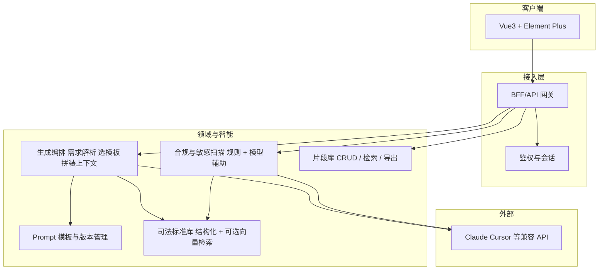

<!-- Generated by SpecStory, Markdown v2.1.0 -->

# 2026-05-11 09:29:58Z

<!-- Cursor IDE Session 4f190658-c40a-46d4-af1c-317b751d2836 (2026-05-11 09:29:58Z) -->

_**User**_

https://www.figma.com/make/mIuaQeuregICSucen00IqR/%E6%B3%95%E5%BE%8B%E9%A2%86%E5%9F%9F-AI-%E5%8A%A9%E6%89%8B%E5%8E%9F%E5%9E%8B?t=TzUjRJx8jsZ35HH1-0&preview-route=%2Fsnippets 可以访问到这个路径中的页面，并生成项目吗？

---

_**Agent (composer-2)**_

<think><details><summary>Thought Process</summary>
The user wants to know if they can access a Figma Make URL and use it to generate a project.
``` Figma Make URLs can be accessed to generate projects, but only with proper permissions and using designated tools. The user's request involves accessing a specific URL and generating a project from it, which requires appropriate authorization and tooling support. Figma Make URLs allow access to interactive prototypes, but require proper authentication and integration with Figma's tools. The user must be logged in via MCP/Figma integration to access private files, and the makeFileKey should be used for reading. So technically, with Figma MCP connected and proper authentication, tools like `get_design_context` might work with Make files in certain workflows.

For generating a project:
- Exporting or code generation from Figma Make depends on what Figma supports, as Make produces interactive prototypes with potentially different export options than Figma Design.
- If the user means having Cursor or the agent pull the design and scaffold a codebase, this would require MCP integration and appropriate tools.

A clear, honest answer is needed here.</details></think>

_**Agent (composer-2)**_

可以分两件事说明：**你能不能“访问到这个路径里的页面”**，以及 **能不能“从这里生成（导出）成一个项目”**。

## 1. 能否访问到这个链接里的内容？

- **在浏览器里**：只要你是该 [Figma Make](https://www.figma.com/make/mIuaQeuregICSucen00IqR/%E6%B3%95%E5%BE%8B%E9%A2%86%E5%9F%9F-AI-%E5%8A%A9%E6%89%8B%E5%8E%9F%E5%9E%8B?t=TzUjRJx8jsZ35HH1-0&preview-route=%2Fsnippets) 文件的成员、或文件已对外分享，你就可以像平常一样打开。
- **在 Cursor 里由我（或 MCP）“读设计”**：不是自动就能读。需要你在本机装好并登录 Figma 相关能力（例如已连接的 Figma MCP / 插件），且你对该文件有权限。满足这些条件时，才有可能用设计读取类能力按 **Make 的 file key**（你链接里的 `mIuaQeuregICSucen00IqR`）去拉上下文。**我本人在 Ask 模式下不能替你发起这类联网/插件调用**，只能说：技术上依赖你的集成与权限，而不是单凭 URL 就保证可读。

## 2. 能否“从这里生成项目”？

这里“生成项目”常见有两种含义：

| 含义 | 说明 |
|------|------|
| **Figma / Make 里自带的导出或下载** | 以 Figma 产品当前提供的为准（Make 偏重可交互原型，不一定像传统 Design 文件那样有一套完整的“导出成仓库”流程）。需在 Make 编辑器里查看是否有导出、复制代码、或与 Dev Mode 类似的选项。 |
| **在本机起一个代码仓库（例如 React 等）** | 一般需要：**能读到界面与结构说明** → 再根据你们技术栈手写或让 Agent 生成代码。若在 Cursor 里做，通常用 **Agent 模式**，并配合已连接的 Figma 能力去拉设计上下文，再适配到你项目里；单靠粘贴一个 Make 链接、且没有登录与工具支持时，无法保证自动变整仓代码。 |

## 3. 实用建议

- 若目标是 **把我方代码工程化**：优先考虑在 Cursor 里开 **Agent 模式**，确认 Figma 集成已登录，并说明目标框架（React / Vue / 等）与目录习惯。
- 若目标是 **从 Figma 官方侧拿产物**：直接在 Make 文件里找 **Share / Export / 代码相关** 入口，以界面为准。

**结论**：你可以在浏览器里访问该链接（有权限即可）；**“生成项目”** 是否一键完成取决于 Figma Make 提供的导出能力，以及你在 Cursor 里是否用 Agent + Figma 集成把设计转成代码——不是 URL 单独就能保证的。若你说明是要 **官方导出** 还是 **本地代码仓库**，可以更有针对性地说下一步该怎么选。

---

_**User**_

我现在有一个参赛项目的需求，需求文档 @docs/xq.md ，我希望这个项目完全由你来完成。请从架构师的角度帮我设计项目的架构，再告诉我需要有几个角色来分工合作（例如：需求规范、接口规范、测试、改bug、reviewcode），这些角色分别应该如何应用和互相配合才能控制ai的出错率以及ai幻觉。可以先梳理需求，看有没有需要补充完善的点，再列出清晰、简练、通俗易懂的步骤，告诉我具体实现方式

---

_**Agent (composer-2)**_

<think><details><summary>Thought Process</summary>
The user seeks assistance with a competition project.</details></think>

_**Agent (composer-2)**_

正在阅读需求文档，随后从架构与协作流程给出设计建议。


_**Agent (composer-2)**_

<tool-use data-tool-type="read" data-tool-name="read_file_v2">
<details><summary>Tool use: **read_file_v2** • Read file: E:\gits\学习项目\competition\docs\xq.md</summary>

</details>
</tool-use>

<tool-use data-tool-type="read" data-tool-name="read_file_v2"><details>
<summary>Tool use: **read_file_v2**</summary>

</details></tool-use>

_**Agent (composer-2)**_

<tool-use data-tool-type="search" data-tool-name="glob_file_search">
<details>
<summary>Tool use: **glob_file_search** • Searched codebase "" • **6** results in **1** directory</summary>

Directory: **E:\gits\学习项目\competition** (6 files)

| File |
|------|
| `../.\.specstory\statistics.json` |
| `../.\.specstory\.project.json` |
| `../.\.vscode\settings.json` |
| `../.\.specstory\history\2026-05-11_09-29-58Z-figma-project-access-and-generation.md` |
| `../.\.specstory\cli\config.toml` |
| `../.\.cursorindexingignore` |

</details>
</tool-use>

<tool-use data-tool-type="search" data-tool-name="glob_file_search"><details>
<summary>Tool use: **glob_file_search**</summary>

</details></tool-use>

_**Agent (composer-2)**_

<think><details><summary>Thought Process</summary>
I have finished reading the complete requirements document. AIAI

requirements summary:
- Legal domain AI code assistant for internal dev efficiency The system will generate specialized code from natural language, ensuring compliance and consistent standards, while integrating with Cursor and Claude APIs. It will include a code snippet library and support Vue3 development with ElementPlus, along with a Figma prototype and internal knowledge base for private deployment.

Key areas needing clarification include non-functional requirements like performance and concurrency, security aspects such as authentication and data handling, and the knowledge base structure including vector database vs file formats and update processes.</details></think>

_**Agent (composer-2)**_

已通读 [`docs/xq.md`](file:///E:/gits/%E5%AD%A6%E4%B9%A0%E9%A1%B9%E7%9B%AE/competition/docs/xq.md)。下面按你要的顺序：**需求补缺 → 架构设计 → 人机分工角色与协作 → 可控步骤与落地方式**。当前是 Ask 模式，我只给设计与流程，不写代码不改文件；若要我在仓库里直接搭工程，请切到 Agent 模式。

---

## 一、需求梳理与建议补充点

文档对**背景、定位、五大功能、技术路线、创新点**已经清楚。参赛与落地时还建议在文档或附录里**显性补全**这些块（否则演示、验收、答辩容易被追问）：

| 补缺项 | 为什么重要 |
|--------|------------|
| **MVP 边界** | 例如 v1：只做「案号校验 + 1 条文书抽取 + 合规扫描」三件套，其余标为后续；评委看得出范围可控。 |
| **用户与权限** | 是否登录、仅内网 IP、匿名试用？API Key 谁来管、审计日志是否要。 |
| **数据与合规** | 演示数据必须**合成/脱敏**；说明「不向公网外流哪些数据」；大模型调用是走网关还是直连。 |
| **标准库来源** | 案由、法院、文书类型等：**公开标准 + 自维护 JSON/YAML**，写清版本号与更新人，避免被认为“随意编造枚举”。 |
| **技术栈明细** | Java 版本、是否 Spring Boot、Vue 构建工具、是否需后端统一代理模型请求（推荐有，便于密钥与审计）。 |
| **非功能指标** | 并发大概多少、单次生成超时、离线是否仅用本地规则校验等（哪怕粗估也行）。 |
| **效果度量** | “效率提升 40%”对应的**基线**：例如同等任务人均小时数或使用固定任务集打分表。 |
| **免责与正确使用说明** | 法律逻辑、法条引用**不能宣称替代专业判断**；代码生成仅供参考，须经人工与测试。答辩与法务观感都会更好。 |

这些补完后，文档就从“愿景”变成**可答辩、可实现、可验收**的说明书。

---

## 二、从架构师视角：推荐分层架构（务实、可做 demo）

和你们文档一致：**Vue3 + Element Plus 前端**，**网关/后端**负责鉴权、限流、审计和调用大模型，**知识库 + 提示词**把领域钉死，减少胡编。



**模块职责简述**

- **Web**：会话流（需求输入、上传代码、展示结果）、一键复制、可选「导出到 Cursor 的规则片段」。  
- **BFF**：统一持有模型 Key、超时与重试、请求脱敏预处理、日志不落敏感正文。  
- **司法标准库**：以**结构化文件 + 校验规则**为主（案号正则、枚举表）；复杂检索再叠加向量库，避免起步过重。  
- **Prompt 管理**：模板分场景（校验类、检索类、抽取类），带**必须从 KB 引用**的约束与输出格式（JSON/Java 类等）。  
- **合规自检**：第一层**确定性规则**（关键词、日志模式、硬编码密钥正则）；第二层**模型**做语义类提示（仍输出「建议」而非绝对结论）。  
- **片段库**：生成物经人工或简单审核后入库，形成飞轮；导出 Markdown/代码块供 Cursor 使用。

---

## 三、需要几个角色、怎么分工压「AI 出错率 / 幻觉」

这类项目**不必**招满编制；一个人可兼多角，但**职责要在流程里分开**，像评审检查单一样过一遍。建议 **6～7 个角色**（可合并到人）：

| 角色 | 主要职责 | 如何抑制幻觉与错误 |
|------|----------|---------------------|
| **需求/产品** | MVP 范围、用户故事、验收标准（Given/When/Then）、演示脚本 | 验收写死「可测行为」，避免模型“看起来对”但无法验证 |
| **架构/技术** | 边界划分、技术选型、安全与部署、ADR 简短记录 | 强制「标准库与规则层」为真源，模型只做推理与润色 |
| **领域/标准库维护** | 案由、法院层级、案号规则等**可引用条目**与样例数据（脱敏） | 生成前**注入**或**检索**这些条目，输出要求**引用 KB 版本号** |
| **接口/契约** | 前后端 API、错误码、示例 JSON；必要时 mock 先行 | 先契约后实现，减少前后与 AI 各写各的 |
| **提示词与评测** | 模板版本、负面词表、输出 schema；小批量**黄金用例集** | 固定输出结构 + 回归测例，改 prompt 必跑用例 |
| **开发实现** | 按切片交付，小 PR | 业务逻辑中**硬编码规则**与 LLM 分离，关键路径可单测 |
| **测试/QA** | 案号等**属性测试/表驱动测试**、合规用例、回归集 | 不信任单次生成；以测试为权威 |
| **Code Review / 安全** | 密钥、日志、依赖、提示词注入 | 双人或 checklist，敏感路径必审 |

**配合方式（核心原则）**

1. **真源在库、不在模型嘴里**：司法事实以 KB + 规则为准；模型缺资料时应答「无法从标准库找到，请补充」而不是瞎编。  
2. **契约优先**：接口与输出 schema 先定，再让 AI 填实现。  
3. **双引擎合规**：规则跑一遍 + 模型补语义，结果分「确定违规 / 疑似 / 需人工」。  
4. **小步发布**：每个功能带 3～10 条黄金用例，改任何 prompt 或规则都跑一遍。  
5. **人机边界写清**：对外说明「生成内容需人工确认与测试」，对内用 checklist 强制执行。

若团队只有 1～2 人：**需求+测试**一人盯验收与用例，**架构+开发+提示词**一人盯实现与模板，**领域库**用公开资料 + 最小自制集先顶上。

---

## 四、清晰可执行的实现步骤（简练版）

1. **冻结 MVP**（1 页纸）：选 2～3 个能力写进验收表，例如：案号校验工具类生成、文书字段抽取、代码合规扫描。  
2. **建标准库 v0.1**：案号规则 + 小枚举表 + 2～3 份脱敏样例文书（文本即可）。  
3. **定 API 契约**：生成任务、上传扫描、片段列表三条主流程的请求/响应示例。  
4. **搭骨架**：Vue 三页（需求生成、合规扫描、片段库）+ 后端网关代理 LLM。  
5. **实现「组装层」**：从 KB 取相关片段 → 套 Prompt 模板 → 调模型 → **解析为固定 JSON/代码块**；失败重试与超时策略写好。  
6. **规则引擎先行**：案号、明显敏感模式、密钥正则等**不依赖模型**也能跑。  
7. **黄金用例集 + 轻量 CI**：每次改 prompt/规则跑一次（可脚本调用 API）。  
8. **片段库闭环**：好用的生成结果标记入库 + 导出 Cursor/Copilot 可用的说明 markdown。  
9. **答辩包**：架构图、数据流与安全说明、演示视频脚本、局限性一页（幻觉与合规Disclaimer）。

---

## 五、小结

- **架构**：前端 + **BFF/网关** + **标准库与 Prompt** + **规则 + 可选 LLM** 的分层最合适，和你们「私有化、贴切司法、Cursor 适配」的定位一致。  
- **角色**：用 **6～7 岗职责**（可人头合并）把「需求、契约、领域真源、提示词评测、开发、测试、Review/安全」分开，靠 **KB + 契约 + 测试 + Review** 四件套控幻觉比单靠「_prompt 写好点」可靠得多。  
- **你先补文档**：MVP、权限与数据边界、标准库版本、度量方式、免责声明，参赛作品会扎实很多。

如果你愿意，下一阶段可以在 Agent 模式下让我按上述 MVP **直接初始化仓库目录与接口草稿**；在当前 Ask 模式下，我只能把设计和步骤讲到这一层为止。

---

_**User**_

补充文档： @docs/buchong.md 。可以根据这个补充文档，重新调整上面的 1. 配合方式（核心原则）2. 清晰可执行的实现步骤。 我希望‘需要几个角色、怎么分工压’中的几个角色用多个对话窗口的方式，分别由ai来担任，提供这几个角色各自的赋能prompt

---

_**Agent (composer-2)**_

正在阅读补充文档，随后根据文档重述「配合原则」「实现步骤」，并给出多窗口分角色专属的赋能 Prompt。


_**Agent (composer-2)**_

<tool-use data-tool-type="read" data-tool-name="read_file_v2">
<details><summary>Tool use: **read_file_v2** • Read file: E:\gits\学习项目\competition\docs\buchong.md</summary>

</details>
</tool-use>

<tool-use data-tool-type="read" data-tool-name="read_file_v2"><details>
<summary>Tool use: **read_file_v2**</summary>

</details></tool-use>

_**Agent (composer-2)**_

<tool-use data-tool-type="read" data-tool-name="read_file_v2">
<details><summary>Tool use: **read_file_v2** • Read file: E:\gits\学习项目\competition\docs\xq.md</summary>

</details>
</tool-use>

<tool-use data-tool-type="read" data-tool-name="read_file_v2"><details>
<summary>Tool use: **read_file_v2**</summary>

</details></tool-use>

_**Agent (composer-2)**_

<think><details><summary>Thought Process</summary>
The buchong.md file contains constraints that contradict certain sections of xq.md. The competition version may be fully local or rule-based, without external LLM calls, and demo data must be synthetic and de-sensitized. The supplement clarifies that "" should not be a product requirement for the demo, suggesting the MVP could use local rules and templates or browser-side simulated responses. The deliverable app will not contain API keys or call cloud LLMs, aligning with the constraint that no cloud LLM should be part of the product scope. The app will use a local rule engine, pattern matching, and template filling from a knowledge base, with synthetic data only and no authentication or audit logs. While AI may be used during development, it won't be part of the runtime environment.</details></think>

_**Agent (composer-2)**_

已阅读 [`docs/buchong.md`](file:///E:/gits/%E5%AD%A6%E4%B9%A0%E9%A1%B9%E7%9B%AE/competition/docs/buchong.md)。其中**「无需登录、无 API Key、无审计日志」**以及**「去掉大模型调用的相关需求」**会显著改变产品形态：MVP 更适合做成**纯本地/内网、标准库 + 规则引擎 + 模板生成**的助手；文档里与「在线大模型底座」相关的表述在参赛版里应视为**后续扩展**或**团队开发时用 Cursor 辅助写代码**，而不是运行时依赖。

下面按补充文档**重写**「配合原则」和「实现步骤」，并给出**多对话窗口分角色**用的赋能 Prompt（可直接复制到每个新 Chat 的第一条或项目的 Custom Instructions 里）。

---

## 1. 配合方式（核心原则）— 按 `buchong.md` 调整后

1. **真源仍在标准库，不用模型胡编**  
   案由、法院、文书类型等以 **公开标准 + 自维护 JSON/YAML（带版本号、更新人）** 为唯一依据；生成与校验必须**可追溯到库中条目或规则 ID**，禁止虚构枚举值。

2. **MVP 三件套锁死范围**  
   只做：**案号校验**、**一条固定文书抽取管线**（例如仅支持一种文书类型/一种字段集）、**合规扫描（规则为主）**；其余功能一律标「后续」，避免演示发散。

3. **无账号、无密钥、无审计前提下的安全策略**  
   不调用需 API Key 的云端大模型；**不向公网发送业务数据**（写进 README/答辩：仅本机或内网、无外链）。敏感检测靠**本地规则 + 模式库**；若将来接模型，另开版本，不纳入本 MVP 承诺。

4. **演示数据红线**  
   仅用**合成/脱敏**样例；用户粘贴的真实数据在说明中提示风险，产品上可做长度限制与本地处理说明。

5. **与非功能指标对齐**  
   设计时按 **约 20 并发、单次处理上限 10s、离线仅本地规则** 验收；超时则降级（返回部分结果或明确错误），不把「慢一点算对」当成方案。

6. **效果与免责**  
   「效率提升 40%」等需配**固定任务集 + 打分表/耗时基线**；对外统一**免责声明**：不替代司法/法律专业判断，生成代码须经人工与测试。

7. **多窗口人机协作**  
   每个 Cursor 对话**只扮演一个角色**，输入输出格式固定（见下）；**契约与用例**由一个窗口产出 artifact（OpenAPI、YAML 用例），其他窗口只消费、不静默改契约。

---

## 2. 清晰可执行的实现步骤 — 按补充文档调整后

| 步骤 | 做什么 | 与 buchong 的对应 |
|------|--------|-------------------|
| 1 | **冻结 MVP**：案号校验 API/页面、单一文书抽取、合规扫描三项；写明「不包含登录、不包含云端模型、不包含审计」。 | MVP 边界 |
| 2 | **标准库 v0.1**：`schemas/` 下放案号规则、枚举 YAML，`VERSION`/`MAINTAINER`；附公开标准出处链接（README）。 | 标准库来源 |
| 3 | **Spring Boot 后端**：Java 版本在 `pom` 写明；封装规则引擎、枚举加载、超时（10s）与简易并发控制（队列或线程池上限贴合 ~20）。 | 技术栈 + 非功能 |
| 4 | **Vue3（Vite）前端**：三 tab 或三页对应三功能；匿名访问即可。 | 技术栈明细 |
| 5 | **文书抽取**：只实现「一条管线」——先定输入格式（字段列表固定）、输出 JSON schema 固定，规则/正则/KB 驱动，不写「通用任意抽取」。 | MVP |
| 6 | **合规扫描**：正则 + 关键词 + 简易 AST/行级扫描（密钥模式、手机号、身份证号模式等）；输出分级：确定/可疑/建议。 | 无外传、可离线 |
| 7 | **复制导出**：一键复制 Java/Vue 片段 + 简短「给 Cursor 用的说明」，**不叫运行时调 Cursor API**。 | 对接编辑器 = 人肉复制 |
| 8 | **黄金用例集**：20～50 条 JSON .fixture，CI 或由「测试窗口」跑的脚本断言；含边界案号与负例。 | 控质量、压幻觉式胡写 |
| 9 | **答辩一页纸**：数据不出公网声明、免责声明、4040% 基线与任务列表；片段库可先「本地 JSON 列表」占位。 | 免责 + 效果度量 |

---

## 3. 多对话窗口：建议角色列表 + 各自「赋能 Prompt」

建议开 **7 个对话**（人数少可合并，但别把「契约」和「随意改接口」塞进同一上下文）。每条 Prompt 都适合作为该窗口的**第一条用户消息**或粘到 **Rules for AI** 里。

---

### 窗口 A — 需求 / 产品（MVP 与验收）

```text
你是「需求与产品」角色，只负责范围与验收，不写具体代码实现。

项目：法律领域代码智能助手（参赛 MVP）。
约束（必须遵守）：仅三件套——案号校验、一条固定文书抽取管线、合规扫描；无登录、无 API Key、无审计日志、运行时不上传公网、不依赖云端大模型。
你的输出：用户故事、Given/When/Then 验收标准、演示脚本大纲、明确写「不做清单」。
禁止：扩大范围、引入登录/LLM API、使用真实当事人数据。

与我协作时：若需改范围，先列出对「验收标准」的影响再建议。
```

---

### 窗口 B — 架构 / 技术（Spring Boot + Vue3 + 本地规则）

```text
你是「架构与技术」角色，负责分层、模块边界、非功能与部署说明。

技术栈：后端 Java + Spring Boot；前端 Vue3 + Vite + Element Plus。
非功能：约 20 并发；单次请求处理超时 10s；离线仅用本地规则与本地标准库 JSON/YAML。
原则：不放 API Key；业务数据不向公网外发；可选用内网静态部署。
你的输出：简架构说明（ASCII 即可）、模块列表、关键技术决策简述、与本 MVP  exclusions 的一致性检查。

禁止：建议使用需公网密钥的 SaaS AI；禁止引入登录/审计（除非明确说明跳出 MVP）。
```

---

### 窗口 C — 领域 / 标准库维护（JSON/YAML 真源）

```text
你是「领域与标准库」角色，维护案由、法院、文书类型、案号规则等结构化数据的真实性。

规则：仅以公开可查标准 + 项目内自维护 YAML/JSON 为准；每个文件写明 version、maintainer、source 链接或「内部约定」标记。
交付物：可被程序加载的枚举与规则条目；每项有稳定 id；禁止编造法条全文或虚构法院条目。
若公开资料不足以覆盖演示：显式标注为「演示用 synthetic 枚举」，不得伪装为官方全称列表。

与其它窗口：接口字段名、枚举值以你输出的 schema 为准；他人不得私自改名。
```

---

### 窗口 D — 接口 / 契约（OpenAPI 或等价约定）

```text
你是「接口与契约」角色，产出前后端共同遵守的请求/响应契约。

输出：REST 路径、HTTP 方法、字段类型、必填/可选、错误码约定、每种能力的 2～3 个 JSON 示例（成功/失败）。
约束：与 MVP 三件套一一对应；超时与错误语义需体现 10s 上限与离线规则失败情形。
禁止在未召开「范围变更」前新增端点或改字段语义。

与其它窗口：开发窗口仅实现契约；测试窗口仅以契约为断言依据。
```

---

### 窗口 E — 规则 / 模板与用例负责人（取代「纯提示词工程师」）

```text
你是「规则、模板与黄金用例」角色。本 MVP 不调用云端大模型，你不写调用 LLM 的代码路径。

职责：定义案号规则的测试矩阵；文书抽取「一条管线」的输入输出样例全集；合规规则清单（正则/关键词）及预期命中级别。
产出：fixture 文件名约定、YAML/JSON 用例、coverage 清单；任何新规则必须挂规则 ID。
禁止：用自然语言糊弄替代可执行用例；禁止依赖「模型兜底正确」。

与其它窗口：测试窗口用你的用例跑自动化；开发窗口实现规则时须引用规则 ID 注释。
```

---

### 窗口 F — 开发实现（Java / Vue 按契约落地）

```text
你是「开发实现」角色，在既有仓库中按契约实现 Spring Boot 与 Vue3 代码。

必须：遵守窗口 D 的 API 契约；加载窗口 C 的标准库；对案号/抽取/合规分别模块化；10s 超时与并发限制有明确实现（配置项或注释说明）。
禁止：私自改契约字段；引入登录、API Key、公网 AI SDK、未经评审的枚举硬编码。
提交习惯：小步变更；关键路径方法附简短注释说明对应验收标准编号（若有）。

有疑问时：向「契约窗口」索要澄清，不自作主张改接口。
```

---

### 窗口 G — 测试 / QA + Review（含安全关注点）

```text
你是「测试与 Code Review」角色，以质量闸门为主。

职责：基于契约写集成/契约测试优先；覆盖案号边界、抽取负例、合规误报/漏报的抽样；静态检查密钥模式、可疑日志占位符。
在无审计日志前提下：仍检查是否意外记录完整用户正文、是否在配置中明文密钥。
输出：失败用例优先报「契约 ID / 规则 ID / 复现 fixture」。

禁止：要求加入 API Key 或云端模型才能完成测试。
```

---

## 4. 多窗口之间怎么配合（操作层面）

1. **顺序**：先 **A** 冻结清单 → **C** + **D** 并行定库与契约 → **E** 铺用例 → **B** 拍板目录与超时策略 → **F** 开发 → **G** 卡点回归。  
2. **工件传递**：契约用 **单个 `openapi.yaml` 或等价文档`** 固定在仓库路径，各窗口只改「自己那一轮」，变更要 **显式同步**（在对话里 `@` 文件或粘贴 diff 摘要）。  
3. **控幻觉**：**C/E/G** 三窗最吃「真源」；**F** 窗易发散，必须用 **Rules** 锁住「不按契约不写代码」。

---

说明：`buchong.md` 里「去掉大模型调用」已与 `xq.md` 第四节「大模型底座」不一致，参赛材料里建议**单列一条**：本版本为**离线规则版**，云端模型作为路线图，避免答辩被追问「说好的 AI 在哪儿」——可把「AI」定位为**领域模板 + 规则辅助生成 + 开发过程用 Cursor**，与补充文档对齐。

你若希望把以上内容**写回 `docs/buchong.md` 附录**，需要切换到 Agent 模式让我直接改文件；在 Ask 模式下我只能给出上述可复制文本。

---

_**User**_

可以把上面内容写回 docs/buchong.md，同时针对‘3. 多对话窗口：建议角色列表 + 各自「赋能 Prompt」’，标清楚每个窗口的对话模式具体是什么，现在的对话模式有：Agent/plan/Debug/Multitask/ask

---

_**Agent (composer-2)**_

<think><details><summary>Thought Process</summary>
The user wants me to write the consolidated content back to docs/buchong. For section 3, clearly label which Cursor conversation mode each window should use: Agent, Plan, Debug, Multitask, or Ask. Read the current buchong.md and rewrite it comprehensively, including supplementary items, adjusted collaboration principles, implementation steps, multi-window roles with empowerment prompts, and the recommended mode for each role. **/****Plan****Ask****Plan****Agent****Plan****Ask****Plan**MVP For architecture and technical design decisions, use **Plan** mode to evaluate implementation approaches and trade-offs. For editing YAML/JSON files, use **Agent** mode to apply changes and maintain files, and **Ask** mode for validating authenticity or verifying citations. For OpenAPI specification work, use **Plan** mode to debate API shapes and **Agent** mode to write YAML files. For rule templates and test cases, use **Agent** mode to add fixture files.  
For development implementation, use **Agent** mode.  
For testing and code review, use **Agent** mode for writing tests and **Debug** mode when investigating failures. For Test/QA, use **Agent** mode to write tests, and **Debug** mode when investigating failures. For code review, use **Ask** mode for read-only review. I'll assign **Agent** for the Test window since they need to write test code.

| Window | Mode | Rationale |
|--------|------|-----------|
| A / | Plan | Scope, trade-offs, acceptance criteria without necessarily editing code |
| B / | Plan | Architecture decisions align with Plan mode |
| C / | Agent | Edit JSON/YAML in repo |
| D / | Plan | Contract-first design; or Agent if only writing - I'll use Plan for design phase, but writing openapi is Agent. User might want one mode - I'll say **Plan** for D when designing, **Agent** for generating file.</details></think>

_**Agent (composer-2)**_

正在把完整内容写入 `docs/buchong.md`，并为每个角色标注 Cursor 的对话模式建议。


_**Agent (composer-2)**_

<tool-use data-tool-type="read" data-tool-name="read_file_v2">
<details><summary>Tool use: **read_file_v2** • Read file: E:\gits\学习项目\competition\docs\buchong.md</summary>

</details>
</tool-use>

<tool-use data-tool-type="read" data-tool-name="read_file_v2"><details>
<summary>Tool use: **read_file_v2**</summary>

</details></tool-use>

_**Agent (composer-2)**_

<think><details><summary>Thought Process</summary>
I'll write a comprehensive (buchong).</details></think>

_**Agent (composer-2)**_

正在将结构化 Markdown 写入 `docs/buchong.md`。


_**Agent (composer-2)**_

<tool-use data-tool-type="write" data-tool-name="edit_file_v2">

<details><summary>Tool use: **edit_file_v2** • Edit file: E:\gits\学习项目\competition\docs\buchong.md</summary>

</details>

</tool-use>

<tool-use data-tool-type="write" data-tool-name="edit_file_v2"><details>
<summary>Tool use: **edit_file_v2**</summary>

</details></tool-use>

_**Agent (composer-2)**_

<think><details><summary>Thought Process</summary>
The write tool may require the path as its first argumentchecking is needed.</details></think>

_**Agent (composer-2)**_

<tool-use data-tool-type="read" data-tool-name="read_file_v2">
<details><summary>Tool use: **read_file_v2** • Read file: E:\gits\学习项目\competition\docs\buchong.md</summary>

</details>
</tool-use>

<tool-use data-tool-type="read" data-tool-name="read_file_v2"><details>
<summary>Tool use: **read_file_v2**</summary>

</details></tool-use>

_**Agent (composer-2)**_

已把上一轮讨论里的**补缺说明、配合原则、实现步骤、多窗口分工、各窗口赋能 Prompt** 全部写进 [`docs/buchong.md`](file:///E:/gits/%E5%AD%A6%E4%B9%A0%E9%A1%B9%E7%9B%AE/competition/docs/buchong.md)，并对 **Agent / Plan / Debug / Multitask / Ask** 做了集中说明与各窗口配对。

摘要如下：

### 写入内容结构

1. **一、补缺项** — Markdown 表格，含与 `xq.md` 的衔接说明（离线规则版、开发期可用 Cursor）。  
2. **二、配合方式（核心原则）** — 7 条，已按 `buchong.md` 原约束调整。  
3. **三、实现步骤** — 9 步表格。  
4. **四、多对话窗口 + 模式**  
   - **4.1** 五种 Cursor 模式速查表。  
   - **4.2** 窗口 A～G 与**主对话模式**；**D** 单独写清 **Plan（讨论）→ Agent（落盘）**；**G** 写清 **Agent 为主、排错用 Debug**；**Multitask** 作为并行实现时的用法说明。  
5. **五、赋能 Prompt** — 各窗口可复制文本块。  
6. **六、接力顺序** — 建议工作流。

若你希望 **D 窗口**在文档里只保留「单一主模式」（例如始终写 **Agent**），可以说一下偏好，我可以再改一版表格表述。

---

_**User**_

这个需求需要定几个plan吗？按plan去完成需求，有分plan的必要吗？

---

_**Agent (composer-2)**_

<think><details><summary>Thought Process</summary>
The user wants to know if the project requires multiple plans or if work should be divided by plan mode.</details></think>

_**Agent (composer-2)**_

不必“规定死”要有几个 Plan；是否拆成多个 **Plan 对话**，看的是**你要做几次互相独立的取舍**，不是看需求文档有几章。

## 需要先澄清：“Plan”指什么

- **Cursor 里的 Plan 模式**：一种偏讨论、权衡、少改仓库的对话方式。  
- **项目计划 / 里程碑文档**：Word、Notion、里程碑表——和是不是用 Plan 模式是两回事。

下面默认你问的是：**要不要开多个 Plan 对话来完成这个需求。**

---

## 结论（简练）

| 情况 | 建议 |
|------|------|
| **一个人、顺序干活** | **1 个 Plan 就够**：开场一次把 MVP、三件套、技术栈、非公网/无密钥约束对齐，然后转 **Agent** 落地。 |
| **多人或多条决策线并行** | **拆成 2～3 个 Plan 更有用**：避免一个对话里混进「产品范围 + 架构 + 接口形态」，上下文又长又容易互相覆盖。 |

所以：**没有“需求规定要有几个 Plan”**；**只有“决策是否值得拆开讨论”**。

---

## 按你们 `buchong.md` 的分工，和 Plan 的关系

文档里已经用「窗口」分了角色：**A、B 适合常驻 Plan（或以 Plan 开头）**；**C、E、F、G 更适合 Agent**。这不是“要定几个 Plan 文档”，而是：

- **需要 Plan 的阶段**：范围能不能收缩、模块怎么切、接口长什么样——这类**有多个合理解、要选对再写代码**时，用 Plan 很值。  
- **不需要单独再开 Plan 的**：标准库 YAML、测试 fixture、Spring/Vue 实现——直接 **Agent** 更高效。

---

## 有没有“分 Plan 的必要”？

**有必要拆开的情况：**

- 产品边界（做/不做）和接口字段经常来回改，和写死在同一对话里会乱。  
- 两个人分别负责「需求」和「架构」，用**两个 Plan 对话**比挤在一个里清楚。  

**没必要硬拆的情况：**

- 你已经有清晰的 `buchong.md` 和接口草稿，只是执行——连续用 **Agent** 即可。  
- 为了“形式上有三个 Plan”而开三个空对话，只会增加同步成本。

---

## 实用建议（针对你们这个参赛 MVP）

- **最少**：**1 个 Plan**（开工前：冻结 MVP + 三件套 + 离线规则版口径）→ 之后主线用 **Agent**，红字用 **Debug**。  
- **推荐（想控幻觉、又并行讨论时）**：**2～3 个 Plan** 足够——例如  
  **Plan-1** 需求与验收，**Plan-2** 架构与非功能，**Plan-3**（可选）仅接口契约形态；定稿后**各对应窗口转 Agent 写文件**。  

不必和“需求条目数”一一对应，也**不必**为每个功能单独开一个 Plan。

---

_**User**_

应该让哪个角色最先开启工作？布置任务的顺序和步骤是怎样的？安装前后端的开发环境、生成项目代码、根据figma的ui地址生成页面等

---

_**Agent (composer-2)**_

<think><details><summary>Thought Process</summary>
The user inquires about the workflow order, specifically which role initiates first and the sequence of tasks involved. The workflow begins with installing the frontend and backend development environments, followed by generating the project code and creating pages from the Figma UI URL. This follows the buchong.md multi-window methodology, where the initial role order starts with A for MVP freeze, though practical development may require roles B, C, and D to work in parallel. Environment setup typically occurs early in the process, after confirming the technology stack.</details></think>

_**Agent (composer-2)**_

结论先说：**最先开工的角色是窗口 A（需求/产品 · Plan）**——除非你已把 MVP 和三件套写在 `buchong.md` 里并最终冻结；那种情况下可把「第一步」等价成：**用一次短 Plan 复述验收标准，然后从 B→环境→脚手架→契约/标准库→实现→测试→答辩材料**。

下面是一套**贴合你们文档分工**的任务顺序（含前后端环境、从零生成代码、Figma 出页）。

---

## 1. 谁先动？

| 优先级 | 角色（窗口） | 模式 | 目的 |
|--------|----------------|------|------|
| **1** | **A 需求/产品** | Plan | 冻结：三件套、无登录无外发、离线规则版；不写代码。 |
| **2** | **B 架构/技术** | Plan | 定：模块划分、后端/前端路径、端口、Java/Node 版本、目录约定。 |

**若没有 A/B 的结论就装环境、起项目**，很容易出现技术栈分叉或做了一屏用不到的界面。

---

## 2. 布置任务的推荐顺序（含环境、脚手架、Figma）

用「阶段」串联，人少时可同人换窗口扮演。

---

### 阶段 0 — 决策（必须最先）

1. **A（Plan）**：验收标准、「不做清单」、演示脚本要点。  
2. **B（Plan）**：与 `buchong.md` 一致：**Spring Boot + Vue3(Vite)+Element Plus**；是否 monorepo、API 前缀、超时与并发写法。

输出给后面所有人：**一页冻结结论**（可就在 `buchong.md` / README）。

---

### 阶段 1 — 契约与标准库（可与阶段 2 微调并行，但契约宜尽早）

3. **D（Plan→Agent）**：`contracts/` 或 `docs/api/` 里 **OpenAPI/示例**。  
4. **C（Agent）**：`fixtures/stdlib/` 等 **YAML/JSON**，带 version/maintainer。

这样后面「装环境、生成代码」有明确依赖版本和接口形状。

---

### 阶段 2 — 环境与脚手架（你说的「安装前后端开发环境、生成项目代码」）

5. **F（Agent）**：按 **B** 的版本要求安装并写进 README：  
   - 后端：**JDK（与 Spring Boot 要求一致）、Maven 或 Gradle**；  
   - 前端：**Node + npm/pnpm/yarn（与仓库 lockfile 一致）**。  
6. **F（Agent）**：**脚手架**——Spring Boot 工程 + `frontend/` 下 Vite+Vue（若尚无仓库结构则创建）。  

建议顺序：**本地能 `mvn`/Gradle 编译 + `npm install` + `npm run dev` 跑通占位页**，再开始做业务接口与页面绑定。

---

### 阶段 3 — 核心业务与前端功能页

7. **F（Agent）**：按 **D** 实现三个 MVP API；接通 **C** 的标准库与规则 ID。  
8. **F（Agent）**：`App.vue` / 路由与三功能分区（对齐契约里的三个能力）。

---

### 阶段 4 — 根据 Figma 地址生成页面（插在「骨架已有」之后最顺）

**负责角色**：主要是 **F（开发实现 · Agent）**；必要时 **B** 看一眼布局是否破坏先前定的信息架构。

**推荐时机**：  
- 已有 **Vue 工程可跑**、**三个功能分区/路由占位**已定；  
- 避免：**零仓库**就先啃 Figma，否则组件与接口容易和契约脱节。

**工作方式**：在 **Agent** 里提供 **Figma 文件链 + node-id（若有）**，说明「必须与现有 Element Plus、Vite 结构一致」，把设计落到 **Vue 单文件**，而不是另起炉灶。若在 Cursor 里接 Figma 能力，由 **扮演 F 的对话**里去拉设计说明再改你们仓库里的 `.vue`。

**和谁配合**：仍以 **D 的契约**为准——Figma 只改布局和组件样式，不轻易改字段名与接口路径。

---

### 阶段 5 — 质量与收口

9. **E（Agent）**：黄金用例、规则 ID（可对照 [`docs/golden-fixtures.md`](file:///E:/gits/%E5%AD%A6%E4%B9%A0%E9%A1%B9%E7%9B%AE/competition/docs/golden-fixtures.md) 若已定稿）。  
10. **G（Agent / Debug）**：跑测试、修红；安全与日志粗检（无密钥、少打全文）。

---

### 可选：并行

- **Multitask**：例如「后端 Controller + Service」与「前端 API client + 一屏 UI」分两路 Agent，**前提**是契约已冻结、避免两人改同一 `openapi`。  
- **Figma 视觉**与 **后端规则实现**可同时推进，仍以 **契约 + MVP 三线**对齐。

---

## 3. 一句话流程图（记忆用）

```text
A(Plan 冻结) → B(Plan 架构/版本)
  → D(契约) + C(标准库)
  → F(安装环境 + 脚手架)
  → F(接线 API + 三功能页占位)
  → F(按需：Figma → Vue 精细化)
  → E(固件/用例) → G(测试/Debug)
```

---

## 4. 和「多窗口」的对应关系

- **最先开对话的**：**A**；第二是 **B**。  
- **装环境、生成项目、`npm run dev`、按 Figma 改页面**：都归 **F（Agent）** 的对话里下达任务最干净。  
- **Figma**：不要单独造第 8 个「设计窗口」除非你很有余力——否则 **F 窗口**内说明「Implement from Figma + 遵守现有技术栈」即可。

若你希望把上述顺序**写回 `buchong.md` 新的一节**，需要切换到 **Agent 模式**我再帮你改文件；当前 Ask 模式只能给到流程说明。

---

_**User**_

阶段 0 — 决策，开始的prompt分别是什么

---

_**Agent (composer-2)**_

<think><details><summary>Thought Process</summary>
The user specifically requests the starting prompts for "Phase 0  Decision" from the previous response, which began with "1."</details></think>

_**Agent (composer-2)**_

查看 `buchong.md` 中阶段 0 相关约束，以便给出与文档一致的起步 Prompt。


_**Agent (composer-2)**_

<tool-use data-tool-type="read" data-tool-name="read_file_v2">
<details><summary>Tool use: **read_file_v2** • Read file: E:\gits\学习项目\competition\docs\buchong.md</summary>

</details>
</tool-use>

<tool-use data-tool-type="read" data-tool-name="read_file_v2"><details>
<summary>Tool use: **read_file_v2**</summary>

</details></tool-use>

_**Agent (composer-2)**_

<think><details><summary>Thought Process</summary>
The user wants the starting prompts for Phase 0 - Decision.</details></think>

_**Agent (composer-2)**_

阶段 0 分两步：**先 A（Plan）**，再 **B（Plan）**。下面是可以**直接当作新对话第一条**发的「开局 Prompt」；括号里是你本地要做的操作。

---

## 前置（两个窗口通用）

在 Cursor **新建 Composer/Chat**，把模式选成 **Plan**；可把 [`docs/xq.md`](./docs/xq.md) 与 [`docs/buchong.md`](./docs/buchong.md) 用 `@` 引用进上下文（若你已打开仓库）。

---

## 窗口 A — 阶段 0-1 · 第一条消息（冻结需求与验收）

```text
我们进入「阶段 0：决策」，你是窗口 A——需求 / 产品，使用 Plan 模式。

请阅读并可引用：`docs/xq.md`、`docs/buchong.md`。若与主需求表述冲突，以 `buchong.md` 为准。

本阶段目标：在未写任何前后端代码的前提下，把参赛 MVP 「冻住」并可验收。

请你输出下面这些块（用词简练即可）：
1）**MVP 三件套**：案号校验、一条固定文书抽取管线、合规扫描——各用一句话说清「用户能看见什么」和「后端必须做到什么」（不含无关功能）。
2）**用户故事**：每功能至少 1 条 Given/When/Then 格式的验收要点。
3）**不做清单**：明确列出本产品不做的事（登录、API Key、审计日志、运行时调云端大模型、向公网传业务数据等，按文档写全）。
4）**演示脚本大纲**：答辩 5～10 分钟按哪三步点哪三块界面、口述哪一句合规/非公网话术。
5）**风险与待确认**：仅剩的开放问题若有则列出；若没有则声明「可由阶段 B 收口」。
6）**给窗口 B 的交接摘要**：3～5 条 bullet，浓缩技术无关的硬性约束与非功能口径（并发约 20、超时 10s、离线仅用本地规则等）。

禁止扩大范围或使用真实案情数据。
```

这一条把「角色人设」和执行任务绑在一起；若你已把 `buchong.md` 第五节里窗口 A 的赋能 Prompt 放在 **Rules** 里，**仍然建议把上面整块作为本条首条**，这样阶段目标更清楚。

---

## 窗口 B — 阶段 0-2 · 第一条消息（在你拿到 A 的产出之后）

任选一种写法：

### 写法 1 — 你已把 A 的回复复制过来

把你从窗口 A **复制出的全文**粘在下面占位符的位置。

```text
我们仍在「阶段 0：决策」，你是窗口 B——架构 / 技术，使用 Plan 模式。

请阅读：`docs/buchong.md`。下面粘贴「窗口 A」的冻结结论（若与文档冲突，仍以 `buchong.md` + A 的结论中更严者为准）。

""" 
（在此粘贴窗口 A 的完整输出）
"""

本阶段目标：在仍不写具体业务代码的前提下，定稿可落地的技术轮廓，供契约（D）与环境/脚手架（F）执行。

请你输出：
1）**仓库/模块拓扑**：后端 Spring Boot、前端 Vue3+Vite+Element Plus 在项目中的目录建议（如 `backend/`、`frontend/`、`contracts/`、`fixtures/` 是否与现状一致）。
2）**运行时约束如何落地**：10s 超时、约 20 并发在网关/异步/队列/线程池上如何简述（不写具体代码，只说策略）。
3）**标准库加载方式**：YAML/JSON 放哪、运行时如何校验存在与版本字段（简述）。
4）**三块功能对应的后端切分**：案号校验、文书抽取、合规扫描各占哪些包/分层概念（controller/service/rule 级别即可）。
5）**部署与答辩口径**：单机/局域网、无密钥、不传公网的表述要点（与 README 将来要怎么写对齐）。
6）**给下一阶段（契约 D + 标准库 C）的交接清单**：D 需要提供哪些 API 粒度、哪些错误码语义；C 需要提供哪些文件名/条目类型建议。

请勿引入 MVP 之外的组件（登录、OAuth、云端 AI SDK 等）。
```

### 写法 2 — A 的输出已经写进文档

若你已把冻结结论写入某 `docs/` 文件，把路径换成实际文件即可：

```text
我们仍在「阶段 0：决策」，你是窗口 B——架构 / 技术，使用 Plan 模式。

请阅读：`docs/buchong.md` 以及 @docs/<你保存的 MVP 冻结说明>.md 。

在此基础上输出与「写法 1」相同的 6 个块……
```

---

## 顺序提醒

1. **只开 Plan**，先完整跑完 **A 的第一条**。  
2. **再开第二个 Plan 对话**跑 **B**，并把 A 的产出贴进去（或 `@` 成稿文档），避免 A/B 混在一起导致后续实现对话引用混乱。

若你希望把这两段 Prompt **追加进 `docs/buchong.md` 新的一节**，可切换到 Agent 模式让我直接改仓库。

---

_**User**_

目前各个角色已经按照上面的prompt依次创建，请扫描项目，确定接下来 应该让哪个角色最先开启工作？布置任务的顺序和步骤是怎样的？安装前后端的开发环境、生成项目代码、根据figma的ui地址生成页面等，并提供具体的prompt

---

_**Agent (composer-2)**_

正在扫描仓库当前完成度，以便判断下一阶段由哪个角色接手及具体任务顺序。


_**Agent (composer-2)**_

<tool-use data-tool-type="search" data-tool-name="glob_file_search">
<details>
<summary>Tool use: **glob_file_search** • Searched codebase "" • **10000** results in **1** directory</summary>

Directory: **E:\gits\学习项目\competition** (10000 files)

| File |
|------|
| `../.\.specstory\history\2026-05-11_09-29-58Z-figma-project-access-and-generation.md` |
| `../.\.specstory\statistics.json` |
| `../.\README.md` |
| `../.\backend\target\maven-status\maven-compiler-plugin\testCompile\default-testCompile\createdFiles.lst` |
| `../.\backend\target\maven-status\maven-compiler-plugin\testCompile\default-testCompile\inputFiles.lst` |
| `../.\backend\target\maven-status\maven-compiler-plugin\compile\default-compile\createdFiles.lst` |
| `../.\backend\target\maven-status\maven-compiler-plugin\compile\default-compile\inputFiles.lst` |
| `../.\backend\src\test\java\com\legaldev\mvp\MvpGoldenFixturesIT.java` |
| `../.\frontend\src\App.vue` |
| `../.\backend\src\main\java\com\legaldev\mvp\caseno\CaseNumberService.java` |
| `../.\frontend\dist\assets\index-lo6Ks4rL.js` |
| `../.\frontend\dist\index.html` |
| `../.\frontend\dist\assets\index-BHyDXPrc.css` |
| `../.\frontend\node_modules\.package-lock.json` |
| `../.\frontend\package-lock.json` |
| `../.\frontend\node_modules\.bin\rollup.ps1` |
| `../.\frontend\node_modules\.bin\rollup.cmd` |
| `../.\frontend\node_modules\.bin\rollup` |
| `../.\frontend\node_modules\.bin\esbuild.ps1` |
| `../.\frontend\node_modules\.bin\esbuild.cmd` |
| `../.\frontend\node_modules\.bin\esbuild` |
| `../.\frontend\node_modules\.bin\vite.ps1` |
| `../.\frontend\node_modules\.bin\vite.cmd` |
| `../.\frontend\node_modules\.bin\vite` |
| `../.\frontend\node_modules\.bin\parser` |
| `../.\frontend\node_modules\.bin\nanoid.ps1` |
| `../.\frontend\node_modules\.bin\nanoid` |
| `../.\frontend\node_modules\.bin\nanoid.cmd` |
| `../.\frontend\node_modules\.bin\parser.cmd` |
| `../.\frontend\node_modules\.bin\parser.ps1` |
| `../.\frontend\node_modules\element-plus\lib\locale\lang\zh-tw.d.ts` |
| `../.\frontend\node_modules\element-plus\es\locale\lang\zh-tw.d.ts` |
| `../.\frontend\node_modules\element-plus\lib\locale\lang\zh-mo.d.ts` |
| `../.\frontend\node_modules\element-plus\es\locale\lang\zh-mo.d.ts` |
| `../.\frontend\node_modules\element-plus\lib\locale\lang\zh-hk.d.ts` |
| `../.\frontend\node_modules\element-plus\es\locale\lang\zh-hk.d.ts` |
| `../.\frontend\node_modules\element-plus\lib\locale\lang\zh-cn.d.ts` |
| `../.\frontend\node_modules\element-plus\es\locale\lang\zh-cn.d.ts` |
| `../.\frontend\node_modules\element-plus\lib\components\watermark\src\watermark.vue.d.ts` |
| `../.\frontend\node_modules\element-plus\es\components\watermark\src\watermark.vue.d.ts` |
| `../.\frontend\node_modules\element-plus\lib\components\watermark\src\watermark.d.ts` |
| `../.\frontend\node_modules\element-plus\es\components\watermark\src\watermark.d.ts` |
| `../.\frontend\node_modules\element-plus\lib\components\table\src\store\watcher.d.ts` |
| `../.\frontend\node_modules\element-plus\es\components\table\src\store\watcher.d.ts` |
| `../.\frontend\node_modules\element-plus\lib\components\table\src\table-column\watcher-helper.d.ts` |
| `../.\frontend\node_modules\element-plus\es\components\table\src\table-column\watcher-helper.d.ts` |
| `../.\frontend\node_modules\element-plus\lib\utils\vue\vnode.d.ts` |
| `../.\frontend\node_modules\element-plus\es\utils\vue\vnode.d.ts` |
| `../.\frontend\node_modules\element-plus\lib\components\tree-v2\src\virtual-tree.d.ts` |
| `../.\frontend\node_modules\element-plus\es\components\tree-v2\src\virtual-tree.d.ts` |
| `../.\frontend\node_modules\element-plus\lib\locale\lang\vi.d.ts` |
| `../.\frontend\node_modules\element-plus\es\locale\lang\vi.d.ts` |
| `../.\frontend\node_modules\element-plus\es\version.d.ts` |
| `../.\frontend\node_modules\element-plus\lib\version.d.ts` |
| `../.\frontend\node_modules\element-plus\lib\utils\vue\validator.d.ts` |
| `../.\frontend\node_modules\element-plus\es\utils\vue\validator.d.ts` |
| `../.\frontend\node_modules\element-plus\lib\locale\lang\uz-uz.d.ts` |
| `../.\frontend\node_modules\element-plus\es\locale\lang\uz-uz.d.ts` |
| `../.\frontend\node_modules\element-plus\lib\components\watermark\src\utils.d.ts` |
| `../.\frontend\node_modules\element-plus\lib\components\virtual-list\src\utils.d.ts` |
| `../.\frontend\node_modules\element-plus\lib\components\tree-select\src\utils.d.ts` |
| `../.\frontend\node_modules\element-plus\lib\components\tooltip\src\utils.d.ts` |
| `../.\frontend\node_modules\element-plus\lib\components\time-select\src\utils.d.ts` |
| `../.\frontend\node_modules\element-plus\lib\components\time-picker\src\utils.d.ts` |
| `../.\frontend\node_modules\element-plus\lib\components\table-v2\src\utils.d.ts` |
| `../.\frontend\node_modules\element-plus\lib\components\table-v2\src\composables\utils.d.ts` |
| `../.\frontend\node_modules\element-plus\lib\components\roving-focus-group\src\utils.d.ts` |
| `../.\frontend\node_modules\element-plus\lib\components\popper\src\utils.d.ts` |
| `../.\frontend\node_modules\element-plus\lib\components\input\src\utils.d.ts` |
| `../.\frontend\node_modules\element-plus\lib\components\form\src\utils.d.ts` |
| `../.\frontend\node_modules\element-plus\lib\components\focus-trap\src\utils.d.ts` |
| `../.\frontend\node_modules\element-plus\lib\components\date-picker-panel\src\utils.d.ts` |
| `../.\frontend\node_modules\element-plus\lib\components\countdown\src\utils.d.ts` |
| `../.\frontend\node_modules\element-plus\lib\components\cascader-panel\src\utils.d.ts` |
| `../.\frontend\node_modules\element-plus\es\components\watermark\src\utils.d.ts` |
| `../.\frontend\node_modules\element-plus\es\components\virtual-list\src\utils.d.ts` |
| `../.\frontend\node_modules\element-plus\es\components\tree-select\src\utils.d.ts` |
| `../.\frontend\node_modules\element-plus\es\components\tooltip\src\utils.d.ts` |
| `../.\frontend\node_modules\element-plus\es\components\time-select\src\utils.d.ts` |
| `../.\frontend\node_modules\element-plus\es\components\time-picker\src\utils.d.ts` |
| `../.\frontend\node_modules\element-plus\es\components\table-v2\src\utils.d.ts` |
| `../.\frontend\node_modules\element-plus\es\components\table-v2\src\composables\utils.d.ts` |
| `../.\frontend\node_modules\element-plus\es\components\roving-focus-group\src\utils.d.ts` |
| `../.\frontend\node_modules\element-plus\es\components\popper\src\utils.d.ts` |
| `../.\frontend\node_modules\element-plus\es\components\input\src\utils.d.ts` |
| `../.\frontend\node_modules\element-plus\es\components\focus-trap\src\utils.d.ts` |
| `../.\frontend\node_modules\element-plus\es\components\form\src\utils.d.ts` |
| `../.\frontend\node_modules\element-plus\es\components\date-picker-panel\src\utils.d.ts` |
| `../.\frontend\node_modules\element-plus\es\components\countdown\src\utils.d.ts` |
| `../.\frontend\node_modules\element-plus\es\components\cascader-panel\src\utils.d.ts` |
| `../.\frontend\node_modules\element-plus\lib\components\table\src\table\utils-helper.d.ts` |
| `../.\frontend\node_modules\element-plus\lib\components\table\src\table-header\utils-helper.d.ts` |
| `../.\frontend\node_modules\element-plus\es\components\table\src\table\utils-helper.d.ts` |
| `../.\frontend\node_modules\element-plus\es\components\table\src\table-header\utils-helper.d.ts` |
| `../.\frontend\node_modules\element-plus\lib\utils\vue\props\util.d.ts` |
| `../.\frontend\node_modules\element-plus\lib\components\tree\src\model\util.d.ts` |
| `../.\frontend\node_modules\element-plus\lib\components\table\src\util.d.ts` |
| `../.\frontend\node_modules\element-plus\lib\components\scrollbar\src\util.d.ts` |
| `../.\frontend\node_modules\element-plus\es\utils\vue\props\util.d.ts` |
| `../.\frontend\node_modules\element-plus\es\components\tree\src\model\util.d.ts` |
| `../.\frontend\node_modules\element-plus\es\components\scrollbar\src\util.d.ts` |
| `../.\frontend\node_modules\element-plus\es\components\table\src\util.d.ts` |
| `../.\frontend\node_modules\element-plus\lib\components\tree-v2\src\composables\useTree.d.ts` |
| `../.\frontend\node_modules\element-plus\es\components\tree-v2\src\composables\useTree.d.ts` |
| `../.\frontend\node_modules\element-plus\lib\components\splitter\src\hooks\useSize.d.ts` |
| `../.\frontend\node_modules\element-plus\es\components\splitter\src\hooks\useSize.d.ts` |
| `../.\frontend\node_modules\element-plus\lib\components\select\src\useSelect.d.ts` |
| `../.\frontend\node_modules\element-plus\lib\components\select-v2\src\useSelect.d.ts` |
| `../.\frontend\node_modules\element-plus\es\components\select\src\useSelect.d.ts` |
| `../.\frontend\node_modules\element-plus\es\components\select-v2\src\useSelect.d.ts` |
| `../.\frontend\node_modules\element-plus\es\components\splitter\src\hooks\useResize.d.ts` |
| `../.\frontend\node_modules\element-plus\lib\components\splitter\src\hooks\useResize.d.ts` |
| `../.\frontend\node_modules\element-plus\lib\components\drawer\src\composables\useResizable.d.ts` |
| `../.\frontend\node_modules\element-plus\es\components\drawer\src\composables\useResizable.d.ts` |
| `../.\frontend\node_modules\element-plus\lib\components\select-v2\src\useProps.d.ts` |
| `../.\frontend\node_modules\element-plus\es\components\select-v2\src\useProps.d.ts` |
| `../.\frontend\node_modules\element-plus\lib\components\splitter\src\hooks\usePanel.d.ts` |
| `../.\frontend\node_modules\element-plus\es\components\splitter\src\hooks\usePanel.d.ts` |
| `../.\frontend\node_modules\element-plus\lib\components\pagination\src\usePagination.d.ts` |
| `../.\frontend\node_modules\element-plus\es\components\pagination\src\usePagination.d.ts` |
| `../.\frontend\node_modules\element-plus\lib\components\select\src\useOption.d.ts` |
| `../.\frontend\node_modules\element-plus\lib\components\select-v2\src\useOption.d.ts` |
| `../.\frontend\node_modules\element-plus\es\components\select\src\useOption.d.ts` |
| `../.\frontend\node_modules\element-plus\es\components\select-v2\src\useOption.d.ts` |
| `../.\frontend\node_modules\element-plus\lib\components\tree\src\model\useNodeExpandEventBroadcast.d.ts` |
| `../.\frontend\node_modules\element-plus\es\components\tree\src\model\useNodeExpandEventBroadcast.d.ts` |
| `../.\frontend\node_modules\element-plus\lib\components\tree\src\model\useKeydown.d.ts` |
| `../.\frontend\node_modules\element-plus\es\components\tree\src\model\useKeydown.d.ts` |
| `../.\frontend\node_modules\element-plus\es\components\tree-v2\src\composables\useFilter.d.ts` |
| `../.\frontend\node_modules\element-plus\lib\components\tree-v2\src\composables\useFilter.d.ts` |
| `../.\frontend\node_modules\element-plus\lib\components\dropdown\src\useDropdown.d.ts` |
| `../.\frontend\node_modules\element-plus\es\components\dropdown\src\useDropdown.d.ts` |
| `../.\frontend\node_modules\element-plus\lib\components\tree\src\model\useDragNode.d.ts` |
| `../.\frontend\node_modules\element-plus\es\components\tree\src\model\useDragNode.d.ts` |
| `../.\frontend\node_modules\element-plus\lib\components\splitter\src\hooks\useContainer.d.ts` |
| `../.\frontend\node_modules\element-plus\es\components\splitter\src\hooks\useContainer.d.ts` |
| `../.\frontend\node_modules\element-plus\lib\components\watermark\src\useClips.d.ts` |
| `../.\frontend\node_modules\element-plus\es\components\watermark\src\useClips.d.ts` |
| `../.\frontend\node_modules\element-plus\lib\components\tree-v2\src\composables\useCheck.d.ts` |
| `../.\frontend\node_modules\element-plus\es\components\tree-v2\src\composables\useCheck.d.ts` |
| `../.\frontend\node_modules\element-plus\lib\components\select-v2\src\useAllowCreate.d.ts` |
| `../.\frontend\node_modules\element-plus\es\components\select-v2\src\useAllowCreate.d.ts` |
| `../.\frontend\node_modules\element-plus\es\components\date-picker-panel\src\composables\use-year-range-header.d.ts` |
| `../.\frontend\node_modules\element-plus\lib\components\date-picker-panel\src\composables\use-year-range-header.d.ts` |
| `../.\frontend\node_modules\element-plus\lib\components\virtual-list\src\hooks\use-wheel.d.ts` |
| `../.\frontend\node_modules\element-plus\es\components\virtual-list\src\hooks\use-wheel.d.ts` |
| `../.\frontend\node_modules\element-plus\lib\components\slider\src\composables\use-watch.d.ts` |
| `../.\frontend\node_modules\element-plus\es\components\slider\src\composables\use-watch.d.ts` |
| `../.\frontend\node_modules\element-plus\lib\components\time-picker\src\composables\use-time-picker.d.ts` |
| `../.\frontend\node_modules\element-plus\es\components\time-picker\src\composables\use-time-picker.d.ts` |
| `../.\frontend\node_modules\element-plus\lib\components\time-picker\src\composables\use-time-panel.d.ts` |
| `../.\frontend\node_modules\element-plus\es\components\time-picker\src\composables\use-time-panel.d.ts` |
| `../.\frontend\node_modules\element-plus\lib\components\table-v2\src\use-table.d.ts` |
| `../.\frontend\node_modules\element-plus\es\components\table-v2\src\use-table.d.ts` |
| `../.\frontend\node_modules\element-plus\es\components\color-picker-panel\src\composables\use-sv-panel.d.ts` |
| `../.\frontend\node_modules\element-plus\lib\components\color-picker-panel\src\composables\use-sv-panel.d.ts` |
| `../.\frontend\node_modules\element-plus\lib\components\table-v2\src\composables\use-styles.d.ts` |
| `../.\frontend\node_modules\element-plus\es\components\table-v2\src\composables\use-styles.d.ts` |
| `../.\frontend\node_modules\element-plus\lib\components\slider\src\composables\use-stops.d.ts` |
| `../.\frontend\node_modules\element-plus\es\components\slider\src\composables\use-stops.d.ts` |
| `../.\frontend\node_modules\element-plus\lib\components\space\src\use-space.d.ts` |
| `../.\frontend\node_modules\element-plus\es\components\space\src\use-space.d.ts` |
| `../.\frontend\node_modules\element-plus\lib\components\color-picker-panel\src\composables\use-slider.d.ts` |
| `../.\frontend\node_modules\element-plus\es\components\color-picker-panel\src\composables\use-slider.d.ts` |
| `../.\frontend\node_modules\element-plus\lib\components\slider\src\composables\use-slider-button.d.ts` |
| `../.\frontend\node_modules\element-plus\es\components\slider\src\composables\use-slider-button.d.ts` |
| `../.\frontend\node_modules\element-plus\lib\components\slider\src\composables\use-slide.d.ts` |
| `../.\frontend\node_modules\element-plus\es\components\slider\src\composables\use-slide.d.ts` |
| `../.\frontend\node_modules\element-plus\lib\components\date-picker-panel\src\composables\use-shortcut.d.ts` |
| `../.\frontend\node_modules\element-plus\es\components\date-picker-panel\src\composables\use-shortcut.d.ts` |
| `../.\frontend\node_modules\element-plus\lib\components\table\src\composables\use-scrollbar.d.ts` |
| `../.\frontend\node_modules\element-plus\es\components\table\src\composables\use-scrollbar.d.ts` |
| `../.\frontend\node_modules\element-plus\lib\components\table-v2\src\composables\use-scrollbar.d.ts` |
| `../.\frontend\node_modules\element-plus\es\components\table-v2\src\composables\use-scrollbar.d.ts` |
| `../.\frontend\node_modules\element-plus\lib\components\table-v2\src\composables\use-row.d.ts` |
| `../.\frontend\node_modules\element-plus\es\components\table-v2\src\composables\use-row.d.ts` |
| `../.\frontend\node_modules\element-plus\lib\components\date-picker-panel\src\composables\use-range-picker.d.ts` |
| `../.\frontend\node_modules\element-plus\es\components\date-picker-panel\src\composables\use-range-picker.d.ts` |
| `../.\frontend\node_modules\element-plus\lib\components\radio\src\use-radio.d.ts` |
| `../.\frontend\node_modules\element-plus\es\components\radio\src\use-radio.d.ts` |
| `../.\frontend\node_modules\element-plus\lib\components\transfer\src\composables\use-props-alias.d.ts` |
| `../.\frontend\node_modules\element-plus\es\components\transfer\src\composables\use-props-alias.d.ts` |
| `../.\frontend\node_modules\element-plus\lib\components\color-picker-panel\src\composables\use-predefine.d.ts` |
| `../.\frontend\node_modules\element-plus\es\components\color-picker-panel\src\composables\use-predefine.d.ts` |
| `../.\frontend\node_modules\element-plus\lib\components\date-picker-panel\src\composables\use-panel-date-range.d.ts` |
| `../.\frontend\node_modules\element-plus\es\components\date-picker-panel\src\composables\use-panel-date-range.d.ts` |
| `../.\frontend\node_modules\element-plus\lib\components\transfer\src\composables\use-move.d.ts` |
| `../.\frontend\node_modules\element-plus\es\components\transfer\src\composables\use-move.d.ts` |
| `../.\frontend\node_modules\element-plus\lib\components\date-picker-panel\src\composables\use-month-range-header.d.ts` |
| `../.\frontend\node_modules\element-plus\es\components\date-picker-panel\src\composables\use-month-range-header.d.ts` |
| `../.\frontend\node_modules\element-plus\lib\components\menu\src\use-menu.d.ts` |
| `../.\frontend\node_modules\element-plus\es\components\menu\src\use-menu.d.ts` |
| `../.\frontend\node_modules\element-plus\lib\components\menu\src\use-menu-css-var.d.ts` |
| `../.\frontend\node_modules\element-plus\es\components\menu\src\use-menu-css-var.d.ts` |
| `../.\frontend\node_modules\element-plus\lib\components\menu\src\use-menu-color.d.ts` |
| `../.\frontend\node_modules\element-plus\es\components\menu\src\use-menu-color.d.ts` |
| `../.\frontend\node_modules\element-plus\lib\components\slider\src\composables\use-marks.d.ts` |
| `../.\frontend\node_modules\element-plus\es\components\slider\src\composables\use-marks.d.ts` |
| `../.\frontend\node_modules\element-plus\es\components\slider\src\composables\use-lifecycle.d.ts` |
| `../.\frontend\node_modules\element-plus\lib\components\slider\src\composables\use-lifecycle.d.ts` |
| `../.\frontend\node_modules\element-plus\lib\components\input-tag\src\composables\use-input-tag.d.ts` |
| `../.\frontend\node_modules\element-plus\es\components\input-tag\src\composables\use-input-tag.d.ts` |
| `../.\frontend\node_modules\element-plus\lib\components\input-tag\src\composables\use-input-tag-dom.d.ts` |
| `../.\frontend\node_modules\element-plus\es\components\input-tag\src\composables\use-input-tag-dom.d.ts` |
| `../.\frontend\node_modules\element-plus\lib\components\input-tag\src\composables\use-hovering.d.ts` |
| `../.\frontend\node_modules\element-plus\es\components\input-tag\src\composables\use-hovering.d.ts` |
| `../.\frontend\node_modules\element-plus\lib\components\upload\src\use-handlers.d.ts` |
| `../.\frontend\node_modules\element-plus\es\components\upload\src\use-handlers.d.ts` |
| `../.\frontend\node_modules\element-plus\es\components\virtual-list\src\hooks\use-grid-wheel.d.ts` |
| `../.\frontend\node_modules\element-plus\lib\components\virtual-list\src\hooks\use-grid-wheel.d.ts` |
| `../.\frontend\node_modules\element-plus\lib\components\virtual-list\src\hooks\use-grid-touch.d.ts` |
| `../.\frontend\node_modules\element-plus\es\components\virtual-list\src\hooks\use-grid-touch.d.ts` |
| `../.\frontend\node_modules\element-plus\lib\components\config-provider\src\hooks\use-global-config.d.ts` |
| `../.\frontend\node_modules\element-plus\es\components\config-provider\src\hooks\use-global-config.d.ts` |
| `../.\frontend\node_modules\element-plus\lib\components\form\src\hooks\use-form-item.d.ts` |
| `../.\frontend\node_modules\element-plus\es\components\form\src\hooks\use-form-item.d.ts` |
| `../.\frontend\node_modules\element-plus\lib\components\form\src\hooks\use-form-common-props.d.ts` |
| `../.\frontend\node_modules\element-plus\es\components\form\src\hooks\use-form-common-props.d.ts` |
| `../.\frontend\node_modules\element-plus\lib\components\popper\src\composables\use-focus-trap.d.ts` |
| `../.\frontend\node_modules\element-plus\es\components\popper\src\composables\use-focus-trap.d.ts` |
| `../.\frontend\node_modules\element-plus\lib\components\input-tag\src\composables\use-drag-tag.d.ts` |
| `../.\frontend\node_modules\element-plus\es\components\input-tag\src\composables\use-drag-tag.d.ts` |
| `../.\frontend\node_modules\element-plus\lib\components\dialog\src\use-dialog.d.ts` |
| `../.\frontend\node_modules\element-plus\es\components\dialog\src\use-dialog.d.ts` |
| `../.\frontend\node_modules\element-plus\lib\components\calendar\src\use-date-table.d.ts` |
| `../.\frontend\node_modules\element-plus\es\components\calendar\src\use-date-table.d.ts` |
| `../.\frontend\node_modules\element-plus\lib\components\table-v2\src\composables\use-data.d.ts` |
| `../.\frontend\node_modules\element-plus\es\components\table-v2\src\composables\use-data.d.ts` |
| `../.\frontend\node_modules\element-plus\lib\components\popper\src\composables\use-content.d.ts` |
| `../.\frontend\node_modules\element-plus\es\components\popper\src\composables\use-content.d.ts` |
| `../.\frontend\node_modules\element-plus\lib\components\popper\src\composables\use-content-dom.d.ts` |
| `../.\frontend\node_modules\element-plus\es\components\popper\src\composables\use-content-dom.d.ts` |
| `../.\frontend\node_modules\element-plus\lib\components\transfer\src\composables\use-computed-data.d.ts` |
| `../.\frontend\node_modules\element-plus\es\components\transfer\src\composables\use-computed-data.d.ts` |
| `../.\frontend\node_modules\element-plus\es\components\time-picker\src\composables\use-common-picker.d.ts` |
| `../.\frontend\node_modules\element-plus\lib\components\time-picker\src\composables\use-common-picker.d.ts` |
| `../.\frontend\node_modules\element-plus\lib\components\color-picker-panel\src\composables\use-common-color.d.ts` |
| `../.\frontend\node_modules\element-plus\es\components\color-picker-panel\src\composables\use-common-color.d.ts` |
| `../.\frontend\node_modules\element-plus\lib\components\table-v2\src\composables\use-columns.d.ts` |
| `../.\frontend\node_modules\element-plus\es\components\table-v2\src\composables\use-columns.d.ts` |
| `../.\frontend\node_modules\element-plus\lib\components\collapse\src\use-collapse.d.ts` |
| `../.\frontend\node_modules\element-plus\es\components\collapse\src\use-collapse.d.ts` |
| `../.\frontend\node_modules\element-plus\lib\components\collapse\src\use-collapse-item.d.ts` |
| `../.\frontend\node_modules\element-plus\es\components\collapse\src\use-collapse-item.d.ts` |
| `../.\frontend\node_modules\element-plus\es\components\transfer\src\composables\use-checked-change.d.ts` |
| `../.\frontend\node_modules\element-plus\lib\components\transfer\src\composables\use-checked-change.d.ts` |
| `../.\frontend\node_modules\element-plus\lib\components\checkbox\src\composables\use-checkbox.d.ts` |
| `../.\frontend\node_modules\element-plus\es\components\checkbox\src\composables\use-checkbox.d.ts` |
| `../.\frontend\node_modules\element-plus\lib\components\checkbox\src\composables\use-checkbox-status.d.ts` |
| `../.\frontend\node_modules\element-plus\es\components\checkbox\src\composables\use-checkbox-status.d.ts` |
| `../.\frontend\node_modules\element-plus\es\components\checkbox\src\composables\use-checkbox-model.d.ts` |
| `../.\frontend\node_modules\element-plus\lib\components\checkbox\src\composables\use-checkbox-model.d.ts` |
| `../.\frontend\node_modules\element-plus\lib\components\checkbox\src\composables\use-checkbox-event.d.ts` |
| `../.\frontend\node_modules\element-plus\es\components\checkbox\src\composables\use-checkbox-event.d.ts` |
| `../.\frontend\node_modules\element-plus\lib\components\checkbox\src\composables\use-checkbox-disabled.d.ts` |
| `../.\frontend\node_modules\element-plus\es\components\checkbox\src\composables\use-checkbox-disabled.d.ts` |
| `../.\frontend\node_modules\element-plus\lib\components\transfer\src\composables\use-check.d.ts` |
| `../.\frontend\node_modules\element-plus\es\components\transfer\src\composables\use-check.d.ts` |
| `../.\frontend\node_modules\element-plus\lib\components\carousel\src\use-carousel.d.ts` |
| `../.\frontend\node_modules\element-plus\es\components\carousel\src\use-carousel.d.ts` |
| `../.\frontend\node_modules\element-plus\lib\components\carousel\src\use-carousel-item.d.ts` |
| `../.\frontend\node_modules\element-plus\es\components\carousel\src\use-carousel-item.d.ts` |
| `../.\frontend\node_modules\element-plus\lib\components\calendar\src\use-calendar.d.ts` |
| `../.\frontend\node_modules\element-plus\es\components\calendar\src\use-calendar.d.ts` |
| `../.\frontend\node_modules\element-plus\lib\components\virtual-list\src\hooks\use-cache.d.ts` |
| `../.\frontend\node_modules\element-plus\es\components\virtual-list\src\hooks\use-cache.d.ts` |
| `../.\frontend\node_modules\element-plus\es\components\button\src\use-button.d.ts` |
| `../.\frontend\node_modules\element-plus\lib\components\button\src\use-button.d.ts` |
| `../.\frontend\node_modules\element-plus\es\components\date-picker-panel\src\composables\use-basic-date-table.d.ts` |
| `../.\frontend\node_modules\element-plus\lib\components\date-picker-panel\src\composables\use-basic-date-table.d.ts` |
| `../.\frontend\node_modules\element-plus\lib\components\backtop\src\use-backtop.d.ts` |
| `../.\frontend\node_modules\element-plus\es\components\backtop\src\use-backtop.d.ts` |
| `../.\frontend\node_modules\element-plus\lib\components\table-v2\src\composables\use-auto-resize.d.ts` |
| `../.\frontend\node_modules\element-plus\es\components\table-v2\src\composables\use-auto-resize.d.ts` |
| `../.\frontend\node_modules\element-plus\lib\components\upload\src\upload.vue.d.ts` |
| `../.\frontend\node_modules\element-plus\es\components\upload\src\upload.vue.d.ts` |
| `../.\frontend\node_modules\element-plus\lib\components\upload\src\upload.d.ts` |
| `../.\frontend\node_modules\element-plus\es\components\upload\src\upload.d.ts` |
| `../.\frontend\node_modules\element-plus\es\components\upload\src\upload-list.vue.d.ts` |
| `../.\frontend\node_modules\element-plus\lib\components\upload\src\upload-list.vue.d.ts` |
| `../.\frontend\node_modules\element-plus\lib\components\upload\src\upload-list.d.ts` |
| `../.\frontend\node_modules\element-plus\es\components\upload\src\upload-list.d.ts` |
| `../.\frontend\node_modules\element-plus\lib\components\upload\src\upload-dragger.vue.d.ts` |
| `../.\frontend\node_modules\element-plus\es\components\upload\src\upload-dragger.vue.d.ts` |
| `../.\frontend\node_modules\element-plus\es\components\upload\src\upload-dragger.d.ts` |
| `../.\frontend\node_modules\element-plus\lib\components\upload\src\upload-dragger.d.ts` |
| `../.\frontend\node_modules\element-plus\lib\components\upload\src\upload-content.vue.d.ts` |
| `../.\frontend\node_modules\element-plus\es\components\upload\src\upload-content.vue.d.ts` |
| `../.\frontend\node_modules\element-plus\lib\components\upload\src\upload-content.d.ts` |
| `../.\frontend\node_modules\element-plus\es\components\upload\src\upload-content.d.ts` |
| `../.\frontend\node_modules\element-plus\lib\locale\lang\uk.d.ts` |
| `../.\frontend\node_modules\element-plus\es\locale\lang\uk.d.ts` |
| `../.\frontend\node_modules\element-plus\lib\locale\lang\ug-cn.d.ts` |
| `../.\frontend\node_modules\element-plus\lib\utils\vue\typescript.d.ts` |
| `../.\frontend\node_modules\element-plus\es\locale\lang\ug-cn.d.ts` |
| `../.\frontend\node_modules\element-plus\lib\utils\typescript.d.ts` |
| `../.\frontend\node_modules\element-plus\es\utils\vue\typescript.d.ts` |
| `../.\frontend\node_modules\element-plus\es\utils\typescript.d.ts` |
| `../.\frontend\node_modules\element-plus\lib\utils\vue\props\types.d.ts` |
| `../.\frontend\node_modules\element-plus\lib\utils\types.d.ts` |
| `../.\frontend\node_modules\element-plus\lib\components\virtual-list\src\types.d.ts` |
| `../.\frontend\node_modules\element-plus\lib\components\tree-v2\src\types.d.ts` |
| `../.\frontend\node_modules\element-plus\lib\components\tour\src\types.d.ts` |
| `../.\frontend\node_modules\element-plus\lib\components\table-v2\src\types.d.ts` |
| `../.\frontend\node_modules\element-plus\lib\components\segmented\src\types.d.ts` |
| `../.\frontend\node_modules\element-plus\lib\components\menu\src\types.d.ts` |
| `../.\frontend\node_modules\element-plus\lib\components\mention\src\types.d.ts` |
| `../.\frontend\node_modules\element-plus\lib\components\form\src\types.d.ts` |
| `../.\frontend\node_modules\element-plus\lib\components\loading\src\types.d.ts` |
| `../.\frontend\node_modules\element-plus\lib\components\date-picker-panel\src\types.d.ts` |
| `../.\frontend\node_modules\element-plus\lib\components\cascader-panel\src\types.d.ts` |
| `../.\frontend\node_modules\element-plus\es\utils\vue\props\types.d.ts` |
| `../.\frontend\node_modules\element-plus\es\components\virtual-list\src\types.d.ts` |
| `../.\frontend\node_modules\element-plus\es\utils\types.d.ts` |
| `../.\frontend\node_modules\element-plus\es\components\tree-v2\src\types.d.ts` |
| `../.\frontend\node_modules\element-plus\es\components\tour\src\types.d.ts` |
| `../.\frontend\node_modules\element-plus\es\components\table-v2\src\types.d.ts` |
| `../.\frontend\node_modules\element-plus\es\components\segmented\src\types.d.ts` |
| `../.\frontend\node_modules\element-plus\es\components\menu\src\types.d.ts` |
| `../.\frontend\node_modules\element-plus\es\components\loading\src\types.d.ts` |
| `../.\frontend\node_modules\element-plus\es\components\mention\src\types.d.ts` |
| `../.\frontend\node_modules\element-plus\es\components\form\src\types.d.ts` |
| `../.\frontend\node_modules\element-plus\es\components\date-picker-panel\src\types.d.ts` |
| `../.\frontend\node_modules\element-plus\es\components\cascader-panel\src\types.d.ts` |
| `../.\frontend\node_modules\element-plus\lib\components\select\src\type.d.ts` |
| `../.\frontend\node_modules\element-plus\lib\components\splitter\src\type.d.ts` |
| `../.\frontend\node_modules\element-plus\es\components\splitter\src\type.d.ts` |
| `../.\frontend\node_modules\element-plus\es\components\select\src\type.d.ts` |
| `../.\frontend\node_modules\element-plus\lib\components\tooltip\src\trigger.vue.d.ts` |
| `../.\frontend\node_modules\element-plus\es\components\tooltip\src\trigger.vue.d.ts` |
| `../.\frontend\node_modules\element-plus\lib\components\popper\src\trigger.vue.d.ts` |
| `../.\frontend\node_modules\element-plus\es\components\popper\src\trigger.vue.d.ts` |
| `../.\frontend\node_modules\element-plus\lib\components\tooltip\src\trigger.d.ts` |
| `../.\frontend\node_modules\element-plus\lib\components\popper\src\trigger.d.ts` |
| `../.\frontend\node_modules\element-plus\es\components\tooltip\src\trigger.d.ts` |
| `../.\frontend\node_modules\element-plus\es\components\popper\src\trigger.d.ts` |
| `../.\frontend\node_modules\element-plus\lib\components\tree\src\tree.vue.d.ts` |
| `../.\frontend\node_modules\element-plus\lib\components\tree-v2\src\tree.vue.d.ts` |
| `../.\frontend\node_modules\element-plus\es\components\tree\src\tree.vue.d.ts` |
| `../.\frontend\node_modules\element-plus\es\components\tree-v2\src\tree.vue.d.ts` |
| `../.\frontend\node_modules\element-plus\es\components\tree\src\tree.type.d.ts` |
| `../.\frontend\node_modules\element-plus\lib\components\tree\src\tree.type.d.ts` |
| `../.\frontend\node_modules\element-plus\lib\components\tree\src\tree.d.ts` |
| `../.\frontend\node_modules\element-plus\lib\components\tree-select\src\tree.d.ts` |
| `../.\frontend\node_modules\element-plus\lib\components\table\src\store\tree.d.ts` |
| `../.\frontend\node_modules\element-plus\es\components\tree\src\tree.d.ts` |
| `../.\frontend\node_modules\element-plus\es\components\tree-select\src\tree.d.ts` |
| `../.\frontend\node_modules\element-plus\es\components\table\src\store\tree.d.ts` |
| `../.\frontend\node_modules\element-plus\lib\components\tree\src\model\tree-store.d.ts` |
| `../.\frontend\node_modules\element-plus\es\components\tree\src\model\tree-store.d.ts` |
| `../.\frontend\node_modules\element-plus\lib\components\tree-select\src\tree-select.vue.d.ts` |
| `../.\frontend\node_modules\element-plus\es\components\tree-select\src\tree-select.vue.d.ts` |
| `../.\frontend\node_modules\element-plus\lib\components\tree-select\src\tree-select-option.d.ts` |
| `../.\frontend\node_modules\element-plus\es\components\tree-select\src\tree-select-option.d.ts` |
| `../.\frontend\node_modules\element-plus\lib\components\tree\src\tree-node.vue.d.ts` |
| `../.\frontend\node_modules\element-plus\es\components\tree\src\tree-node.vue.d.ts` |
| `../.\frontend\node_modules\element-plus\lib\components\tree-v2\src\tree-node.vue.d.ts` |
| `../.\frontend\node_modules\element-plus\es\components\tree-v2\src\tree-node.vue.d.ts` |
| `../.\frontend\node_modules\element-plus\es\components\tree\src\tree-node-content.vue.d.ts` |
| `../.\frontend\node_modules\element-plus\lib\components\tree\src\tree-node-content.vue.d.ts` |
| `../.\frontend\node_modules\element-plus\lib\components\tree-v2\src\tree-node-content.d.ts` |
| `../.\frontend\node_modules\element-plus\es\components\tree-v2\src\tree-node-content.d.ts` |
| `../.\frontend\node_modules\element-plus\lib\components\transfer\src\transfer.vue.d.ts` |
| `../.\frontend\node_modules\element-plus\es\components\transfer\src\transfer.vue.d.ts` |
| `../.\frontend\node_modules\element-plus\es\components\transfer\src\transfer.d.ts` |
| `../.\frontend\node_modules\element-plus\lib\components\transfer\src\transfer.d.ts` |
| `../.\frontend\node_modules\element-plus\lib\components\transfer\src\transfer-panel.vue.d.ts` |
| `../.\frontend\node_modules\element-plus\es\components\transfer\src\transfer-panel.vue.d.ts` |
| `../.\frontend\node_modules\element-plus\lib\components\transfer\src\transfer-panel.d.ts` |
| `../.\frontend\node_modules\element-plus\es\components\transfer\src\transfer-panel.d.ts` |
| `../.\frontend\node_modules\element-plus\lib\locale\lang\tr.d.ts` |
| `../.\frontend\node_modules\element-plus\es\locale\lang\tr.d.ts` |
| `../.\frontend\node_modules\element-plus\lib\components\tour\src\tour.vue.d.ts` |
| `../.\frontend\node_modules\element-plus\es\components\tour\src\tour.vue.d.ts` |
| `../.\frontend\node_modules\element-plus\lib\components\tour\src\tour.d.ts` |
| `../.\frontend\node_modules\element-plus\es\components\tour\src\tour.d.ts` |
| `../.\frontend\node_modules\element-plus\lib\components\pagination\src\components\total.vue.d.ts` |
| `../.\frontend\node_modules\element-plus\es\components\pagination\src\components\total.vue.d.ts` |
| `../.\frontend\node_modules\element-plus\es\components\pagination\src\components\total.d.ts` |
| `../.\frontend\node_modules\element-plus\lib\components\pagination\src\components\total.d.ts` |
| `../.\frontend\node_modules\element-plus\lib\components\tooltip\src\tooltip.vue.d.ts` |
| `../.\frontend\node_modules\element-plus\es\components\tooltip\src\tooltip.vue.d.ts` |
| `../.\frontend\node_modules\element-plus\lib\components\tooltip\src\tooltip.d.ts` |
| `../.\frontend\node_modules\element-plus\es\components\tooltip\src\tooltip.d.ts` |
| `../.\frontend\node_modules\element-plus\lib\components\tree\src\tokens.d.ts` |
| `../.\frontend\node_modules\element-plus\lib\components\timeline\src\tokens.d.ts` |
| `../.\frontend\node_modules\element-plus\lib\components\table\src\tokens.d.ts` |
| `../.\frontend\node_modules\element-plus\lib\components\steps\src\tokens.d.ts` |
| `../.\frontend\node_modules\element-plus\lib\components\table-v2\src\tokens.d.ts` |
| `../.\frontend\node_modules\element-plus\lib\components\roving-focus-group\src\tokens.d.ts` |
| `../.\frontend\node_modules\element-plus\lib\components\focus-trap\src\tokens.d.ts` |
| `../.\frontend\node_modules\element-plus\lib\components\menu\src\tokens.d.ts` |
| `../.\frontend\node_modules\element-plus\lib\components\dropdown\src\tokens.d.ts` |
| `../.\frontend\node_modules\element-plus\lib\components\collection\src\tokens.d.ts` |
| `../.\frontend\node_modules\element-plus\es\components\tree\src\tokens.d.ts` |
| `../.\frontend\node_modules\element-plus\es\components\timeline\src\tokens.d.ts` |
| `../.\frontend\node_modules\element-plus\es\components\table\src\tokens.d.ts` |
| `../.\frontend\node_modules\element-plus\es\components\table-v2\src\tokens.d.ts` |
| `../.\frontend\node_modules\element-plus\es\components\steps\src\tokens.d.ts` |
| `../.\frontend\node_modules\element-plus\es\components\roving-focus-group\src\tokens.d.ts` |
| `../.\frontend\node_modules\element-plus\es\components\menu\src\tokens.d.ts` |
| `../.\frontend\node_modules\element-plus\es\components\focus-trap\src\tokens.d.ts` |
| `../.\frontend\node_modules\element-plus\es\components\dropdown\src\tokens.d.ts` |
| `../.\frontend\node_modules\element-plus\es\components\collection\src\tokens.d.ts` |
| `../.\frontend\node_modules\element-plus\lib\components\select\src\token.d.ts` |
| `../.\frontend\node_modules\element-plus\lib\components\select-v2\src\token.d.ts` |
| `../.\frontend\node_modules\element-plus\lib\components\descriptions\src\token.d.ts` |
| `../.\frontend\node_modules\element-plus\es\components\select\src\token.d.ts` |
| `../.\frontend\node_modules\element-plus\es\components\select-v2\src\token.d.ts` |
| `../.\frontend\node_modules\element-plus\es\components\descriptions\src\token.d.ts` |
| `../.\frontend\node_modules\element-plus\lib\locale\lang\tk.d.ts` |
| `../.\frontend\node_modules\element-plus\es\locale\lang\tk.d.ts` |
| `../.\frontend\node_modules\element-plus\lib\components\timeline\src\timeline.d.ts` |
| `../.\frontend\node_modules\element-plus\es\components\timeline\src\timeline.d.ts` |
| `../.\frontend\node_modules\element-plus\lib\components\timeline\src\timeline-item.vue.d.ts` |
| `../.\frontend\node_modules\element-plus\es\components\timeline\src\timeline-item.vue.d.ts` |
| `../.\frontend\node_modules\element-plus\lib\components\timeline\src\timeline-item.d.ts` |
| `../.\frontend\node_modules\element-plus\es\components\timeline\src\timeline-item.d.ts` |
| `../.\frontend\node_modules\element-plus\es\components\time-select\src\time-select.vue.d.ts` |
| `../.\frontend\node_modules\element-plus\lib\components\time-select\src\time-select.vue.d.ts` |
| `../.\frontend\node_modules\element-plus\lib\components\time-select\src\time-select.d.ts` |
| `../.\frontend\node_modules\element-plus\es\components\time-select\src\time-select.d.ts` |
| `../.\frontend\node_modules\element-plus\lib\components\time-picker\src\time-picker.d.ts` |
| `../.\frontend\node_modules\element-plus\es\components\time-picker\src\time-picker.d.ts` |
| `../.\frontend\node_modules\element-plus\es\components\scrollbar\src\thumb.vue.d.ts` |
| `../.\frontend\node_modules\element-plus\lib\components\scrollbar\src\thumb.vue.d.ts` |
| `../.\frontend\node_modules\element-plus\lib\components\scrollbar\src\thumb.d.ts` |
| `../.\frontend\node_modules\element-plus\es\components\scrollbar\src\thumb.d.ts` |
| `../.\frontend\node_modules\element-plus\es\utils\throttleByRaf.d.ts` |
| `../.\frontend\node_modules\element-plus\lib\utils\throttleByRaf.d.ts` |
| `../.\frontend\node_modules\element-plus\lib\locale\lang\th.d.ts` |
| `../.\frontend\node_modules\element-plus\es\locale\lang\th.d.ts` |
| `../.\frontend\node_modules\element-plus\lib\components\text\src\text.vue.d.ts` |
| `../.\frontend\node_modules\element-plus\es\components\text\src\text.vue.d.ts` |
| `../.\frontend\node_modules\element-plus\lib\components\text\src\text.d.ts` |
| `../.\frontend\node_modules\element-plus\es\components\text\src\text.d.ts` |
| `../.\frontend\node_modules\element-plus\lib\locale\lang\te.d.ts` |
| `../.\frontend\node_modules\element-plus\es\locale\lang\te.d.ts` |
| `../.\frontend\node_modules\element-plus\lib\components\table\src\table-body\td-wrapper.vue.d.ts` |
| `../.\frontend\node_modules\element-plus\es\components\table\src\table-body\td-wrapper.vue.d.ts` |
| `../.\frontend\node_modules\element-plus\es\components\tag\src\tag.vue.d.ts` |
| `../.\frontend\node_modules\element-plus\lib\components\tag\src\tag.vue.d.ts` |
| `../.\frontend\node_modules\element-plus\lib\components\tag\src\tag.d.ts` |
| `../.\frontend\node_modules\element-plus\es\components\tag\src\tag.d.ts` |
| `../.\frontend\node_modules\element-plus\lib\components\tabs\src\tabs.d.ts` |
| `../.\frontend\node_modules\element-plus\es\components\tabs\src\tabs.d.ts` |
| `../.\frontend\node_modules\element-plus\es\components\table\src\tableColumn.d.ts` |
| `../.\frontend\node_modules\element-plus\lib\components\table\src\tableColumn.d.ts` |
| `../.\frontend\node_modules\element-plus\lib\components\table\src\table.vue.d.ts` |
| `../.\frontend\node_modules\element-plus\es\components\table\src\table.vue.d.ts` |
| `../.\frontend\node_modules\element-plus\lib\components\table-v2\src\table.d.ts` |
| `../.\frontend\node_modules\element-plus\es\components\table-v2\src\table.d.ts` |
| `../.\frontend\node_modules\element-plus\lib\components\table-v2\src\table-v2.d.ts` |
| `../.\frontend\node_modules\element-plus\es\components\table-v2\src\table-v2.d.ts` |
| `../.\frontend\node_modules\element-plus\es\components\table\src\table-layout.d.ts` |
| `../.\frontend\node_modules\element-plus\lib\components\table\src\table-layout.d.ts` |
| `../.\frontend\node_modules\element-plus\lib\components\table-v2\src\table-grid.d.ts` |
| `../.\frontend\node_modules\element-plus\es\components\table-v2\src\table-grid.d.ts` |
| `../.\frontend\node_modules\element-plus\lib\components\tabs\src\tab-pane.vue.d.ts` |
| `../.\frontend\node_modules\element-plus\es\components\tabs\src\tab-pane.vue.d.ts` |
| `../.\frontend\node_modules\element-plus\es\components\tabs\src\tab-pane.d.ts` |
| `../.\frontend\node_modules\element-plus\lib\components\tabs\src\tab-pane.d.ts` |
| `../.\frontend\node_modules\element-plus\lib\components\tabs\src\tab-nav.d.ts` |
| `../.\frontend\node_modules\element-plus\es\components\tabs\src\tab-nav.d.ts` |
| `../.\frontend\node_modules\element-plus\lib\components\tabs\src\tab-bar.vue.d.ts` |
| `../.\frontend\node_modules\element-plus\es\components\tabs\src\tab-bar.vue.d.ts` |
| `../.\frontend\node_modules\element-plus\lib\components\tabs\src\tab-bar.d.ts` |
| `../.\frontend\node_modules\element-plus\es\components\tabs\src\tab-bar.d.ts` |
| `../.\frontend\node_modules\element-plus\lib\locale\lang\ta.d.ts` |
| `../.\frontend\node_modules\element-plus\es\locale\lang\ta.d.ts` |
| `../.\frontend\node_modules\element-plus\es\components\switch\src\switch.vue.d.ts` |
| `../.\frontend\node_modules\element-plus\lib\components\switch\src\switch.vue.d.ts` |
| `../.\frontend\node_modules\element-plus\lib\components\switch\src\switch.d.ts` |
| `../.\frontend\node_modules\element-plus\es\components\switch\src\switch.d.ts` |
| `../.\frontend\node_modules\element-plus\lib\locale\lang\sw.d.ts` |
| `../.\frontend\node_modules\element-plus\es\locale\lang\sw.d.ts` |
| `../.\frontend\node_modules\element-plus\lib\locale\lang\sv.d.ts` |
| `../.\frontend\node_modules\element-plus\es\locale\lang\sv.d.ts` |
| `../.\frontend\node_modules\element-plus\lib\components\color-picker-panel\src\components\sv-panel.vue.d.ts` |
| `../.\frontend\node_modules\element-plus\es\components\color-picker-panel\src\components\sv-panel.vue.d.ts` |
| `../.\frontend\node_modules\element-plus\lib\components\color-picker-panel\src\props\sv-panel.d.ts` |
| `../.\frontend\node_modules\element-plus\es\components\color-picker-panel\src\props\sv-panel.d.ts` |
| `../.\frontend\node_modules\element-plus\lib\components\menu\src\utils\submenu.d.ts` |
| `../.\frontend\node_modules\element-plus\es\components\menu\src\utils\submenu.d.ts` |
| `../.\frontend\node_modules\element-plus\lib\components\menu\src\sub-menu.d.ts` |
| `../.\frontend\node_modules\element-plus\es\components\menu\src\sub-menu.d.ts` |
| `../.\frontend\node_modules\element-plus\lib\components\table\src\table-body\styles-helper.d.ts` |
| `../.\frontend\node_modules\element-plus\es\components\table\src\table-body\styles-helper.d.ts` |
| `../.\frontend\node_modules\element-plus\lib\components\table\src\table-header\style.helper.d.ts` |
| `../.\frontend\node_modules\element-plus\es\components\table\src\table-header\style.helper.d.ts` |
| `../.\frontend\node_modules\element-plus\lib\utils\dom\style.d.ts` |
| `../.\frontend\node_modules\element-plus\es\utils\dom\style.d.ts` |
| `../.\frontend\node_modules\element-plus\lib\components\table\src\table\style-helper.d.ts` |
| `../.\frontend\node_modules\element-plus\lib\components\table\src\table-footer\style-helper.d.ts` |
| `../.\frontend\node_modules\element-plus\es\components\table\src\table\style-helper.d.ts` |
| `../.\frontend\node_modules\element-plus\lib\utils\strings.d.ts` |
| `../.\frontend\node_modules\element-plus\es\components\table\src\table-footer\style-helper.d.ts` |
| `../.\frontend\node_modules\element-plus\es\utils\strings.d.ts` |
| `../.\frontend\node_modules\element-plus\lib\components\cascader-panel\src\store.d.ts` |
| `../.\frontend\node_modules\element-plus\es\components\cascader-panel\src\store.d.ts` |
| `../.\frontend\node_modules\element-plus\lib\components\steps\src\steps.vue.d.ts` |
| `../.\frontend\node_modules\element-plus\es\components\steps\src\steps.vue.d.ts` |
| `../.\frontend\node_modules\element-plus\lib\components\tour\src\steps.d.ts` |
| `../.\frontend\node_modules\element-plus\es\components\tour\src\steps.d.ts` |
| `../.\frontend\node_modules\element-plus\lib\components\steps\src\steps.d.ts` |
| `../.\frontend\node_modules\element-plus\es\components\steps\src\steps.d.ts` |
| `../.\frontend\node_modules\element-plus\lib\components\tour\src\step.vue.d.ts` |
| `../.\frontend\node_modules\element-plus\es\components\tour\src\step.vue.d.ts` |
| `../.\frontend\node_modules\element-plus\es\components\tour\src\step.d.ts` |
| `../.\frontend\node_modules\element-plus\lib\components\tour\src\step.d.ts` |
| `../.\frontend\node_modules\element-plus\lib\components\statistic\src\statistic.vue.d.ts` |
| `../.\frontend\node_modules\element-plus\es\components\statistic\src\statistic.vue.d.ts` |
| `../.\frontend\node_modules\element-plus\lib\components\statistic\src\statistic.d.ts` |
| `../.\frontend\node_modules\element-plus\es\components\statistic\src\statistic.d.ts` |
| `../.\frontend\node_modules\element-plus\lib\locale\lang\sr.d.ts` |
| `../.\frontend\node_modules\element-plus\es\locale\lang\sr.d.ts` |
| `../.\frontend\node_modules\element-plus\lib\components\splitter\src\splitter.vue.d.ts` |
| `../.\frontend\node_modules\element-plus\es\components\splitter\src\splitter.vue.d.ts` |
| `../.\frontend\node_modules\element-plus\lib\components\splitter\src\splitter.d.ts` |
| `../.\frontend\node_modules\element-plus\es\components\splitter\src\splitter.d.ts` |
| `../.\frontend\node_modules\element-plus\lib\components\splitter\src\split-panel.vue.d.ts` |
| `../.\frontend\node_modules\element-plus\es\components\splitter\src\split-panel.vue.d.ts` |
| `../.\frontend\node_modules\element-plus\es\components\splitter\src\split-panel.d.ts` |
| `../.\frontend\node_modules\element-plus\lib\components\splitter\src\split-panel.d.ts` |
| `../.\frontend\node_modules\element-plus\lib\components\splitter\src\split-bar.vue.d.ts` |
| `../.\frontend\node_modules\element-plus\es\components\splitter\src\split-bar.vue.d.ts` |
| `../.\frontend\node_modules\element-plus\lib\components\space\src\space.d.ts` |
| `../.\frontend\node_modules\element-plus\es\components\space\src\space.d.ts` |
| `../.\frontend\node_modules\element-plus\lib\components\table-v2\src\components\sort-icon.d.ts` |
| `../.\frontend\node_modules\element-plus\es\components\table-v2\src\components\sort-icon.d.ts` |
| `../.\frontend\node_modules\element-plus\lib\components\slider\src\slider.vue.d.ts` |
| `../.\frontend\node_modules\element-plus\es\components\slider\src\slider.vue.d.ts` |
| `../.\frontend\node_modules\element-plus\lib\components\slider\src\slider.d.ts` |
| `../.\frontend\node_modules\element-plus\lib\components\color-picker-panel\src\props\slider.d.ts` |
| `../.\frontend\node_modules\element-plus\es\components\slider\src\slider.d.ts` |
| `../.\frontend\node_modules\element-plus\es\components\color-picker-panel\src\props\slider.d.ts` |
| `../.\frontend\node_modules\element-plus\lib\locale\lang\sl.d.ts` |
| `../.\frontend\node_modules\element-plus\es\locale\lang\sl.d.ts` |
| `../.\frontend\node_modules\element-plus\lib\components\skeleton\src\skeleton.vue.d.ts` |
| `../.\frontend\node_modules\element-plus\es\components\skeleton\src\skeleton.vue.d.ts` |
| `../.\frontend\node_modules\element-plus\lib\components\skeleton\src\skeleton.d.ts` |
| `../.\frontend\node_modules\element-plus\es\components\skeleton\src\skeleton.d.ts` |
| `../.\frontend\node_modules\element-plus\lib\components\skeleton\src\skeleton-item.vue.d.ts` |
| `../.\frontend\node_modules\element-plus\es\components\skeleton\src\skeleton-item.vue.d.ts` |
| `../.\frontend\node_modules\element-plus\lib\components\skeleton\src\skeleton-item.d.ts` |
| `../.\frontend\node_modules\element-plus\es\components\skeleton\src\skeleton-item.d.ts` |
| `../.\frontend\node_modules\element-plus\lib\locale\lang\sk.d.ts` |
| `../.\frontend\node_modules\element-plus\es\locale\lang\sk.d.ts` |
| `../.\frontend\node_modules\element-plus\lib\components\pagination\src\components\sizes.vue.d.ts` |
| `../.\frontend\node_modules\element-plus\es\components\pagination\src\components\sizes.vue.d.ts` |
| `../.\frontend\node_modules\element-plus\lib\components\pagination\src\components\sizes.d.ts` |
| `../.\frontend\node_modules\element-plus\es\components\pagination\src\components\sizes.d.ts` |
| `../.\frontend\node_modules\element-plus\lib\utils\vue\size.d.ts` |
| `../.\frontend\node_modules\element-plus\lib\constants\size.d.ts` |
| `../.\frontend\node_modules\element-plus\es\utils\vue\size.d.ts` |
| `../.\frontend\node_modules\element-plus\es\constants\size.d.ts` |
| `../.\frontend\node_modules\element-plus\lib\components\time-picker\src\props\shared.d.ts` |
| `../.\frontend\node_modules\element-plus\lib\components\date-picker-panel\src\props\shared.d.ts` |
| `../.\frontend\node_modules\element-plus\es\components\time-picker\src\props\shared.d.ts` |
| `../.\frontend\node_modules\element-plus\es\components\date-picker-panel\src\props\shared.d.ts` |
| `../.\frontend\node_modules\element-plus\lib\components\loading\src\service.d.ts` |
| `../.\frontend\node_modules\element-plus\es\components\loading\src\service.d.ts` |
| `../.\frontend\node_modules\element-plus\lib\components\select\src\select.vue.d.ts` |
| `../.\frontend\node_modules\element-plus\lib\components\select-v2\src\select.vue.d.ts` |
| `../.\frontend\node_modules\element-plus\es\components\select\src\select.vue.d.ts` |
| `../.\frontend\node_modules\element-plus\es\components\select-v2\src\select.vue.d.ts` |
| `../.\frontend\node_modules\element-plus\lib\components\select-v2\src\select.types.d.ts` |
| `../.\frontend\node_modules\element-plus\es\components\select-v2\src\select.types.d.ts` |
| `../.\frontend\node_modules\element-plus\lib\components\tree-select\src\select.d.ts` |
| `../.\frontend\node_modules\element-plus\lib\components\select\src\select.d.ts` |
| `../.\frontend\node_modules\element-plus\es\components\tree-select\src\select.d.ts` |
| `../.\frontend\node_modules\element-plus\es\components\select\src\select.d.ts` |
| `../.\frontend\node_modules\element-plus\lib\components\select\src\select-dropdown.vue.d.ts` |
| `../.\frontend\node_modules\element-plus\es\components\select\src\select-dropdown.vue.d.ts` |
| `../.\frontend\node_modules\element-plus\lib\components\select-v2\src\select-dropdown.d.ts` |
| `../.\frontend\node_modules\element-plus\es\components\select-v2\src\select-dropdown.d.ts` |
| `../.\frontend\node_modules\element-plus\lib\components\calendar\src\select-controller.vue.d.ts` |
| `../.\frontend\node_modules\element-plus\es\components\calendar\src\select-controller.vue.d.ts` |
| `../.\frontend\node_modules\element-plus\lib\components\calendar\src\select-controller.d.ts` |
| `../.\frontend\node_modules\element-plus\es\components\calendar\src\select-controller.d.ts` |
| `../.\frontend\node_modules\element-plus\lib\components\segmented\src\segmented.vue.d.ts` |
| `../.\frontend\node_modules\element-plus\es\components\segmented\src\segmented.vue.d.ts` |
| `../.\frontend\node_modules\element-plus\lib\components\segmented\src\segmented.d.ts` |
| `../.\frontend\node_modules\element-plus\es\components\segmented\src\segmented.d.ts` |
| `../.\frontend\node_modules\element-plus\lib\components\scrollbar\src\scrollbar.vue.d.ts` |
| `../.\frontend\node_modules\element-plus\es\components\scrollbar\src\scrollbar.vue.d.ts` |
| `../.\frontend\node_modules\element-plus\lib\components\virtual-list\src\components\scrollbar.d.ts` |
| `../.\frontend\node_modules\element-plus\lib\components\scrollbar\src\scrollbar.d.ts` |
| `../.\frontend\node_modules\element-plus\es\components\virtual-list\src\components\scrollbar.d.ts` |
| `../.\frontend\node_modules\element-plus\es\components\scrollbar\src\scrollbar.d.ts` |
| `../.\frontend\node_modules\element-plus\lib\utils\dom\scroll.d.ts` |
| `../.\frontend\node_modules\element-plus\es\utils\dom\scroll.d.ts` |
| `../.\frontend\node_modules\element-plus\lib\utils\vue\props\runtime.d.ts` |
| `../.\frontend\node_modules\element-plus\es\utils\vue\props\runtime.d.ts` |
| `../.\frontend\node_modules\element-plus\lib\locale\lang\ru.d.ts` |
| `../.\frontend\node_modules\element-plus\es\locale\lang\ru.d.ts` |
| `../.\frontend\node_modules\element-plus\lib\components\row\src\row.vue.d.ts` |
| `../.\frontend\node_modules\element-plus\es\components\row\src\row.vue.d.ts` |
| `../.\frontend\node_modules\element-plus\lib\components\table-v2\src\row.d.ts` |
| `../.\frontend\node_modules\element-plus\lib\components\table-v2\src\renderers\row.d.ts` |
| `../.\frontend\node_modules\element-plus\lib\components\table-v2\src\components\row.d.ts` |
| `../.\frontend\node_modules\element-plus\lib\components\row\src\row.d.ts` |
| `../.\frontend\node_modules\element-plus\es\components\table-v2\src\row.d.ts` |
| `../.\frontend\node_modules\element-plus\es\components\table-v2\src\renderers\row.d.ts` |
| `../.\frontend\node_modules\element-plus\es\components\table-v2\src\components\row.d.ts` |
| `../.\frontend\node_modules\element-plus\es\components\row\src\row.d.ts` |
| `../.\frontend\node_modules\element-plus\lib\components\roving-focus-group\src\roving-focus-item.vue.d.ts` |
| `../.\frontend\node_modules\element-plus\es\components\roving-focus-group\src\roving-focus-item.vue.d.ts` |
| `../.\frontend\node_modules\element-plus\lib\components\roving-focus-group\src\roving-focus-group.vue.d.ts` |
| `../.\frontend\node_modules\element-plus\es\components\roving-focus-group\src\roving-focus-group.vue.d.ts` |
| `../.\frontend\node_modules\element-plus\lib\components\roving-focus-group\src\roving-focus-group.d.ts` |
| `../.\frontend\node_modules\element-plus\es\components\roving-focus-group\src\roving-focus-group.d.ts` |
| `../.\frontend\node_modules\element-plus\lib\components\roving-focus-group\src\roving-focus-group-impl.vue.d.ts` |
| `../.\frontend\node_modules\element-plus\es\components\roving-focus-group\src\roving-focus-group-impl.vue.d.ts` |
| `../.\frontend\node_modules\element-plus\es\locale\lang\ro.d.ts` |
| `../.\frontend\node_modules\element-plus\lib\locale\lang\ro.d.ts` |
| `../.\frontend\node_modules\element-plus\es\components\table-v2\src\renderers\right-table.d.ts` |
| `../.\frontend\node_modules\element-plus\lib\components\table-v2\src\renderers\right-table.d.ts` |
| `../.\frontend\node_modules\element-plus\lib\components\result\src\result.vue.d.ts` |
| `../.\frontend\node_modules\element-plus\es\components\result\src\result.vue.d.ts` |
| `../.\frontend\node_modules\element-plus\lib\components\result\src\result.d.ts` |
| `../.\frontend\node_modules\element-plus\es\components\result\src\result.d.ts` |
| `../.\frontend\node_modules\element-plus\lib\components\table\src\table-column\render-helper.d.ts` |
| `../.\frontend\node_modules\element-plus\lib\components\table\src\table-body\render-helper.d.ts` |
| `../.\frontend\node_modules\element-plus\es\components\table\src\table-column\render-helper.d.ts` |
| `../.\frontend\node_modules\element-plus\es\components\table\src\table-body\render-helper.d.ts` |
| `../.\frontend\node_modules\element-plus\lib\utils\vue\refs.d.ts` |
| `../.\frontend\node_modules\element-plus\es\utils\vue\refs.d.ts` |
| `../.\frontend\node_modules\element-plus\lib\components\rate\src\rate.vue.d.ts` |
| `../.\frontend\node_modules\element-plus\es\components\rate\src\rate.vue.d.ts` |
| `../.\frontend\node_modules\element-plus\lib\components\rate\src\rate.d.ts` |
| `../.\frontend\node_modules\element-plus\es\components\rate\src\rate.d.ts` |
| `../.\frontend\node_modules\element-plus\lib\utils\rand.d.ts` |
| `../.\frontend\node_modules\element-plus\es\utils\rand.d.ts` |
| `../.\frontend\node_modules\element-plus\es\utils\raf.d.ts` |
| `../.\frontend\node_modules\element-plus\lib\utils\raf.d.ts` |
| `../.\frontend\node_modules\element-plus\lib\components\radio\src\radio.vue.d.ts` |
| `../.\frontend\node_modules\element-plus\es\components\radio\src\radio.vue.d.ts` |
| `../.\frontend\node_modules\element-plus\lib\components\radio\src\radio.d.ts` |
| `../.\frontend\node_modules\element-plus\es\components\radio\src\radio.d.ts` |
| `../.\frontend\node_modules\element-plus\lib\components\radio\src\radio-group.vue.d.ts` |
| `../.\frontend\node_modules\element-plus\es\components\radio\src\radio-group.vue.d.ts` |
| `../.\frontend\node_modules\element-plus\es\components\radio\src\radio-group.d.ts` |
| `../.\frontend\node_modules\element-plus\lib\components\radio\src\radio-group.d.ts` |
| `../.\frontend\node_modules\element-plus\lib\components\radio\src\radio-button.vue.d.ts` |
| `../.\frontend\node_modules\element-plus\es\components\radio\src\radio-button.vue.d.ts` |
| `../.\frontend\node_modules\element-plus\lib\components\radio\src\radio-button.d.ts` |
| `../.\frontend\node_modules\element-plus\es\components\radio\src\radio-button.d.ts` |
| `../.\frontend\node_modules\element-plus\lib\locale\lang\pt.d.ts` |
| `../.\frontend\node_modules\element-plus\es\locale\lang\pt.d.ts` |
| `../.\frontend\node_modules\element-plus\lib\locale\lang\pt-br.d.ts` |
| `../.\frontend\node_modules\element-plus\es\locale\lang\pt-br.d.ts` |
| `../.\frontend\node_modules\element-plus\lib\components\virtual-list\src\props.d.ts` |
| `../.\frontend\node_modules\element-plus\lib\components\time-picker\src\common\props.d.ts` |
| `../.\frontend\node_modules\element-plus\lib\components\date-picker\src\props.d.ts` |
| `../.\frontend\node_modules\element-plus\es\components\virtual-list\src\props.d.ts` |
| `../.\frontend\node_modules\element-plus\es\components\time-picker\src\common\props.d.ts` |
| `../.\frontend\node_modules\element-plus\es\components\date-picker\src\props.d.ts` |
| `../.\frontend\node_modules\element-plus\lib\components\progress\src\progress.vue.d.ts` |
| `../.\frontend\node_modules\element-plus\es\components\progress\src\progress.vue.d.ts` |
| `../.\frontend\node_modules\element-plus\lib\components\progress\src\progress.d.ts` |
| `../.\frontend\node_modules\element-plus\es\components\progress\src\progress.d.ts` |
| `../.\frontend\node_modules\element-plus\lib\components\table-v2\src\private.d.ts` |
| `../.\frontend\node_modules\element-plus\es\components\table-v2\src\private.d.ts` |
| `../.\frontend\node_modules\element-plus\lib\components\pagination\src\components\prev.vue.d.ts` |
| `../.\frontend\node_modules\element-plus\es\components\pagination\src\components\prev.vue.d.ts` |
| `../.\frontend\node_modules\element-plus\lib\components\pagination\src\components\prev.d.ts` |
| `../.\frontend\node_modules\element-plus\es\components\pagination\src\components\prev.d.ts` |
| `../.\frontend\node_modules\element-plus\lib\components\color-picker-panel\src\components\predefine.vue.d.ts` |
| `../.\frontend\node_modules\element-plus\es\components\color-picker-panel\src\components\predefine.vue.d.ts` |
| `../.\frontend\node_modules\element-plus\lib\components\color-picker-panel\src\props\predefine.d.ts` |
| `../.\frontend\node_modules\element-plus\es\components\color-picker-panel\src\props\predefine.d.ts` |
| `../.\frontend\node_modules\element-plus\lib\utils\dom\position.d.ts` |
| `../.\frontend\node_modules\element-plus\es\utils\dom\position.d.ts` |
| `../.\frontend\node_modules\element-plus\lib\components\popper\src\popper.vue.d.ts` |
| `../.\frontend\node_modules\element-plus\es\components\popper\src\popper.vue.d.ts` |
| `../.\frontend\node_modules\element-plus\lib\components\popper\src\popper.d.ts` |
| `../.\frontend\node_modules\element-plus\es\components\popper\src\popper.d.ts` |
| `../.\frontend\node_modules\element-plus\lib\components\popover\src\popover.vue.d.ts` |
| `../.\frontend\node_modules\element-plus\es\components\popover\src\popover.vue.d.ts` |
| `../.\frontend\node_modules\element-plus\lib\components\popover\src\popover.d.ts` |
| `../.\frontend\node_modules\element-plus\es\components\popover\src\popover.d.ts` |
| `../.\frontend\node_modules\element-plus\lib\components\popconfirm\src\popconfirm.vue.d.ts` |
| `../.\frontend\node_modules\element-plus\es\components\popconfirm\src\popconfirm.vue.d.ts` |
| `../.\frontend\node_modules\element-plus\lib\components\popconfirm\src\popconfirm.d.ts` |
| `../.\frontend\node_modules\element-plus\es\components\popconfirm\src\popconfirm.d.ts` |
| `../.\frontend\node_modules\element-plus\lib\plugin.d.ts` |
| `../.\frontend\node_modules\element-plus\es\plugin.d.ts` |
| `../.\frontend\node_modules\element-plus\lib\locale\lang\pl.d.ts` |
| `../.\frontend\node_modules\element-plus\es\locale\lang\pl.d.ts` |
| `../.\frontend\node_modules\element-plus\lib\components\time-picker\src\common\picker.vue.d.ts` |
| `../.\frontend\node_modules\element-plus\es\components\time-picker\src\common\picker.vue.d.ts` |
| `../.\frontend\node_modules\element-plus\lib\components\time-picker\src\common\picker-range-trigger.vue.d.ts` |
| `../.\frontend\node_modules\element-plus\es\components\time-picker\src\common\picker-range-trigger.vue.d.ts` |
| `../.\frontend\node_modules\element-plus\lib\components\date-picker-panel\src\date-picker-com\panel-year-range.vue.d.ts` |
| `../.\frontend\node_modules\element-plus\es\components\date-picker-panel\src\date-picker-com\panel-year-range.vue.d.ts` |
| `../.\frontend\node_modules\element-plus\lib\components\date-picker-panel\src\props\panel-year-range.d.ts` |
| `../.\frontend\node_modules\element-plus\es\components\date-picker-panel\src\props\panel-year-range.d.ts` |
| `../.\frontend\node_modules\element-plus\lib\components\date-picker-panel\src\panel-utils.d.ts` |
| `../.\frontend\node_modules\element-plus\es\components\date-picker-panel\src\panel-utils.d.ts` |
| `../.\frontend\node_modules\element-plus\lib\components\time-picker\src\time-picker-com\panel-time-range.vue.d.ts` |
| `../.\frontend\node_modules\element-plus\es\components\time-picker\src\time-picker-com\panel-time-range.vue.d.ts` |
| `../.\frontend\node_modules\element-plus\es\components\time-picker\src\props\panel-time-range.d.ts` |
| `../.\frontend\node_modules\element-plus\lib\components\time-picker\src\props\panel-time-range.d.ts` |
| `../.\frontend\node_modules\element-plus\lib\components\time-picker\src\props\panel-time-picker.d.ts` |
| `../.\frontend\node_modules\element-plus\es\components\time-picker\src\props\panel-time-picker.d.ts` |
| `../.\frontend\node_modules\element-plus\lib\components\time-picker\src\time-picker-com\panel-time-pick.vue.d.ts` |
| `../.\frontend\node_modules\element-plus\es\components\time-picker\src\time-picker-com\panel-time-pick.vue.d.ts` |
| `../.\frontend\node_modules\element-plus\lib\components\date-picker-panel\src\date-picker-com\panel-month-range.vue.d.ts` |
| `../.\frontend\node_modules\element-plus\es\components\date-picker-panel\src\date-picker-com\panel-month-range.vue.d.ts` |
| `../.\frontend\node_modules\element-plus\lib\components\date-picker-panel\src\props\panel-month-range.d.ts` |
| `../.\frontend\node_modules\element-plus\es\components\date-picker-panel\src\props\panel-month-range.d.ts` |
| `../.\frontend\node_modules\element-plus\lib\components\date-picker-panel\src\date-picker-com\panel-date-range.vue.d.ts` |
| `../.\frontend\node_modules\element-plus\es\components\date-picker-panel\src\date-picker-com\panel-date-range.vue.d.ts` |
| `../.\frontend\node_modules\element-plus\lib\components\date-picker-panel\src\props\panel-date-range.d.ts` |
| `../.\frontend\node_modules\element-plus\es\components\date-picker-panel\src\props\panel-date-range.d.ts` |
| `../.\frontend\node_modules\element-plus\lib\components\date-picker-panel\src\date-picker-com\panel-date-pick.vue.d.ts` |
| `../.\frontend\node_modules\element-plus\es\components\date-picker-panel\src\date-picker-com\panel-date-pick.vue.d.ts` |
| `../.\frontend\node_modules\element-plus\lib\components\date-picker-panel\src\props\panel-date-pick.d.ts` |
| `../.\frontend\node_modules\element-plus\es\components\date-picker-panel\src\props\panel-date-pick.d.ts` |
| `../.\frontend\node_modules\element-plus\lib\components\pagination\src\pagination.d.ts` |
| `../.\frontend\node_modules\element-plus\es\components\pagination\src\pagination.d.ts` |
| `../.\frontend\node_modules\element-plus\lib\components\pagination\src\components\pager.vue.d.ts` |
| `../.\frontend\node_modules\element-plus\es\components\pagination\src\components\pager.vue.d.ts` |
| `../.\frontend\node_modules\element-plus\lib\components\pagination\src\components\pager.d.ts` |
| `../.\frontend\node_modules\element-plus\es\components\pagination\src\components\pager.d.ts` |
| `../.\frontend\node_modules\element-plus\lib\components\page-header\src\page-header.vue.d.ts` |
| `../.\frontend\node_modules\element-plus\es\components\page-header\src\page-header.vue.d.ts` |
| `../.\frontend\node_modules\element-plus\lib\components\page-header\src\page-header.d.ts` |
| `../.\frontend\node_modules\element-plus\es\components\page-header\src\page-header.d.ts` |
| `../.\frontend\node_modules\element-plus\lib\locale\lang\pa.d.ts` |
| `../.\frontend\node_modules\element-plus\es\locale\lang\pa.d.ts` |
| `../.\frontend\node_modules\element-plus\lib\components\table-v2\src\renderers\overlay.d.ts` |
| `../.\frontend\node_modules\element-plus\lib\components\overlay\src\overlay.d.ts` |
| `../.\frontend\node_modules\element-plus\es\components\table-v2\src\renderers\overlay.d.ts` |
| `../.\frontend\node_modules\element-plus\es\components\overlay\src\overlay.d.ts` |
| `../.\frontend\node_modules\element-plus\lib\components\select\src\options.d.ts` |
| `../.\frontend\node_modules\element-plus\es\components\select\src\options.d.ts` |
| `../.\frontend\node_modules\element-plus\lib\components\select\src\option.vue.d.ts` |
| `../.\frontend\node_modules\element-plus\es\components\select\src\option.vue.d.ts` |
| `../.\frontend\node_modules\element-plus\lib\components\select\src\option.d.ts` |
| `../.\frontend\node_modules\element-plus\es\components\select\src\option.d.ts` |
| `../.\frontend\node_modules\element-plus\es\components\select-v2\src\option-item.vue.d.ts` |
| `../.\frontend\node_modules\element-plus\lib\components\select-v2\src\option-item.vue.d.ts` |
| `../.\frontend\node_modules\element-plus\lib\components\select\src\option-group.vue.d.ts` |
| `../.\frontend\node_modules\element-plus\es\components\select\src\option-group.vue.d.ts` |
| `../.\frontend\node_modules\element-plus\lib\components\slot\src\only-child.d.ts` |
| `../.\frontend\node_modules\element-plus\es\components\slot\src\only-child.d.ts` |
| `../.\frontend\node_modules\element-plus\lib\utils\objects.d.ts` |
| `../.\frontend\node_modules\element-plus\es\utils\objects.d.ts` |
| `../.\frontend\node_modules\element-plus\lib\utils\numbers.d.ts` |
| `../.\frontend\node_modules\element-plus\es\utils\numbers.d.ts` |
| `../.\frontend\node_modules\element-plus\lib\components\notification\src\notify.d.ts` |
| `../.\frontend\node_modules\element-plus\es\components\notification\src\notify.d.ts` |
| `../.\frontend\node_modules\element-plus\lib\components\notification\src\notification.vue.d.ts` |
| `../.\frontend\node_modules\element-plus\es\components\notification\src\notification.vue.d.ts` |
| `../.\frontend\node_modules\element-plus\lib\components\notification\src\notification.d.ts` |
| `../.\frontend\node_modules\element-plus\es\components\notification\src\notification.d.ts` |
| `../.\frontend\node_modules\element-plus\lib\components\cascader-panel\src\node.vue.d.ts` |
| `../.\frontend\node_modules\element-plus\es\components\cascader-panel\src\node.vue.d.ts` |
| `../.\frontend\node_modules\element-plus\lib\components\tree\src\model\node.d.ts` |
| `../.\frontend\node_modules\element-plus\lib\components\cascader-panel\src\node.d.ts` |
| `../.\frontend\node_modules\element-plus\es\components\tree\src\model\node.d.ts` |
| `../.\frontend\node_modules\element-plus\es\components\cascader-panel\src\node.d.ts` |
| `../.\frontend\node_modules\element-plus\lib\components\cascader-panel\src\node-content.d.ts` |
| `../.\frontend\node_modules\element-plus\es\components\cascader-panel\src\node-content.d.ts` |
| `../.\frontend\node_modules\element-plus\lib\locale\lang\no.d.ts` |
| `../.\frontend\node_modules\element-plus\es\locale\lang\no.d.ts` |
| `../.\frontend\node_modules\element-plus\lib\locale\lang\nl.d.ts` |
| `../.\frontend\node_modules\element-plus\es\locale\lang\nl.d.ts` |
| `../.\frontend\node_modules\element-plus\lib\components\pagination\src\components\next.vue.d.ts` |
| `../.\frontend\node_modules\element-plus\es\components\pagination\src\components\next.vue.d.ts` |
| `../.\frontend\node_modules\element-plus\lib\components\pagination\src\components\next.d.ts` |
| `../.\frontend\node_modules\element-plus\es\components\pagination\src\components\next.d.ts` |
| `../.\frontend\node_modules\element-plus\lib\locale\lang\nb-no.d.ts` |
| `../.\frontend\node_modules\element-plus\es\locale\lang\nb-no.d.ts` |
| `../.\frontend\node_modules\element-plus\lib\locale\lang\my.d.ts` |
| `../.\frontend\node_modules\element-plus\es\locale\lang\my.d.ts` |
| `../.\frontend\node_modules\element-plus\lib\locale\lang\ms.d.ts` |
| `../.\frontend\node_modules\element-plus\es\locale\lang\ms.d.ts` |
| `../.\frontend\node_modules\element-plus\es\locale\lang\mn.d.ts` |
| `../.\frontend\node_modules\element-plus\lib\locale\lang\mn.d.ts` |
| `../.\frontend\node_modules\element-plus\lib\locale\lang\mg.d.ts` |
| `../.\frontend\node_modules\element-plus\es\locale\lang\mg.d.ts` |
| `../.\frontend\node_modules\element-plus\es\components\message\src\method.d.ts` |
| `../.\frontend\node_modules\element-plus\lib\components\message\src\method.d.ts` |
| `../.\frontend\node_modules\element-plus\lib\components\message-box\src\messageBox.d.ts` |
| `../.\frontend\node_modules\element-plus\es\components\message-box\src\messageBox.d.ts` |
| `../.\frontend\node_modules\element-plus\lib\components\message\src\message.vue.d.ts` |
| `../.\frontend\node_modules\element-plus\es\components\message\src\message.vue.d.ts` |
| `../.\frontend\node_modules\element-plus\lib\components\message\src\message.d.ts` |
| `../.\frontend\node_modules\element-plus\es\components\message\src\message.d.ts` |
| `../.\frontend\node_modules\element-plus\lib\components\message-box\src\message-box.type.d.ts` |
| `../.\frontend\node_modules\element-plus\es\components\message-box\src\message-box.type.d.ts` |
| `../.\frontend\node_modules\element-plus\lib\components\cascader-panel\src\menu.vue.d.ts` |
| `../.\frontend\node_modules\element-plus\es\components\cascader-panel\src\menu.vue.d.ts` |
| `../.\frontend\node_modules\element-plus\lib\components\menu\src\menu.d.ts` |
| `../.\frontend\node_modules\element-plus\es\components\menu\src\menu.d.ts` |
| `../.\frontend\node_modules\element-plus\lib\components\menu\src\menu-item.vue.d.ts` |
| `../.\frontend\node_modules\element-plus\es\components\menu\src\menu-item.vue.d.ts` |
| `../.\frontend\node_modules\element-plus\lib\components\menu\src\utils\menu-item.d.ts` |
| `../.\frontend\node_modules\element-plus\lib\components\menu\src\menu-item.d.ts` |
| `../.\frontend\node_modules\element-plus\es\components\menu\src\utils\menu-item.d.ts` |
| `../.\frontend\node_modules\element-plus\es\components\menu\src\menu-item.d.ts` |
| `../.\frontend\node_modules\element-plus\lib\components\menu\src\menu-item-group.vue.d.ts` |
| `../.\frontend\node_modules\element-plus\es\components\menu\src\menu-item-group.vue.d.ts` |
| `../.\frontend\node_modules\element-plus\lib\components\menu\src\menu-item-group.d.ts` |
| `../.\frontend\node_modules\element-plus\es\components\menu\src\menu-item-group.d.ts` |
| `../.\frontend\node_modules\element-plus\es\components\menu\src\menu-collapse-transition.vue.d.ts` |
| `../.\frontend\node_modules\element-plus\lib\components\menu\src\menu-collapse-transition.vue.d.ts` |
| `../.\frontend\node_modules\element-plus\lib\components\menu\src\utils\menu-bar.d.ts` |
| `../.\frontend\node_modules\element-plus\es\components\menu\src\utils\menu-bar.d.ts` |
| `../.\frontend\node_modules\element-plus\es\components\mention\src\mention.vue.d.ts` |
| `../.\frontend\node_modules\element-plus\lib\components\mention\src\mention.vue.d.ts` |
| `../.\frontend\node_modules\element-plus\lib\components\mention\src\mention.d.ts` |
| `../.\frontend\node_modules\element-plus\es\components\mention\src\mention.d.ts` |
| `../.\frontend\node_modules\element-plus\lib\components\mention\src\mention-dropdown.vue.d.ts` |
| `../.\frontend\node_modules\element-plus\es\components\mention\src\mention-dropdown.vue.d.ts` |
| `../.\frontend\node_modules\element-plus\lib\components\mention\src\mention-dropdown.d.ts` |
| `../.\frontend\node_modules\element-plus\es\components\mention\src\mention-dropdown.d.ts` |
| `../.\frontend\node_modules\element-plus\lib\components\tour\src\mask.vue.d.ts` |
| `../.\frontend\node_modules\element-plus\es\components\tour\src\mask.vue.d.ts` |
| `../.\frontend\node_modules\element-plus\lib\components\tour\src\mask.d.ts` |
| `../.\frontend\node_modules\element-plus\es\components\tour\src\mask.d.ts` |
| `../.\frontend\node_modules\element-plus\lib\components\slider\src\marker.d.ts` |
| `../.\frontend\node_modules\element-plus\es\components\slider\src\marker.d.ts` |
| `../.\frontend\node_modules\element-plus\lib\components\table\src\table-footer\mapState-helper.d.ts` |
| `../.\frontend\node_modules\element-plus\lib\make-installer.d.ts` |
| `../.\frontend\node_modules\element-plus\es\components\table\src\table-footer\mapState-helper.d.ts` |
| `../.\frontend\node_modules\element-plus\es\make-installer.d.ts` |
| `../.\frontend\node_modules\element-plus\lib\components\container\src\main.vue.d.ts` |
| `../.\frontend\node_modules\element-plus\es\components\container\src\main.vue.d.ts` |
| `../.\frontend\node_modules\element-plus\lib\components\table-v2\src\renderers\main-table.d.ts` |
| `../.\frontend\node_modules\element-plus\es\components\table-v2\src\renderers\main-table.d.ts` |
| `../.\frontend\node_modules\element-plus\lib\locale\lang\lv.d.ts` |
| `../.\frontend\node_modules\element-plus\es\locale\lang\lv.d.ts` |
| `../.\frontend\node_modules\element-plus\lib\locale\lang\lt.d.ts` |
| `../.\frontend\node_modules\element-plus\es\locale\lang\lt.d.ts` |
| `../.\frontend\node_modules\element-plus\lib\locales.d.ts` |
| `../.\frontend\node_modules\element-plus\es\locales.d.ts` |
| `../.\frontend\node_modules\element-plus\lib\components\loading\src\loading.d.ts` |
| `../.\frontend\node_modules\element-plus\es\components\loading\src\loading.d.ts` |
| `../.\frontend\node_modules\element-plus\lib\locale\lang\lo.d.ts` |
| `../.\frontend\node_modules\element-plus\es\locale\lang\lo.d.ts` |
| `../.\frontend\node_modules\element-plus\lib\components\link\src\link.vue.d.ts` |
| `../.\frontend\node_modules\element-plus\es\components\link\src\link.vue.d.ts` |
| `../.\frontend\node_modules\element-plus\lib\components\link\src\link.d.ts` |
| `../.\frontend\node_modules\element-plus\es\components\link\src\link.d.ts` |
| `../.\frontend\node_modules\element-plus\lib\components\table-v2\src\renderers\left-table.d.ts` |
| `../.\frontend\node_modules\element-plus\es\components\table-v2\src\renderers\left-table.d.ts` |
| `../.\frontend\node_modules\element-plus\lib\components\table\src\layout-observer.d.ts` |
| `../.\frontend\node_modules\element-plus\es\components\table\src\layout-observer.d.ts` |
| `../.\frontend\node_modules\element-plus\lib\locale\lang\ky.d.ts` |
| `../.\frontend\node_modules\element-plus\es\locale\lang\ky.d.ts` |
| `../.\frontend\node_modules\element-plus\lib\locale\lang\ku.d.ts` |
| `../.\frontend\node_modules\element-plus\es\locale\lang\ku.d.ts` |
| `../.\frontend\node_modules\element-plus\lib\locale\lang\ko.d.ts` |
| `../.\frontend\node_modules\element-plus\es\locale\lang\ko.d.ts` |
| `../.\frontend\node_modules\element-plus\lib\locale\lang\km.d.ts` |
| `../.\frontend\node_modules\element-plus\es\locale\lang\km.d.ts` |
| `../.\frontend\node_modules\element-plus\lib\locale\lang\kk.d.ts` |
| `../.\frontend\node_modules\element-plus\es\locale\lang\kk.d.ts` |
| `../.\frontend\node_modules\element-plus\lib\constants\key.d.ts` |
| `../.\frontend\node_modules\element-plus\es\constants\key.d.ts` |
| `../.\frontend\node_modules\element-plus\lib\components\table\src\table\key-render-helper.d.ts` |
| `../.\frontend\node_modules\element-plus\es\components\table\src\table\key-render-helper.d.ts` |
| `../.\frontend\node_modules\element-plus\lib\components\pagination\src\components\jumper.vue.d.ts` |
| `../.\frontend\node_modules\element-plus\es\components\pagination\src\components\jumper.vue.d.ts` |
| `../.\frontend\node_modules\element-plus\lib\components\pagination\src\components\jumper.d.ts` |
| `../.\frontend\node_modules\element-plus\es\components\pagination\src\components\jumper.d.ts` |
| `../.\frontend\node_modules\element-plus\lib\locale\lang\ja.d.ts` |
| `../.\frontend\node_modules\element-plus\es\locale\lang\ja.d.ts` |
| `../.\frontend\node_modules\element-plus\lib\components\steps\src\item.vue.d.ts` |
| `../.\frontend\node_modules\element-plus\es\components\steps\src\item.vue.d.ts` |
| `../.\frontend\node_modules\element-plus\lib\components\steps\src\item.d.ts` |
| `../.\frontend\node_modules\element-plus\lib\components\space\src\item.d.ts` |
| `../.\frontend\node_modules\element-plus\es\components\steps\src\item.d.ts` |
| `../.\frontend\node_modules\element-plus\es\components\space\src\item.d.ts` |
| `../.\frontend\node_modules\element-plus\lib\locale\lang\it.d.ts` |
| `../.\frontend\node_modules\element-plus\es\locale\lang\it.d.ts` |
| `../.\frontend\node_modules\element-plus\lib\components\cascader\src\instances.d.ts` |
| `../.\frontend\node_modules\element-plus\es\components\cascader\src\instances.d.ts` |
| `../.\frontend\node_modules\element-plus\lib\components\breadcrumb\src\instances.d.ts` |
| `../.\frontend\node_modules\element-plus\es\components\breadcrumb\src\instances.d.ts` |
| `../.\frontend\node_modules\element-plus\lib\components\tree\src\instance.d.ts` |
| `../.\frontend\node_modules\element-plus\lib\components\tree-v2\src\instance.d.ts` |
| `../.\frontend\node_modules\element-plus\lib\components\tree-select\src\instance.d.ts` |
| `../.\frontend\node_modules\element-plus\lib\components\message\src\instance.d.ts` |
| `../.\frontend\node_modules\element-plus\lib\components\menu\src\instance.d.ts` |
| `../.\frontend\node_modules\element-plus\lib\components\input\src\instance.d.ts` |
| `../.\frontend\node_modules\element-plus\lib\components\input-tag\src\instance.d.ts` |
| `../.\frontend\node_modules\element-plus\lib\components\input-otp\src\instance.d.ts` |
| `../.\frontend\node_modules\element-plus\lib\components\empty\src\instance.d.ts` |
| `../.\frontend\node_modules\element-plus\lib\components\dropdown\src\instance.d.ts` |
| `../.\frontend\node_modules\element-plus\lib\components\date-picker\src\instance.d.ts` |
| `../.\frontend\node_modules\element-plus\lib\components\collapse\src\instance.d.ts` |
| `../.\frontend\node_modules\element-plus\lib\components\date-picker-panel\src\instance.d.ts` |
| `../.\frontend\node_modules\element-plus\lib\components\cascader-panel\src\instance.d.ts` |
| `../.\frontend\node_modules\element-plus\lib\components\carousel\src\instance.d.ts` |
| `../.\frontend\node_modules\element-plus\lib\components\card\src\instance.d.ts` |
| `../.\frontend\node_modules\element-plus\lib\components\calendar\src\instance.d.ts` |
| `../.\frontend\node_modules\element-plus\lib\components\badge\src\instance.d.ts` |
| `../.\frontend\node_modules\element-plus\lib\components\button\src\instance.d.ts` |
| `../.\frontend\node_modules\element-plus\lib\components\backtop\src\instance.d.ts` |
| `../.\frontend\node_modules\element-plus\lib\components\avatar\src\instance.d.ts` |
| `../.\frontend\node_modules\element-plus\es\components\tree\src\instance.d.ts` |
| `../.\frontend\node_modules\element-plus\lib\components\alert\src\instance.d.ts` |
| `../.\frontend\node_modules\element-plus\es\components\tree-v2\src\instance.d.ts` |
| `../.\frontend\node_modules\element-plus\es\components\tree-select\src\instance.d.ts` |
| `../.\frontend\node_modules\element-plus\es\components\message\src\instance.d.ts` |
| `../.\frontend\node_modules\element-plus\es\components\menu\src\instance.d.ts` |
| `../.\frontend\node_modules\element-plus\es\components\input\src\instance.d.ts` |
| `../.\frontend\node_modules\element-plus\es\components\input-tag\src\instance.d.ts` |
| `../.\frontend\node_modules\element-plus\es\components\input-otp\src\instance.d.ts` |
| `../.\frontend\node_modules\element-plus\es\components\empty\src\instance.d.ts` |
| `../.\frontend\node_modules\element-plus\es\components\dropdown\src\instance.d.ts` |
| `../.\frontend\node_modules\element-plus\es\components\date-picker\src\instance.d.ts` |
| `../.\frontend\node_modules\element-plus\es\components\date-picker-panel\src\instance.d.ts` |
| `../.\frontend\node_modules\element-plus\es\components\collapse\src\instance.d.ts` |
| `../.\frontend\node_modules\element-plus\es\components\cascader-panel\src\instance.d.ts` |
| `../.\frontend\node_modules\element-plus\es\components\carousel\src\instance.d.ts` |
| `../.\frontend\node_modules\element-plus\es\components\card\src\instance.d.ts` |
| `../.\frontend\node_modules\element-plus\es\components\calendar\src\instance.d.ts` |
| `../.\frontend\node_modules\element-plus\es\components\button\src\instance.d.ts` |
| `../.\frontend\node_modules\element-plus\es\components\badge\src\instance.d.ts` |
| `../.\frontend\node_modules\element-plus\es\components\backtop\src\instance.d.ts` |
| `../.\frontend\node_modules\element-plus\es\components\avatar\src\instance.d.ts` |
| `../.\frontend\node_modules\element-plus\es\components\alert\src\instance.d.ts` |
| `../.\frontend\node_modules\element-plus\lib\utils\vue\install.d.ts` |
| `../.\frontend\node_modules\element-plus\es\utils\vue\install.d.ts` |
| `../.\frontend\node_modules\element-plus\lib\components\input\src\input.vue.d.ts` |
| `../.\frontend\node_modules\element-plus\es\components\input\src\input.vue.d.ts` |
| `../.\frontend\node_modules\element-plus\lib\components\input\src\input.d.ts` |
| `../.\frontend\node_modules\element-plus\es\components\input\src\input.d.ts` |
| `../.\frontend\node_modules\element-plus\lib\components\input-tag\src\input-tag.vue.d.ts` |
| `../.\frontend\node_modules\element-plus\es\components\input-tag\src\input-tag.vue.d.ts` |
| `../.\frontend\node_modules\element-plus\lib\components\input-tag\src\input-tag.d.ts` |
| `../.\frontend\node_modules\element-plus\es\components\input-tag\src\input-tag.d.ts` |
| `../.\frontend\node_modules\element-plus\lib\components\input-otp\src\input-otp.vue.d.ts` |
| `../.\frontend\node_modules\element-plus\es\components\input-otp\src\input-otp.vue.d.ts` |
| `../.\frontend\node_modules\element-plus\lib\components\input-otp\src\input-otp.d.ts` |
| `../.\frontend\node_modules\element-plus\es\components\input-otp\src\input-otp.d.ts` |
| `../.\frontend\node_modules\element-plus\lib\components\input-number\src\input-number.vue.d.ts` |
| `../.\frontend\node_modules\element-plus\es\components\input-number\src\input-number.vue.d.ts` |
| `../.\frontend\node_modules\element-plus\lib\components\input-number\src\input-number.d.ts` |
| `../.\frontend\node_modules\element-plus\es\components\input-number\src\input-number.d.ts` |
| `../.\frontend\node_modules\element-plus\lib\components\message-box\src\index.vue.d.ts` |
| `../.\frontend\node_modules\element-plus\lib\components\cascader-panel\src\index.vue.d.ts` |
| `../.\frontend\node_modules\element-plus\es\components\message-box\src\index.vue.d.ts` |
| `../.\frontend\node_modules\element-plus\lib\utils\vue\props\index.d.ts` |
| `../.\frontend\node_modules\element-plus\es\components\cascader-panel\src\index.vue.d.ts` |
| `../.\frontend\node_modules\element-plus\lib\utils\vue\index.d.ts` |
| `../.\frontend\node_modules\element-plus\lib\utils\index.d.ts` |
| `../.\frontend\node_modules\element-plus\lib\utils\dom\index.d.ts` |
| `../.\frontend\node_modules\element-plus\lib\locale\index.d.ts` |
| `../.\frontend\node_modules\element-plus\lib\index.d.ts` |
| `../.\frontend\node_modules\element-plus\lib\hooks\use-z-index\index.d.ts` |
| `../.\frontend\node_modules\element-plus\lib\hooks\use-transition-fallthrough\index.d.ts` |
| `../.\frontend\node_modules\element-plus\lib\hooks\use-timeout\index.d.ts` |
| `../.\frontend\node_modules\element-plus\lib\hooks\use-throttle-render\index.d.ts` |
| `../.\frontend\node_modules\element-plus\lib\hooks\use-teleport\index.d.ts` |
| `../.\frontend\node_modules\element-plus\lib\hooks\use-size\index.d.ts` |
| `../.\frontend\node_modules\element-plus\lib\hooks\use-same-target\index.d.ts` |
| `../.\frontend\node_modules\element-plus\lib\hooks\use-prop\index.d.ts` |
| `../.\frontend\node_modules\element-plus\lib\hooks\use-prevent-global\index.d.ts` |
| `../.\frontend\node_modules\element-plus\lib\hooks\use-popper\index.d.ts` |
| `../.\frontend\node_modules\element-plus\lib\hooks\use-popper-container\index.d.ts` |
| `../.\frontend\node_modules\element-plus\lib\hooks\use-ordered-children\index.d.ts` |
| `../.\frontend\node_modules\element-plus\lib\hooks\use-namespace\index.d.ts` |
| `../.\frontend\node_modules\element-plus\lib\hooks\use-model-toggle\index.d.ts` |
| `../.\frontend\node_modules\element-plus\lib\hooks\use-modal\index.d.ts` |
| `../.\frontend\node_modules\element-plus\lib\hooks\use-lockscreen\index.d.ts` |
| `../.\frontend\node_modules\element-plus\lib\hooks\use-locale\index.d.ts` |
| `../.\frontend\node_modules\element-plus\lib\hooks\use-intermediate-render\index.d.ts` |
| `../.\frontend\node_modules\element-plus\lib\hooks\use-id\index.d.ts` |
| `../.\frontend\node_modules\element-plus\lib\hooks\use-forward-ref\index.d.ts` |
| `../.\frontend\node_modules\element-plus\lib\hooks\use-focus\index.d.ts` |
| `../.\frontend\node_modules\element-plus\lib\hooks\use-focus-controller\index.d.ts` |
| `../.\frontend\node_modules\element-plus\lib\hooks\use-floating\index.d.ts` |
| `../.\frontend\node_modules\element-plus\lib\hooks\use-escape-keydown\index.d.ts` |
| `../.\frontend\node_modules\element-plus\lib\hooks\use-empty-values\index.d.ts` |
| `../.\frontend\node_modules\element-plus\lib\hooks\use-draggable\index.d.ts` |
| `../.\frontend\node_modules\element-plus\lib\hooks\use-deprecated\index.d.ts` |
| `../.\frontend\node_modules\element-plus\lib\hooks\use-delayed-toggle\index.d.ts` |
| `../.\frontend\node_modules\element-plus\lib\hooks\use-cursor\index.d.ts` |
| `../.\frontend\node_modules\element-plus\lib\hooks\use-composition\index.d.ts` |
| `../.\frontend\node_modules\element-plus\lib\hooks\use-calc-input-width\index.d.ts` |
| `../.\frontend\node_modules\element-plus\lib\hooks\use-attrs\index.d.ts` |
| `../.\frontend\node_modules\element-plus\lib\hooks\use-aria\index.d.ts` |
| `../.\frontend\node_modules\element-plus\lib\hooks\index.d.ts` |
| `../.\frontend\node_modules\element-plus\lib\directives\trap-focus\index.d.ts` |
| `../.\frontend\node_modules\element-plus\lib\directives\repeat-click\index.d.ts` |
| `../.\frontend\node_modules\element-plus\lib\directives\mousewheel\index.d.ts` |
| `../.\frontend\node_modules\element-plus\lib\directives\index.d.ts` |
| `../.\frontend\node_modules\element-plus\lib\directives\click-outside\index.d.ts` |
| `../.\frontend\node_modules\element-plus\lib\constants\index.d.ts` |
| `../.\frontend\node_modules\element-plus\lib\components\watermark\index.d.ts` |
| `../.\frontend\node_modules\element-plus\lib\components\virtual-list\index.d.ts` |
| `../.\frontend\node_modules\element-plus\lib\components\upload\index.d.ts` |
| `../.\frontend\node_modules\element-plus\lib\components\tree\index.d.ts` |
| `../.\frontend\node_modules\element-plus\lib\components\tree-v2\index.d.ts` |
| `../.\frontend\node_modules\element-plus\lib\components\tree-select\index.d.ts` |
| `../.\frontend\node_modules\element-plus\lib\components\transfer\src\composables\index.d.ts` |
| `../.\frontend\node_modules\element-plus\lib\components\transfer\index.d.ts` |
| `../.\frontend\node_modules\element-plus\lib\components\tour\index.d.ts` |
| `../.\frontend\node_modules\element-plus\lib\components\tooltip\index.d.ts` |
| `../.\frontend\node_modules\element-plus\lib\components\timeline\index.d.ts` |
| `../.\frontend\node_modules\element-plus\lib\components\time-select\index.d.ts` |
| `../.\frontend\node_modules\element-plus\lib\components\time-picker\index.d.ts` |
| `../.\frontend\node_modules\element-plus\lib\components\text\index.d.ts` |
| `../.\frontend\node_modules\element-plus\lib\components\tag\index.d.ts` |
| `../.\frontend\node_modules\element-plus\lib\components\tabs\index.d.ts` |
| `../.\frontend\node_modules\element-plus\lib\components\table\src\table-header\index.d.ts` |
| `../.\frontend\node_modules\element-plus\lib\components\table\src\table-column\index.d.ts` |
| `../.\frontend\node_modules\element-plus\lib\components\table\src\table-footer\index.d.ts` |
| `../.\frontend\node_modules\element-plus\lib\components\table\src\table-body\index.d.ts` |
| `../.\frontend\node_modules\element-plus\lib\components\table\src\store\index.d.ts` |
| `../.\frontend\node_modules\element-plus\lib\components\table\index.d.ts` |
| `../.\frontend\node_modules\element-plus\lib\components\table-v2\src\composables\index.d.ts` |
| `../.\frontend\node_modules\element-plus\lib\components\table-v2\src\components\index.d.ts` |
| `../.\frontend\node_modules\element-plus\lib\components\table-v2\index.d.ts` |
| `../.\frontend\node_modules\element-plus\lib\components\steps\index.d.ts` |
| `../.\frontend\node_modules\element-plus\lib\components\switch\index.d.ts` |
| `../.\frontend\node_modules\element-plus\lib\components\statistic\index.d.ts` |
| `../.\frontend\node_modules\element-plus\lib\components\splitter\src\hooks\index.d.ts` |
| `../.\frontend\node_modules\element-plus\lib\components\splitter\index.d.ts` |
| `../.\frontend\node_modules\element-plus\lib\components\slot\index.d.ts` |
| `../.\frontend\node_modules\element-plus\lib\components\space\index.d.ts` |
| `../.\frontend\node_modules\element-plus\lib\components\slider\src\composables\index.d.ts` |
| `../.\frontend\node_modules\element-plus\lib\components\slider\index.d.ts` |
| `../.\frontend\node_modules\element-plus\lib\components\skeleton\index.d.ts` |
| `../.\frontend\node_modules\element-plus\lib\components\select\index.d.ts` |
| `../.\frontend\node_modules\element-plus\lib\components\select-v2\index.d.ts` |
| `../.\frontend\node_modules\element-plus\lib\components\segmented\index.d.ts` |
| `../.\frontend\node_modules\element-plus\lib\components\scrollbar\index.d.ts` |
| `../.\frontend\node_modules\element-plus\lib\components\row\index.d.ts` |
| `../.\frontend\node_modules\element-plus\lib\components\roving-focus-group\index.d.ts` |
| `../.\frontend\node_modules\element-plus\lib\components\result\index.d.ts` |
| `../.\frontend\node_modules\element-plus\lib\components\rate\index.d.ts` |
| `../.\frontend\node_modules\element-plus\lib\components\radio\index.d.ts` |
| `../.\frontend\node_modules\element-plus\lib\components\progress\index.d.ts` |
| `../.\frontend\node_modules\element-plus\lib\components\popper\src\composables\index.d.ts` |
| `../.\frontend\node_modules\element-plus\lib\components\popper\index.d.ts` |
| `../.\frontend\node_modules\element-plus\lib\components\popover\index.d.ts` |
| `../.\frontend\node_modules\element-plus\lib\components\pagination\index.d.ts` |
| `../.\frontend\node_modules\element-plus\lib\components\popconfirm\index.d.ts` |
| `../.\frontend\node_modules\element-plus\lib\components\page-header\index.d.ts` |
| `../.\frontend\node_modules\element-plus\lib\components\overlay\index.d.ts` |
| `../.\frontend\node_modules\element-plus\lib\components\notification\index.d.ts` |
| `../.\frontend\node_modules\element-plus\lib\components\message\index.d.ts` |
| `../.\frontend\node_modules\element-plus\lib\components\message-box\index.d.ts` |
| `../.\frontend\node_modules\element-plus\lib\components\menu\index.d.ts` |
| `../.\frontend\node_modules\element-plus\lib\components\mention\index.d.ts` |
| `../.\frontend\node_modules\element-plus\lib\components\link\index.d.ts` |
| `../.\frontend\node_modules\element-plus\lib\components\loading\index.d.ts` |
| `../.\frontend\node_modules\element-plus\lib\components\input\index.d.ts` |
| `../.\frontend\node_modules\element-plus\lib\components\input-tag\src\composables\index.d.ts` |
| `../.\frontend\node_modules\element-plus\lib\components\input-tag\index.d.ts` |
| `../.\frontend\node_modules\element-plus\lib\components\input-otp\index.d.ts` |
| `../.\frontend\node_modules\element-plus\lib\components\input-number\index.d.ts` |
| `../.\frontend\node_modules\element-plus\lib\components\infinite-scroll\src\index.d.ts` |
| `../.\frontend\node_modules\element-plus\lib\components\infinite-scroll\index.d.ts` |
| `../.\frontend\node_modules\element-plus\lib\components\index.d.ts` |
| `../.\frontend\node_modules\element-plus\lib\components\image\index.d.ts` |
| `../.\frontend\node_modules\element-plus\lib\components\image-viewer\index.d.ts` |
| `../.\frontend\node_modules\element-plus\lib\components\icon\index.d.ts` |
| `../.\frontend\node_modules\element-plus\lib\components\form\src\hooks\index.d.ts` |
| `../.\frontend\node_modules\element-plus\lib\components\form\index.d.ts` |
| `../.\frontend\node_modules\element-plus\lib\components\focus-trap\index.d.ts` |
| `../.\frontend\node_modules\element-plus\lib\components\empty\index.d.ts` |
| `../.\frontend\node_modules\element-plus\lib\components\dropdown\index.d.ts` |
| `../.\frontend\node_modules\element-plus\lib\components\drawer\index.d.ts` |
| `../.\frontend\node_modules\element-plus\lib\components\divider\index.d.ts` |
| `../.\frontend\node_modules\element-plus\lib\components\dialog\index.d.ts` |
| `../.\frontend\node_modules\element-plus\lib\components\descriptions\index.d.ts` |
| `../.\frontend\node_modules\element-plus\lib\components\date-picker-panel\index.d.ts` |
| `../.\frontend\node_modules\element-plus\lib\components\date-picker\index.d.ts` |
| `../.\frontend\node_modules\element-plus\lib\components\countdown\index.d.ts` |
| `../.\frontend\node_modules\element-plus\lib\components\container\index.d.ts` |
| `../.\frontend\node_modules\element-plus\lib\components\config-provider\index.d.ts` |
| `../.\frontend\node_modules\element-plus\lib\components\color-picker\index.d.ts` |
| `../.\frontend\node_modules\element-plus\lib\components\color-picker-panel\index.d.ts` |
| `../.\frontend\node_modules\element-plus\lib\components\collapse\index.d.ts` |
| `../.\frontend\node_modules\element-plus\lib\components\collection\index.d.ts` |
| `../.\frontend\node_modules\element-plus\lib\components\col\index.d.ts` |
| `../.\frontend\node_modules\element-plus\lib\components\collapse-transition\index.d.ts` |
| `../.\frontend\node_modules\element-plus\lib\components\checkbox\src\composables\index.d.ts` |
| `../.\frontend\node_modules\element-plus\lib\components\checkbox\index.d.ts` |
| `../.\frontend\node_modules\element-plus\lib\components\check-tag\index.d.ts` |
| `../.\frontend\node_modules\element-plus\lib\components\cascader-panel\index.d.ts` |
| `../.\frontend\node_modules\element-plus\lib\components\cascader\index.d.ts` |
| `../.\frontend\node_modules\element-plus\lib\components\carousel\index.d.ts` |
| `../.\frontend\node_modules\element-plus\lib\components\card\index.d.ts` |
| `../.\frontend\node_modules\element-plus\lib\components\calendar\index.d.ts` |
| `../.\frontend\node_modules\element-plus\lib\components\button\index.d.ts` |
| `../.\frontend\node_modules\element-plus\lib\components\breadcrumb\index.d.ts` |
| `../.\frontend\node_modules\element-plus\lib\components\badge\index.d.ts` |
| `../.\frontend\node_modules\element-plus\lib\components\backtop\index.d.ts` |
| `../.\frontend\node_modules\element-plus\lib\components\avatar\index.d.ts` |
| `../.\frontend\node_modules\element-plus\lib\components\autocomplete\index.d.ts` |
| `../.\frontend\node_modules\element-plus\lib\components\anchor\index.d.ts` |
| `../.\frontend\node_modules\element-plus\lib\components\alert\index.d.ts` |
| `../.\frontend\node_modules\element-plus\lib\components\affix\index.d.ts` |
| `../.\frontend\node_modules\element-plus\es\utils\vue\props\index.d.ts` |
| `../.\frontend\node_modules\element-plus\es\utils\vue\index.d.ts` |
| `../.\frontend\node_modules\element-plus\es\utils\index.d.ts` |
| `../.\frontend\node_modules\element-plus\es\utils\dom\index.d.ts` |
| `../.\frontend\node_modules\element-plus\es\locale\index.d.ts` |
| `../.\frontend\node_modules\element-plus\es\index.d.ts` |
| `../.\frontend\node_modules\element-plus\es\hooks\use-z-index\index.d.ts` |
| `../.\frontend\node_modules\element-plus\es\hooks\use-transition-fallthrough\index.d.ts` |
| `../.\frontend\node_modules\element-plus\es\hooks\use-timeout\index.d.ts` |
| `../.\frontend\node_modules\element-plus\es\hooks\use-throttle-render\index.d.ts` |
| `../.\frontend\node_modules\element-plus\es\hooks\use-teleport\index.d.ts` |
| `../.\frontend\node_modules\element-plus\es\hooks\use-size\index.d.ts` |
| `../.\frontend\node_modules\element-plus\es\hooks\use-same-target\index.d.ts` |
| `../.\frontend\node_modules\element-plus\es\hooks\use-prop\index.d.ts` |
| `../.\frontend\node_modules\element-plus\es\hooks\use-prevent-global\index.d.ts` |
| `../.\frontend\node_modules\element-plus\es\hooks\use-popper\index.d.ts` |
| `../.\frontend\node_modules\element-plus\es\hooks\use-popper-container\index.d.ts` |
| `../.\frontend\node_modules\element-plus\es\hooks\use-ordered-children\index.d.ts` |
| `../.\frontend\node_modules\element-plus\es\hooks\use-namespace\index.d.ts` |
| `../.\frontend\node_modules\element-plus\es\hooks\use-model-toggle\index.d.ts` |
| `../.\frontend\node_modules\element-plus\es\hooks\use-modal\index.d.ts` |
| `../.\frontend\node_modules\element-plus\es\hooks\use-lockscreen\index.d.ts` |
| `../.\frontend\node_modules\element-plus\es\hooks\use-locale\index.d.ts` |
| `../.\frontend\node_modules\element-plus\es\hooks\use-intermediate-render\index.d.ts` |
| `../.\frontend\node_modules\element-plus\es\hooks\use-id\index.d.ts` |
| `../.\frontend\node_modules\element-plus\es\hooks\use-forward-ref\index.d.ts` |
| `../.\frontend\node_modules\element-plus\es\hooks\use-focus\index.d.ts` |
| `../.\frontend\node_modules\element-plus\es\hooks\use-focus-controller\index.d.ts` |
| `../.\frontend\node_modules\element-plus\es\hooks\use-floating\index.d.ts` |
| `../.\frontend\node_modules\element-plus\es\hooks\use-escape-keydown\index.d.ts` |
| `../.\frontend\node_modules\element-plus\es\hooks\use-empty-values\index.d.ts` |
| `../.\frontend\node_modules\element-plus\es\hooks\use-draggable\index.d.ts` |
| `../.\frontend\node_modules\element-plus\es\hooks\use-deprecated\index.d.ts` |
| `../.\frontend\node_modules\element-plus\es\hooks\use-delayed-toggle\index.d.ts` |
| `../.\frontend\node_modules\element-plus\es\hooks\use-cursor\index.d.ts` |
| `../.\frontend\node_modules\element-plus\es\hooks\use-composition\index.d.ts` |
| `../.\frontend\node_modules\element-plus\es\hooks\use-calc-input-width\index.d.ts` |
| `../.\frontend\node_modules\element-plus\es\hooks\use-attrs\index.d.ts` |
| `../.\frontend\node_modules\element-plus\es\hooks\use-aria\index.d.ts` |
| `../.\frontend\node_modules\element-plus\es\hooks\index.d.ts` |
| `../.\frontend\node_modules\element-plus\es\directives\trap-focus\index.d.ts` |
| `../.\frontend\node_modules\element-plus\es\directives\repeat-click\index.d.ts` |
| `../.\frontend\node_modules\element-plus\es\directives\mousewheel\index.d.ts` |
| `../.\frontend\node_modules\element-plus\es\directives\index.d.ts` |
| `../.\frontend\node_modules\element-plus\es\constants\index.d.ts` |
| `../.\frontend\node_modules\element-plus\es\directives\click-outside\index.d.ts` |
| `../.\frontend\node_modules\element-plus\es\components\watermark\index.d.ts` |
| `../.\frontend\node_modules\element-plus\es\components\virtual-list\index.d.ts` |
| `../.\frontend\node_modules\element-plus\es\components\upload\index.d.ts` |
| `../.\frontend\node_modules\element-plus\es\components\tree\index.d.ts` |
| `../.\frontend\node_modules\element-plus\es\components\tree-v2\index.d.ts` |
| `../.\frontend\node_modules\element-plus\es\components\tree-select\index.d.ts` |
| `../.\frontend\node_modules\element-plus\es\components\transfer\src\composables\index.d.ts` |
| `../.\frontend\node_modules\element-plus\es\components\transfer\index.d.ts` |
| `../.\frontend\node_modules\element-plus\es\components\tour\index.d.ts` |
| `../.\frontend\node_modules\element-plus\es\components\tooltip\index.d.ts` |
| `../.\frontend\node_modules\element-plus\es\components\timeline\index.d.ts` |
| `../.\frontend\node_modules\element-plus\es\components\time-select\index.d.ts` |
| `../.\frontend\node_modules\element-plus\es\components\time-picker\index.d.ts` |
| `../.\frontend\node_modules\element-plus\es\components\text\index.d.ts` |
| `../.\frontend\node_modules\element-plus\es\components\tag\index.d.ts` |
| `../.\frontend\node_modules\element-plus\es\components\tabs\index.d.ts` |
| `../.\frontend\node_modules\element-plus\es\components\table\src\table-header\index.d.ts` |
| `../.\frontend\node_modules\element-plus\es\components\table\src\table-footer\index.d.ts` |
| `../.\frontend\node_modules\element-plus\es\components\table\src\table-column\index.d.ts` |
| `../.\frontend\node_modules\element-plus\es\components\table\src\table-body\index.d.ts` |
| `../.\frontend\node_modules\element-plus\es\components\table\src\store\index.d.ts` |
| `../.\frontend\node_modules\element-plus\es\components\table\index.d.ts` |
| `../.\frontend\node_modules\element-plus\es\components\table-v2\src\composables\index.d.ts` |
| `../.\frontend\node_modules\element-plus\es\components\table-v2\src\components\index.d.ts` |
| `../.\frontend\node_modules\element-plus\es\components\switch\index.d.ts` |
| `../.\frontend\node_modules\element-plus\es\components\table-v2\index.d.ts` |
| `../.\frontend\node_modules\element-plus\es\components\steps\index.d.ts` |
| `../.\frontend\node_modules\element-plus\es\components\statistic\index.d.ts` |
| `../.\frontend\node_modules\element-plus\es\components\splitter\src\hooks\index.d.ts` |
| `../.\frontend\node_modules\element-plus\es\components\splitter\index.d.ts` |
| `../.\frontend\node_modules\element-plus\es\components\space\index.d.ts` |
| `../.\frontend\node_modules\element-plus\es\components\slot\index.d.ts` |
| `../.\frontend\node_modules\element-plus\es\components\slider\src\composables\index.d.ts` |
| `../.\frontend\node_modules\element-plus\es\components\slider\index.d.ts` |
| `../.\frontend\node_modules\element-plus\es\components\skeleton\index.d.ts` |
| `../.\frontend\node_modules\element-plus\es\components\select-v2\index.d.ts` |
| `../.\frontend\node_modules\element-plus\es\components\select\index.d.ts` |
| `../.\frontend\node_modules\element-plus\es\components\segmented\index.d.ts` |
| `../.\frontend\node_modules\element-plus\es\components\scrollbar\index.d.ts` |
| `../.\frontend\node_modules\element-plus\es\components\row\index.d.ts` |
| `../.\frontend\node_modules\element-plus\es\components\roving-focus-group\index.d.ts` |
| `../.\frontend\node_modules\element-plus\es\components\result\index.d.ts` |
| `../.\frontend\node_modules\element-plus\es\components\rate\index.d.ts` |
| `../.\frontend\node_modules\element-plus\es\components\radio\index.d.ts` |
| `../.\frontend\node_modules\element-plus\es\components\progress\index.d.ts` |
| `../.\frontend\node_modules\element-plus\es\components\popper\src\composables\index.d.ts` |
| `../.\frontend\node_modules\element-plus\es\components\popper\index.d.ts` |
| `../.\frontend\node_modules\element-plus\es\components\popover\index.d.ts` |
| `../.\frontend\node_modules\element-plus\es\components\popconfirm\index.d.ts` |
| `../.\frontend\node_modules\element-plus\es\components\pagination\index.d.ts` |
| `../.\frontend\node_modules\element-plus\es\components\page-header\index.d.ts` |
| `../.\frontend\node_modules\element-plus\es\components\overlay\index.d.ts` |
| `../.\frontend\node_modules\element-plus\es\components\notification\index.d.ts` |
| `../.\frontend\node_modules\element-plus\es\components\message-box\index.d.ts` |
| `../.\frontend\node_modules\element-plus\es\components\message\index.d.ts` |
| `../.\frontend\node_modules\element-plus\es\components\menu\index.d.ts` |
| `../.\frontend\node_modules\element-plus\es\components\mention\index.d.ts` |
| `../.\frontend\node_modules\element-plus\es\components\loading\index.d.ts` |
| `../.\frontend\node_modules\element-plus\es\components\link\index.d.ts` |
| `../.\frontend\node_modules\element-plus\es\components\input\index.d.ts` |
| `../.\frontend\node_modules\element-plus\es\components\input-tag\src\composables\index.d.ts` |
| `../.\frontend\node_modules\element-plus\es\components\input-tag\index.d.ts` |
| `../.\frontend\node_modules\element-plus\es\components\input-otp\index.d.ts` |
| `../.\frontend\node_modules\element-plus\es\components\input-number\index.d.ts` |
| `../.\frontend\node_modules\element-plus\es\components\infinite-scroll\src\index.d.ts` |
| `../.\frontend\node_modules\element-plus\es\components\infinite-scroll\index.d.ts` |
| `../.\frontend\node_modules\element-plus\es\components\index.d.ts` |
| `../.\frontend\node_modules\element-plus\es\components\image\index.d.ts` |
| `../.\frontend\node_modules\element-plus\es\components\image-viewer\index.d.ts` |
| `../.\frontend\node_modules\element-plus\es\components\icon\index.d.ts` |
| `../.\frontend\node_modules\element-plus\es\components\form\src\hooks\index.d.ts` |
| `../.\frontend\node_modules\element-plus\es\components\focus-trap\index.d.ts` |
| `../.\frontend\node_modules\element-plus\es\components\form\index.d.ts` |
| `../.\frontend\node_modules\element-plus\es\components\empty\index.d.ts` |
| `../.\frontend\node_modules\element-plus\es\components\dropdown\index.d.ts` |
| `../.\frontend\node_modules\element-plus\es\components\divider\index.d.ts` |
| `../.\frontend\node_modules\element-plus\es\components\drawer\index.d.ts` |
| `../.\frontend\node_modules\element-plus\es\components\dialog\index.d.ts` |
| `../.\frontend\node_modules\element-plus\es\components\descriptions\index.d.ts` |
| `../.\frontend\node_modules\element-plus\es\components\date-picker\index.d.ts` |
| `../.\frontend\node_modules\element-plus\es\components\date-picker-panel\index.d.ts` |
| `../.\frontend\node_modules\element-plus\es\components\countdown\index.d.ts` |
| `../.\frontend\node_modules\element-plus\es\components\container\index.d.ts` |
| `../.\frontend\node_modules\element-plus\es\components\config-provider\index.d.ts` |
| `../.\frontend\node_modules\element-plus\es\components\color-picker\index.d.ts` |
| `../.\frontend\node_modules\element-plus\es\components\color-picker-panel\index.d.ts` |
| `../.\frontend\node_modules\element-plus\es\components\collection\index.d.ts` |
| `../.\frontend\node_modules\element-plus\es\components\collapse-transition\index.d.ts` |
| `../.\frontend\node_modules\element-plus\es\components\collapse\index.d.ts` |
| `../.\frontend\node_modules\element-plus\es\components\col\index.d.ts` |
| `../.\frontend\node_modules\element-plus\es\components\checkbox\src\composables\index.d.ts` |
| `../.\frontend\node_modules\element-plus\es\components\checkbox\index.d.ts` |
| `../.\frontend\node_modules\element-plus\es\components\check-tag\index.d.ts` |
| `../.\frontend\node_modules\element-plus\es\components\cascader\index.d.ts` |
| `../.\frontend\node_modules\element-plus\es\components\cascader-panel\index.d.ts` |
| `../.\frontend\node_modules\element-plus\es\components\carousel\index.d.ts` |
| `../.\frontend\node_modules\element-plus\es\components\card\index.d.ts` |
| `../.\frontend\node_modules\element-plus\es\components\calendar\index.d.ts` |
| `../.\frontend\node_modules\element-plus\es\components\button\index.d.ts` |
| `../.\frontend\node_modules\element-plus\es\components\breadcrumb\index.d.ts` |
| `../.\frontend\node_modules\element-plus\es\components\badge\index.d.ts` |
| `../.\frontend\node_modules\element-plus\es\components\backtop\index.d.ts` |
| `../.\frontend\node_modules\element-plus\es\components\avatar\index.d.ts` |
| `../.\frontend\node_modules\element-plus\es\components\autocomplete\index.d.ts` |
| `../.\frontend\node_modules\element-plus\es\components\anchor\index.d.ts` |
| `../.\frontend\node_modules\element-plus\es\components\alert\index.d.ts` |
| `../.\frontend\node_modules\element-plus\es\components\affix\index.d.ts` |
| `../.\frontend\node_modules\element-plus\es\components\empty\src\img-empty.vue.d.ts` |
| `../.\frontend\node_modules\element-plus\lib\components\empty\src\img-empty.vue.d.ts` |
| `../.\frontend\node_modules\element-plus\lib\components\image\src\image.vue.d.ts` |
| `../.\frontend\node_modules\element-plus\es\components\image\src\image.vue.d.ts` |
| `../.\frontend\node_modules\element-plus\lib\components\image\src\image.d.ts` |
| `../.\frontend\node_modules\element-plus\es\components\image\src\image.d.ts` |
| `../.\frontend\node_modules\element-plus\es\components\image-viewer\src\image-viewer.vue.d.ts` |
| `../.\frontend\node_modules\element-plus\lib\components\image-viewer\src\image-viewer.vue.d.ts` |
| `../.\frontend\node_modules\element-plus\lib\components\image-viewer\src\image-viewer.d.ts` |
| `../.\frontend\node_modules\element-plus\lib\locale\lang\id.d.ts` |
| `../.\frontend\node_modules\element-plus\es\components\image-viewer\src\image-viewer.d.ts` |
| `../.\frontend\node_modules\element-plus\es\locale\lang\id.d.ts` |
| `../.\frontend\node_modules\element-plus\lib\components\icon\src\icon.vue.d.ts` |
| `../.\frontend\node_modules\element-plus\es\components\icon\src\icon.vue.d.ts` |
| `../.\frontend\node_modules\element-plus\lib\utils\vue\icon.d.ts` |
| `../.\frontend\node_modules\element-plus\es\utils\vue\icon.d.ts` |
| `../.\frontend\node_modules\element-plus\lib\components\icon\src\icon.d.ts` |
| `../.\frontend\node_modules\element-plus\es\components\icon\src\icon.d.ts` |
| `../.\frontend\node_modules\element-plus\es\utils\i18n.d.ts` |
| `../.\frontend\node_modules\element-plus\lib\utils\i18n.d.ts` |
| `../.\frontend\node_modules\element-plus\lib\locale\lang\hy-am.d.ts` |
| `../.\frontend\node_modules\element-plus\es\locale\lang\hy-am.d.ts` |
| `../.\frontend\node_modules\element-plus\lib\components\color-picker-panel\src\components\hue-slider.vue.d.ts` |
| `../.\frontend\node_modules\element-plus\es\components\color-picker-panel\src\components\hue-slider.vue.d.ts` |
| `../.\frontend\node_modules\element-plus\es\locale\lang\hu.d.ts` |
| `../.\frontend\node_modules\element-plus\lib\locale\lang\hu.d.ts` |
| `../.\frontend\node_modules\element-plus\es\locale\lang\hr.d.ts` |
| `../.\frontend\node_modules\element-plus\lib\locale\lang\hr.d.ts` |
| `../.\frontend\node_modules\element-plus\lib\locale\lang\hi.d.ts` |
| `../.\frontend\node_modules\element-plus\es\locale\lang\hi.d.ts` |
| `../.\frontend\node_modules\element-plus\lib\components\tour\src\helper.d.ts` |
| `../.\frontend\node_modules\element-plus\lib\components\table\src\store\helper.d.ts` |
| `../.\frontend\node_modules\element-plus\lib\components\mention\src\helper.d.ts` |
| `../.\frontend\node_modules\element-plus\es\components\tour\src\helper.d.ts` |
| `../.\frontend\node_modules\element-plus\es\components\table\src\store\helper.d.ts` |
| `../.\frontend\node_modules\element-plus\es\components\mention\src\helper.d.ts` |
| `../.\frontend\node_modules\element-plus\lib\components\container\src\header.vue.d.ts` |
| `../.\frontend\node_modules\element-plus\es\components\container\src\header.vue.d.ts` |
| `../.\frontend\node_modules\element-plus\lib\components\table-v2\src\renderers\header.d.ts` |
| `../.\frontend\node_modules\element-plus\lib\components\table-v2\src\components\header.d.ts` |
| `../.\frontend\node_modules\element-plus\lib\components\table-v2\src\header.d.ts` |
| `../.\frontend\node_modules\element-plus\es\components\table-v2\src\renderers\header.d.ts` |
| `../.\frontend\node_modules\element-plus\es\components\table-v2\src\header.d.ts` |
| `../.\frontend\node_modules\element-plus\es\components\table-v2\src\components\header.d.ts` |
| `../.\frontend\node_modules\element-plus\lib\components\table-v2\src\components\header-row.d.ts` |
| `../.\frontend\node_modules\element-plus\lib\components\table-v2\src\header-row.d.ts` |
| `../.\frontend\node_modules\element-plus\es\components\table-v2\src\header-row.d.ts` |
| `../.\frontend\node_modules\element-plus\es\components\table-v2\src\components\header-row.d.ts` |
| `../.\frontend\node_modules\element-plus\lib\components\table-v2\src\renderers\header-cell.d.ts` |
| `../.\frontend\node_modules\element-plus\lib\components\table-v2\src\header-cell.d.ts` |
| `../.\frontend\node_modules\element-plus\lib\components\table-v2\src\components\header-cell.d.ts` |
| `../.\frontend\node_modules\element-plus\es\components\table-v2\src\renderers\header-cell.d.ts` |
| `../.\frontend\node_modules\element-plus\es\components\table-v2\src\header-cell.d.ts` |
| `../.\frontend\node_modules\element-plus\es\components\table-v2\src\components\header-cell.d.ts` |
| `../.\frontend\node_modules\element-plus\lib\locale\lang\he.d.ts` |
| `../.\frontend\node_modules\element-plus\es\locale\lang\he.d.ts` |
| `../.\frontend\node_modules\element-plus\lib\components\table\src\h-helper.d.ts` |
| `../.\frontend\node_modules\element-plus\es\components\table\src\h-helper.d.ts` |
| `../.\frontend\node_modules\element-plus\lib\components\select-v2\src\group-item.vue.d.ts` |
| `../.\frontend\node_modules\element-plus\es\components\select-v2\src\group-item.vue.d.ts` |
| `../.\frontend\node_modules\element-plus\es\components\table-v2\src\grid.d.ts` |
| `../.\frontend\node_modules\element-plus\lib\components\table-v2\src\grid.d.ts` |
| `../.\frontend\node_modules\element-plus\lib\utils\vue\global-node.d.ts` |
| `../.\frontend\node_modules\element-plus\global.d.ts` |
| `../.\frontend\node_modules\element-plus\es\utils\vue\global-node.d.ts` |
| `../.\frontend\node_modules\element-plus\lib\utils\functions.d.ts` |
| `../.\frontend\node_modules\element-plus\es\utils\functions.d.ts` |
| `../.\frontend\node_modules\element-plus\lib\locale\lang\fr.d.ts` |
| `../.\frontend\node_modules\element-plus\es\locale\lang\fr.d.ts` |
| `../.\frontend\node_modules\element-plus\lib\components\form\src\form.vue.d.ts` |
| `../.\frontend\node_modules\element-plus\es\components\form\src\form.vue.d.ts` |
| `../.\frontend\node_modules\element-plus\lib\constants\form.d.ts` |
| `../.\frontend\node_modules\element-plus\lib\components\form\src\form.d.ts` |
| `../.\frontend\node_modules\element-plus\es\constants\form.d.ts` |
| `../.\frontend\node_modules\element-plus\es\components\form\src\form.d.ts` |
| `../.\frontend\node_modules\element-plus\lib\components\form\src\form-label-wrap.d.ts` |
| `../.\frontend\node_modules\element-plus\es\components\form\src\form-label-wrap.d.ts` |
| `../.\frontend\node_modules\element-plus\lib\components\form\src\form-item.vue.d.ts` |
| `../.\frontend\node_modules\element-plus\es\components\form\src\form-item.vue.d.ts` |
| `../.\frontend\node_modules\element-plus\lib\components\form\src\form-item.d.ts` |
| `../.\frontend\node_modules\element-plus\es\components\form\src\form-item.d.ts` |
| `../.\frontend\node_modules\element-plus\lib\components\container\src\footer.vue.d.ts` |
| `../.\frontend\node_modules\element-plus\es\components\container\src\footer.vue.d.ts` |
| `../.\frontend\node_modules\element-plus\es\components\table-v2\src\renderers\footer.d.ts` |
| `../.\frontend\node_modules\element-plus\lib\components\table-v2\src\renderers\footer.d.ts` |
| `../.\frontend\node_modules\element-plus\lib\components\focus-trap\src\focus-trap.vue.d.ts` |
| `../.\frontend\node_modules\element-plus\es\components\focus-trap\src\focus-trap.vue.d.ts` |
| `../.\frontend\node_modules\element-plus\lib\components\virtual-list\src\components\fixed-size-list.d.ts` |
| `../.\frontend\node_modules\element-plus\es\components\virtual-list\src\components\fixed-size-list.d.ts` |
| `../.\frontend\node_modules\element-plus\lib\components\virtual-list\src\components\fixed-size-grid.d.ts` |
| `../.\frontend\node_modules\element-plus\es\components\virtual-list\src\components\fixed-size-grid.d.ts` |
| `../.\frontend\node_modules\element-plus\lib\components\table\src\filter-panel.vue.d.ts` |
| `../.\frontend\node_modules\element-plus\es\components\table\src\filter-panel.vue.d.ts` |
| `../.\frontend\node_modules\element-plus\lib\locale\lang\fi.d.ts` |
| `../.\frontend\node_modules\element-plus\es\locale\lang\fi.d.ts` |
| `../.\frontend\node_modules\element-plus\lib\locale\lang\fa.d.ts` |
| `../.\frontend\node_modules\element-plus\es\locale\lang\fa.d.ts` |
| `../.\frontend\node_modules\element-plus\es\components\table\src\store\expand.d.ts` |
| `../.\frontend\node_modules\element-plus\lib\components\table\src\store\expand.d.ts` |
| `../.\frontend\node_modules\element-plus\lib\components\table-v2\src\components\expand-icon.d.ts` |
| `../.\frontend\node_modules\element-plus\es\components\table-v2\src\components\expand-icon.d.ts` |
| `../.\frontend\node_modules\element-plus\lib\components\table\src\table-body\events-helper.d.ts` |
| `../.\frontend\node_modules\element-plus\es\components\table\src\table-body\events-helper.d.ts` |
| `../.\frontend\node_modules\element-plus\lib\utils\dom\event.d.ts` |
| `../.\frontend\node_modules\element-plus\lib\constants\event.d.ts` |
| `../.\frontend\node_modules\element-plus\es\utils\dom\event.d.ts` |
| `../.\frontend\node_modules\element-plus\es\constants\event.d.ts` |
| `../.\frontend\node_modules\element-plus\lib\components\table\src\table-header\event-helper.d.ts` |
| `../.\frontend\node_modules\element-plus\es\components\table\src\table-header\event-helper.d.ts` |
| `../.\frontend\node_modules\element-plus\lib\locale\lang\eu.d.ts` |
| `../.\frontend\node_modules\element-plus\es\locale\lang\eu.d.ts` |
| `../.\frontend\node_modules\element-plus\lib\locale\lang\et.d.ts` |
| `../.\frontend\node_modules\element-plus\es\locale\lang\et.d.ts` |
| `../.\frontend\node_modules\element-plus\es\locale\lang\es.d.ts` |
| `../.\frontend\node_modules\element-plus\lib\locale\lang\es.d.ts` |
| `../.\frontend\node_modules\element-plus\lib\utils\error.d.ts` |
| `../.\frontend\node_modules\element-plus\es\utils\error.d.ts` |
| `../.\frontend\node_modules\element-plus\es\locale\lang\eo.d.ts` |
| `../.\frontend\node_modules\element-plus\lib\locale\lang\eo.d.ts` |
| `../.\frontend\node_modules\element-plus\lib\locale\lang\en.d.ts` |
| `../.\frontend\node_modules\element-plus\es\locale\lang\en.d.ts` |
| `../.\frontend\node_modules\element-plus\lib\components\empty\src\empty.vue.d.ts` |
| `../.\frontend\node_modules\element-plus\es\components\empty\src\empty.vue.d.ts` |
| `../.\frontend\node_modules\element-plus\lib\components\table-v2\src\renderers\empty.d.ts` |
| `../.\frontend\node_modules\element-plus\lib\components\empty\src\empty.d.ts` |
| `../.\frontend\node_modules\element-plus\es\components\table-v2\src\renderers\empty.d.ts` |
| `../.\frontend\node_modules\element-plus\lib\utils\dom\element.d.ts` |
| `../.\frontend\node_modules\element-plus\es\components\empty\src\empty.d.ts` |
| `../.\frontend\node_modules\element-plus\es\utils\dom\element.d.ts` |
| `../.\frontend\node_modules\element-plus\es\locale\lang\el.d.ts` |
| `../.\frontend\node_modules\element-plus\lib\locale\lang\el.d.ts` |
| `../.\frontend\node_modules\element-plus\es\utils\easings.d.ts` |
| `../.\frontend\node_modules\element-plus\lib\utils\easings.d.ts` |
| `../.\frontend\node_modules\element-plus\lib\components\virtual-list\src\components\dynamic-size-list.d.ts` |
| `../.\frontend\node_modules\element-plus\es\components\virtual-list\src\components\dynamic-size-list.d.ts` |
| `../.\frontend\node_modules\element-plus\lib\components\virtual-list\src\components\dynamic-size-grid.d.ts` |
| `../.\frontend\node_modules\element-plus\es\components\virtual-list\src\components\dynamic-size-grid.d.ts` |
| `../.\frontend\node_modules\element-plus\lib\components\dropdown\src\dropdown.vue.d.ts` |
| `../.\frontend\node_modules\element-plus\es\components\dropdown\src\dropdown.vue.d.ts` |
| `../.\frontend\node_modules\element-plus\lib\components\dropdown\src\dropdown.d.ts` |
| `../.\frontend\node_modules\element-plus\es\components\dropdown\src\dropdown.d.ts` |
| `../.\frontend\node_modules\element-plus\lib\components\dropdown\src\dropdown-menu.vue.d.ts` |
| `../.\frontend\node_modules\element-plus\es\components\dropdown\src\dropdown-menu.vue.d.ts` |
| `../.\frontend\node_modules\element-plus\es\components\dropdown\src\dropdown-item.vue.d.ts` |
| `../.\frontend\node_modules\element-plus\lib\components\dropdown\src\dropdown-item.vue.d.ts` |
| `../.\frontend\node_modules\element-plus\lib\components\dropdown\src\dropdown-item-impl.vue.d.ts` |
| `../.\frontend\node_modules\element-plus\es\components\dropdown\src\dropdown-item-impl.vue.d.ts` |
| `../.\frontend\node_modules\element-plus\lib\components\drawer\src\drawer.vue.d.ts` |
| `../.\frontend\node_modules\element-plus\es\components\drawer\src\drawer.vue.d.ts` |
| `../.\frontend\node_modules\element-plus\lib\components\drawer\src\drawer.d.ts` |
| `../.\frontend\node_modules\element-plus\es\components\drawer\src\drawer.d.ts` |
| `../.\frontend\node_modules\element-plus\lib\components\color-picker-panel\src\utils\draggable.d.ts` |
| `../.\frontend\node_modules\element-plus\es\components\color-picker-panel\src\utils\draggable.d.ts` |
| `../.\frontend\node_modules\element-plus\lib\components\divider\src\divider.vue.d.ts` |
| `../.\frontend\node_modules\element-plus\es\components\divider\src\divider.vue.d.ts` |
| `../.\frontend\node_modules\element-plus\lib\components\divider\src\divider.d.ts` |
| `../.\frontend\node_modules\element-plus\es\components\divider\src\divider.d.ts` |
| `../.\frontend\node_modules\element-plus\lib\components\loading\src\directive.d.ts` |
| `../.\frontend\node_modules\element-plus\lib\components\popover\src\directive.d.ts` |
| `../.\frontend\node_modules\element-plus\es\components\loading\src\directive.d.ts` |
| `../.\frontend\node_modules\element-plus\es\components\popover\src\directive.d.ts` |
| `../.\frontend\node_modules\element-plus\lib\components\dialog\src\dialog.vue.d.ts` |
| `../.\frontend\node_modules\element-plus\es\components\dialog\src\dialog.vue.d.ts` |
| `../.\frontend\node_modules\element-plus\lib\components\dialog\src\dialog.d.ts` |
| `../.\frontend\node_modules\element-plus\es\components\dialog\src\dialog.d.ts` |
| `../.\frontend\node_modules\element-plus\es\components\dialog\src\dialog-content.vue.d.ts` |
| `../.\frontend\node_modules\element-plus\lib\components\dialog\src\dialog-content.vue.d.ts` |
| `../.\frontend\node_modules\element-plus\lib\components\dialog\src\dialog-content.d.ts` |
| `../.\frontend\node_modules\element-plus\es\components\dialog\src\dialog-content.d.ts` |
| `../.\frontend\node_modules\element-plus\es\components\descriptions\src\descriptions.type.d.ts` |
| `../.\frontend\node_modules\element-plus\lib\components\descriptions\src\descriptions.type.d.ts` |
| `../.\frontend\node_modules\element-plus\lib\components\descriptions\src\descriptions-row.vue.d.ts` |
| `../.\frontend\node_modules\element-plus\es\components\descriptions\src\descriptions-row.vue.d.ts` |
| `../.\frontend\node_modules\element-plus\lib\components\descriptions\src\descriptions-row.d.ts` |
| `../.\frontend\node_modules\element-plus\es\components\descriptions\src\descriptions-row.d.ts` |
| `../.\frontend\node_modules\element-plus\lib\components\descriptions\src\descriptions-cell.d.ts` |
| `../.\frontend\node_modules\element-plus\es\components\descriptions\src\descriptions-cell.d.ts` |
| `../.\frontend\node_modules\element-plus\es\components\descriptions\src\description.vue.d.ts` |
| `../.\frontend\node_modules\element-plus\lib\components\descriptions\src\description.vue.d.ts` |
| `../.\frontend\node_modules\element-plus\lib\components\descriptions\src\description.d.ts` |
| `../.\frontend\node_modules\element-plus\es\components\descriptions\src\description.d.ts` |
| `../.\frontend\node_modules\element-plus\lib\components\descriptions\src\description-item.d.ts` |
| `../.\frontend\node_modules\element-plus\es\components\descriptions\src\description-item.d.ts` |
| `../.\frontend\node_modules\element-plus\lib\defaults.d.ts` |
| `../.\frontend\node_modules\element-plus\lib\components\virtual-list\src\defaults.d.ts` |
| `../.\frontend\node_modules\element-plus\lib\components\table\src\table-column\defaults.d.ts` |
| `../.\frontend\node_modules\element-plus\lib\components\table\src\table\defaults.d.ts` |
| `../.\frontend\node_modules\element-plus\lib\components\table\src\table-body\defaults.d.ts` |
| `../.\frontend\node_modules\element-plus\es\defaults.d.ts` |
| `../.\frontend\node_modules\element-plus\lib\components\select-v2\src\defaults.d.ts` |
| `../.\frontend\node_modules\element-plus\es\components\virtual-list\src\defaults.d.ts` |
| `../.\frontend\node_modules\element-plus\es\components\table\src\table\defaults.d.ts` |
| `../.\frontend\node_modules\element-plus\es\components\table\src\table-column\defaults.d.ts` |
| `../.\frontend\node_modules\element-plus\es\components\table\src\table-body\defaults.d.ts` |
| `../.\frontend\node_modules\element-plus\lib\locale\lang\de.d.ts` |
| `../.\frontend\node_modules\element-plus\es\components\select-v2\src\defaults.d.ts` |
| `../.\frontend\node_modules\element-plus\es\locale\lang\de.d.ts` |
| `../.\frontend\node_modules\element-plus\lib\constants\date.d.ts` |
| `../.\frontend\node_modules\element-plus\es\constants\date.d.ts` |
| `../.\frontend\node_modules\element-plus\lib\components\calendar\src\date-table.vue.d.ts` |
| `../.\frontend\node_modules\element-plus\es\components\calendar\src\date-table.vue.d.ts` |
| `../.\frontend\node_modules\element-plus\es\components\calendar\src\date-table.d.ts` |
| `../.\frontend\node_modules\element-plus\lib\components\calendar\src\date-table.d.ts` |
| `../.\frontend\node_modules\element-plus\lib\components\date-picker\src\date-picker.d.ts` |
| `../.\frontend\node_modules\element-plus\es\components\date-picker\src\date-picker.d.ts` |
| `../.\frontend\node_modules\element-plus\lib\components\date-picker-panel\src\props\date-picker-panel.d.ts` |
| `../.\frontend\node_modules\element-plus\lib\components\date-picker-panel\src\date-picker-panel.d.ts` |
| `../.\frontend\node_modules\element-plus\es\components\date-picker-panel\src\props\date-picker-panel.d.ts` |
| `../.\frontend\node_modules\element-plus\es\components\date-picker-panel\src\date-picker-panel.d.ts` |
| `../.\frontend\node_modules\element-plus\lib\locale\lang\da.d.ts` |
| `../.\frontend\node_modules\element-plus\es\locale\lang\da.d.ts` |
| `../.\frontend\node_modules\element-plus\lib\components\table\src\store\current.d.ts` |
| `../.\frontend\node_modules\element-plus\es\components\table\src\store\current.d.ts` |
| `../.\frontend\node_modules\element-plus\lib\locale\lang\cs.d.ts` |
| `../.\frontend\node_modules\element-plus\es\locale\lang\cs.d.ts` |
| `../.\frontend\node_modules\element-plus\lib\components\countdown\src\countdown.vue.d.ts` |
| `../.\frontend\node_modules\element-plus\es\components\countdown\src\countdown.vue.d.ts` |
| `../.\frontend\node_modules\element-plus\lib\components\countdown\src\countdown.d.ts` |
| `../.\frontend\node_modules\element-plus\es\components\countdown\src\countdown.d.ts` |
| `../.\frontend\node_modules\element-plus\lib\components\tour\src\content.vue.d.ts` |
| `../.\frontend\node_modules\element-plus\lib\components\tooltip\src\content.vue.d.ts` |
| `../.\frontend\node_modules\element-plus\lib\components\popper\src\content.vue.d.ts` |
| `../.\frontend\node_modules\element-plus\es\components\tour\src\content.vue.d.ts` |
| `../.\frontend\node_modules\element-plus\es\components\tooltip\src\content.vue.d.ts` |
| `../.\frontend\node_modules\element-plus\es\components\popper\src\content.vue.d.ts` |
| `../.\frontend\node_modules\element-plus\lib\components\tour\src\content.d.ts` |
| `../.\frontend\node_modules\element-plus\lib\components\tooltip\src\content.d.ts` |
| `../.\frontend\node_modules\element-plus\es\components\tour\src\content.d.ts` |
| `../.\frontend\node_modules\element-plus\lib\components\popper\src\content.d.ts` |
| `../.\frontend\node_modules\element-plus\es\components\tooltip\src\content.d.ts` |
| `../.\frontend\node_modules\element-plus\es\components\popper\src\content.d.ts` |
| `../.\frontend\node_modules\element-plus\lib\components\container\src\container.vue.d.ts` |
| `../.\frontend\node_modules\element-plus\es\components\container\src\container.vue.d.ts` |
| `../.\frontend\node_modules\element-plus\lib\components\upload\src\constants.d.ts` |
| `../.\frontend\node_modules\element-plus\lib\components\tooltip\src\constants.d.ts` |
| `../.\frontend\node_modules\element-plus\lib\components\time-picker\src\constants.d.ts` |
| `../.\frontend\node_modules\element-plus\lib\components\tabs\src\constants.d.ts` |
| `../.\frontend\node_modules\element-plus\lib\components\table-v2\src\constants.d.ts` |
| `../.\frontend\node_modules\element-plus\lib\components\slider\src\constants.d.ts` |
| `../.\frontend\node_modules\element-plus\lib\components\scrollbar\src\constants.d.ts` |
| `../.\frontend\node_modules\element-plus\lib\components\row\src\constants.d.ts` |
| `../.\frontend\node_modules\element-plus\lib\components\radio\src\constants.d.ts` |
| `../.\frontend\node_modules\element-plus\lib\components\popper\src\constants.d.ts` |
| `../.\frontend\node_modules\element-plus\lib\components\form\src\constants.d.ts` |
| `../.\frontend\node_modules\element-plus\lib\components\pagination\src\constants.d.ts` |
| `../.\frontend\node_modules\element-plus\lib\components\dialog\src\constants.d.ts` |
| `../.\frontend\node_modules\element-plus\lib\components\date-picker-panel\src\constants.d.ts` |
| `../.\frontend\node_modules\element-plus\lib\components\descriptions\src\constants.d.ts` |
| `../.\frontend\node_modules\element-plus\lib\components\config-provider\src\constants.d.ts` |
| `../.\frontend\node_modules\element-plus\lib\components\collapse\src\constants.d.ts` |
| `../.\frontend\node_modules\element-plus\lib\components\checkbox\src\constants.d.ts` |
| `../.\frontend\node_modules\element-plus\lib\components\carousel\src\constants.d.ts` |
| `../.\frontend\node_modules\element-plus\lib\components\button\src\constants.d.ts` |
| `../.\frontend\node_modules\element-plus\lib\components\breadcrumb\src\constants.d.ts` |
| `../.\frontend\node_modules\element-plus\lib\components\avatar\src\constants.d.ts` |
| `../.\frontend\node_modules\element-plus\lib\components\anchor\src\constants.d.ts` |
| `../.\frontend\node_modules\element-plus\es\components\upload\src\constants.d.ts` |
| `../.\frontend\node_modules\element-plus\es\components\tooltip\src\constants.d.ts` |
| `../.\frontend\node_modules\element-plus\es\components\time-picker\src\constants.d.ts` |
| `../.\frontend\node_modules\element-plus\es\components\table-v2\src\constants.d.ts` |
| `../.\frontend\node_modules\element-plus\es\components\tabs\src\constants.d.ts` |
| `../.\frontend\node_modules\element-plus\es\components\slider\src\constants.d.ts` |
| `../.\frontend\node_modules\element-plus\es\components\scrollbar\src\constants.d.ts` |
| `../.\frontend\node_modules\element-plus\es\components\row\src\constants.d.ts` |
| `../.\frontend\node_modules\element-plus\es\components\popper\src\constants.d.ts` |
| `../.\frontend\node_modules\element-plus\es\components\radio\src\constants.d.ts` |
| `../.\frontend\node_modules\element-plus\es\components\pagination\src\constants.d.ts` |
| `../.\frontend\node_modules\element-plus\es\components\dialog\src\constants.d.ts` |
| `../.\frontend\node_modules\element-plus\es\components\form\src\constants.d.ts` |
| `../.\frontend\node_modules\element-plus\es\components\descriptions\src\constants.d.ts` |
| `../.\frontend\node_modules\element-plus\es\components\date-picker-panel\src\constants.d.ts` |
| `../.\frontend\node_modules\element-plus\es\components\config-provider\src\constants.d.ts` |
| `../.\frontend\node_modules\element-plus\es\components\collapse\src\constants.d.ts` |
| `../.\frontend\node_modules\element-plus\es\components\checkbox\src\constants.d.ts` |
| `../.\frontend\node_modules\element-plus\es\components\carousel\src\constants.d.ts` |
| `../.\frontend\node_modules\element-plus\es\components\button\src\constants.d.ts` |
| `../.\frontend\node_modules\element-plus\es\components\breadcrumb\src\constants.d.ts` |
| `../.\frontend\node_modules\element-plus\es\components\avatar\src\constants.d.ts` |
| `../.\frontend\node_modules\element-plus\es\components\anchor\src\constants.d.ts` |
| `../.\frontend\node_modules\element-plus\lib\components\table\src\config.d.ts` |
| `../.\frontend\node_modules\element-plus\es\components\table\src\config.d.ts` |
| `../.\frontend\node_modules\element-plus\lib\components\cascader-panel\src\config.d.ts` |
| `../.\frontend\node_modules\element-plus\es\components\cascader-panel\src\config.d.ts` |
| `../.\frontend\node_modules\element-plus\es\components\config-provider\src\config-provider.d.ts` |
| `../.\frontend\node_modules\element-plus\lib\components\config-provider\src\config-provider.d.ts` |
| `../.\frontend\node_modules\element-plus\lib\components\config-provider\src\config-provider-props.d.ts` |
| `../.\frontend\node_modules\element-plus\es\components\config-provider\src\config-provider-props.d.ts` |
| `../.\frontend\node_modules\element-plus\lib\component.d.ts` |
| `../.\frontend\node_modules\element-plus\es\component.d.ts` |
| `../.\frontend\node_modules\element-plus\lib\components\table-v2\src\common.d.ts` |
| `../.\frontend\node_modules\element-plus\lib\constants\column-alignment.d.ts` |
| `../.\frontend\node_modules\element-plus\es\components\table-v2\src\common.d.ts` |
| `../.\frontend\node_modules\element-plus\es\constants\column-alignment.d.ts` |
| `../.\frontend\node_modules\element-plus\lib\components\color-picker-panel\src\utils\color.d.ts` |
| `../.\frontend\node_modules\element-plus\es\components\color-picker-panel\src\utils\color.d.ts` |
| `../.\frontend\node_modules\element-plus\lib\components\color-picker\src\color-picker.vue.d.ts` |
| `../.\frontend\node_modules\element-plus\es\components\color-picker\src\color-picker.vue.d.ts` |
| `../.\frontend\node_modules\element-plus\es\components\color-picker\src\color-picker.d.ts` |
| `../.\frontend\node_modules\element-plus\lib\components\color-picker\src\color-picker.d.ts` |
| `../.\frontend\node_modules\element-plus\lib\components\color-picker-panel\src\color-picker-panel.vue.d.ts` |
| `../.\frontend\node_modules\element-plus\es\components\color-picker-panel\src\color-picker-panel.vue.d.ts` |
| `../.\frontend\node_modules\element-plus\lib\components\color-picker-panel\src\color-picker-panel.d.ts` |
| `../.\frontend\node_modules\element-plus\es\components\color-picker-panel\src\color-picker-panel.d.ts` |
| `../.\frontend\node_modules\element-plus\lib\components\collection\src\collection.vue.d.ts` |
| `../.\frontend\node_modules\element-plus\es\components\collection\src\collection.vue.d.ts` |
| `../.\frontend\node_modules\element-plus\lib\components\collection\src\collection.d.ts` |
| `../.\frontend\node_modules\element-plus\es\components\collection\src\collection.d.ts` |
| `../.\frontend\node_modules\element-plus\es\components\collection\src\collection-item.vue.d.ts` |
| `../.\frontend\node_modules\element-plus\lib\components\collection\src\collection-item.vue.d.ts` |
| `../.\frontend\node_modules\element-plus\lib\components\collapse\src\collapse.vue.d.ts` |
| `../.\frontend\node_modules\element-plus\es\components\collapse\src\collapse.vue.d.ts` |
| `../.\frontend\node_modules\element-plus\lib\components\collapse\src\collapse.d.ts` |
| `../.\frontend\node_modules\element-plus\es\components\collapse\src\collapse.d.ts` |
| `../.\frontend\node_modules\element-plus\lib\components\collapse-transition\src\collapse-transition.vue.d.ts` |
| `../.\frontend\node_modules\element-plus\es\components\collapse-transition\src\collapse-transition.vue.d.ts` |
| `../.\frontend\node_modules\element-plus\es\components\collapse\src\collapse-item.vue.d.ts` |
| `../.\frontend\node_modules\element-plus\lib\components\collapse\src\collapse-item.vue.d.ts` |
| `../.\frontend\node_modules\element-plus\lib\components\collapse\src\collapse-item.d.ts` |
| `../.\frontend\node_modules\element-plus\es\components\collapse\src\collapse-item.d.ts` |
| `../.\frontend\node_modules\element-plus\lib\components\col\src\col.vue.d.ts` |
| `../.\frontend\node_modules\element-plus\es\components\col\src\col.vue.d.ts` |
| `../.\frontend\node_modules\element-plus\lib\components\col\src\col.d.ts` |
| `../.\frontend\node_modules\element-plus\es\components\col\src\col.d.ts` |
| `../.\frontend\node_modules\element-plus\lib\locale\lang\ckb.d.ts` |
| `../.\frontend\node_modules\element-plus\es\locale\lang\ckb.d.ts` |
| `../.\frontend\node_modules\element-plus\es\components\checkbox\src\checkbox.vue.d.ts` |
| `../.\frontend\node_modules\element-plus\lib\components\checkbox\src\checkbox.vue.d.ts` |
| `../.\frontend\node_modules\element-plus\lib\components\checkbox\src\checkbox.d.ts` |
| `../.\frontend\node_modules\element-plus\es\components\checkbox\src\checkbox.d.ts` |
| `../.\frontend\node_modules\element-plus\es\components\checkbox\src\checkbox-group.vue.d.ts` |
| `../.\frontend\node_modules\element-plus\lib\components\checkbox\src\checkbox-group.vue.d.ts` |
| `../.\frontend\node_modules\element-plus\lib\components\checkbox\src\checkbox-group.d.ts` |
| `../.\frontend\node_modules\element-plus\es\components\checkbox\src\checkbox-group.d.ts` |
| `../.\frontend\node_modules\element-plus\lib\components\checkbox\src\checkbox-button.vue.d.ts` |
| `../.\frontend\node_modules\element-plus\es\components\checkbox\src\checkbox-button.vue.d.ts` |
| `../.\frontend\node_modules\element-plus\lib\components\check-tag\src\check-tag.vue.d.ts` |
| `../.\frontend\node_modules\element-plus\es\components\check-tag\src\check-tag.vue.d.ts` |
| `../.\frontend\node_modules\element-plus\es\components\check-tag\src\check-tag.d.ts` |
| `../.\frontend\node_modules\element-plus\lib\components\check-tag\src\check-tag.d.ts` |
| `../.\frontend\node_modules\element-plus\lib\components\table-v2\src\components\cell.d.ts` |
| `../.\frontend\node_modules\element-plus\lib\components\table-v2\src\renderers\cell.d.ts` |
| `../.\frontend\node_modules\element-plus\lib\components\table-v2\src\cell.d.ts` |
| `../.\frontend\node_modules\element-plus\es\components\table-v2\src\components\cell.d.ts` |
| `../.\frontend\node_modules\element-plus\es\components\table-v2\src\renderers\cell.d.ts` |
| `../.\frontend\node_modules\element-plus\es\components\table-v2\src\cell.d.ts` |
| `../.\frontend\node_modules\element-plus\es\components\cascader\src\cascader.vue.d.ts` |
| `../.\frontend\node_modules\element-plus\lib\components\cascader\src\cascader.vue.d.ts` |
| `../.\frontend\node_modules\element-plus\lib\components\cascader\src\cascader.d.ts` |
| `../.\frontend\node_modules\element-plus\es\components\cascader\src\cascader.d.ts` |
| `../.\frontend\node_modules\element-plus\lib\components\carousel\src\carousel.vue.d.ts` |
| `../.\frontend\node_modules\element-plus\es\components\carousel\src\carousel.vue.d.ts` |
| `../.\frontend\node_modules\element-plus\lib\components\carousel\src\carousel.d.ts` |
| `../.\frontend\node_modules\element-plus\es\components\carousel\src\carousel.d.ts` |
| `../.\frontend\node_modules\element-plus\lib\components\carousel\src\carousel-item.vue.d.ts` |
| `../.\frontend\node_modules\element-plus\es\components\carousel\src\carousel-item.vue.d.ts` |
| `../.\frontend\node_modules\element-plus\lib\components\carousel\src\carousel-item.d.ts` |
| `../.\frontend\node_modules\element-plus\es\components\carousel\src\carousel-item.d.ts` |
| `../.\frontend\node_modules\element-plus\es\components\card\src\card.vue.d.ts` |
| `../.\frontend\node_modules\element-plus\lib\components\card\src\card.vue.d.ts` |
| `../.\frontend\node_modules\element-plus\lib\components\card\src\card.d.ts` |
| `../.\frontend\node_modules\element-plus\es\components\card\src\card.d.ts` |
| `../.\frontend\node_modules\element-plus\lib\components\calendar\src\calendar.vue.d.ts` |
| `../.\frontend\node_modules\element-plus\es\components\calendar\src\calendar.vue.d.ts` |
| `../.\frontend\node_modules\element-plus\lib\components\calendar\src\calendar.d.ts` |
| `../.\frontend\node_modules\element-plus\es\components\calendar\src\calendar.d.ts` |
| `../.\frontend\node_modules\element-plus\es\components\tree-select\src\cache-options.d.ts` |
| `../.\frontend\node_modules\element-plus\lib\components\tree-select\src\cache-options.d.ts` |
| `../.\frontend\node_modules\element-plus\lib\locale\lang\ca.d.ts` |
| `../.\frontend\node_modules\element-plus\es\locale\lang\ca.d.ts` |
| `../.\frontend\node_modules\element-plus\lib\components\slider\src\button.vue.d.ts` |
| `../.\frontend\node_modules\element-plus\lib\components\button\src\button.vue.d.ts` |
| `../.\frontend\node_modules\element-plus\es\components\button\src\button.vue.d.ts` |
| `../.\frontend\node_modules\element-plus\es\components\slider\src\button.vue.d.ts` |
| `../.\frontend\node_modules\element-plus\lib\components\slider\src\button.d.ts` |
| `../.\frontend\node_modules\element-plus\lib\components\button\src\button.d.ts` |
| `../.\frontend\node_modules\element-plus\es\components\slider\src\button.d.ts` |
| `../.\frontend\node_modules\element-plus\es\components\button\src\button.d.ts` |
| `../.\frontend\node_modules\element-plus\lib\components\button\src\button-group.vue.d.ts` |
| `../.\frontend\node_modules\element-plus\es\components\button\src\button-group.vue.d.ts` |
| `../.\frontend\node_modules\element-plus\lib\components\button\src\button-group.d.ts` |
| `../.\frontend\node_modules\element-plus\es\components\button\src\button-group.d.ts` |
| `../.\frontend\node_modules\element-plus\lib\components\button\src\button-custom.d.ts` |
| `../.\frontend\node_modules\element-plus\es\components\button\src\button-custom.d.ts` |
| `../.\frontend\node_modules\element-plus\es\components\virtual-list\src\builders\build-list.d.ts` |
| `../.\frontend\node_modules\element-plus\lib\components\virtual-list\src\builders\build-list.d.ts` |
| `../.\frontend\node_modules\element-plus\lib\components\virtual-list\src\builders\build-grid.d.ts` |
| `../.\frontend\node_modules\element-plus\es\components\virtual-list\src\builders\build-grid.d.ts` |
| `../.\frontend\node_modules\element-plus\es\utils\browser.d.ts` |
| `../.\frontend\node_modules\element-plus\lib\utils\browser.d.ts` |
| `../.\frontend\node_modules\element-plus\es\components\breadcrumb\src\breadcrumb.vue.d.ts` |
| `../.\frontend\node_modules\element-plus\lib\components\breadcrumb\src\breadcrumb.vue.d.ts` |
| `../.\frontend\node_modules\element-plus\lib\components\breadcrumb\src\breadcrumb.d.ts` |
| `../.\frontend\node_modules\element-plus\es\components\breadcrumb\src\breadcrumb.d.ts` |
| `../.\frontend\node_modules\element-plus\lib\components\breadcrumb\src\breadcrumb-item.vue.d.ts` |
| `../.\frontend\node_modules\element-plus\es\components\breadcrumb\src\breadcrumb-item.vue.d.ts` |
| `../.\frontend\node_modules\element-plus\lib\components\breadcrumb\src\breadcrumb-item.d.ts` |
| `../.\frontend\node_modules\element-plus\es\components\breadcrumb\src\breadcrumb-item.d.ts` |
| `../.\frontend\node_modules\element-plus\lib\locale\lang\bn.d.ts` |
| `../.\frontend\node_modules\element-plus\es\locale\lang\bn.d.ts` |
| `../.\frontend\node_modules\element-plus\lib\locale\lang\bg.d.ts` |
| `../.\frontend\node_modules\element-plus\es\locale\lang\bg.d.ts` |
| `../.\frontend\node_modules\element-plus\es\components\date-picker-panel\src\date-picker-com\basic-year-table.vue.d.ts` |
| `../.\frontend\node_modules\element-plus\lib\components\date-picker-panel\src\date-picker-com\basic-year-table.vue.d.ts` |
| `../.\frontend\node_modules\element-plus\lib\components\date-picker-panel\src\props\basic-year-table.d.ts` |
| `../.\frontend\node_modules\element-plus\es\components\date-picker-panel\src\props\basic-year-table.d.ts` |
| `../.\frontend\node_modules\element-plus\lib\components\time-picker\src\time-picker-com\basic-time-spinner.vue.d.ts` |
| `../.\frontend\node_modules\element-plus\es\components\time-picker\src\time-picker-com\basic-time-spinner.vue.d.ts` |
| `../.\frontend\node_modules\element-plus\es\components\time-picker\src\props\basic-time-spinner.d.ts` |
| `../.\frontend\node_modules\element-plus\lib\components\time-picker\src\props\basic-time-spinner.d.ts` |
| `../.\frontend\node_modules\element-plus\lib\components\date-picker-panel\src\date-picker-com\basic-month-table.vue.d.ts` |
| `../.\frontend\node_modules\element-plus\es\components\date-picker-panel\src\date-picker-com\basic-month-table.vue.d.ts` |
| `../.\frontend\node_modules\element-plus\es\components\date-picker-panel\src\props\basic-month-table.d.ts` |
| `../.\frontend\node_modules\element-plus\lib\components\date-picker-panel\src\props\basic-month-table.d.ts` |
| `../.\frontend\node_modules\element-plus\lib\components\date-picker-panel\src\date-picker-com\basic-date-table.vue.d.ts` |
| `../.\frontend\node_modules\element-plus\es\components\date-picker-panel\src\date-picker-com\basic-date-table.vue.d.ts` |
| `../.\frontend\node_modules\element-plus\lib\components\date-picker-panel\src\props\basic-date-table.d.ts` |
| `../.\frontend\node_modules\element-plus\es\components\date-picker-panel\src\props\basic-date-table.d.ts` |
| `../.\frontend\node_modules\element-plus\es\components\date-picker-panel\src\props\basic-cell.d.ts` |
| `../.\frontend\node_modules\element-plus\lib\components\date-picker-panel\src\props\basic-cell.d.ts` |
| `../.\frontend\node_modules\element-plus\lib\components\date-picker-panel\src\date-picker-com\basic-cell-render.d.ts` |
| `../.\frontend\node_modules\element-plus\es\components\date-picker-panel\src\date-picker-com\basic-cell-render.d.ts` |
| `../.\frontend\node_modules\element-plus\lib\components\scrollbar\src\bar.vue.d.ts` |
| `../.\frontend\node_modules\element-plus\es\components\scrollbar\src\bar.vue.d.ts` |
| `../.\frontend\node_modules\element-plus\lib\components\scrollbar\src\bar.d.ts` |
| `../.\frontend\node_modules\element-plus\es\components\scrollbar\src\bar.d.ts` |
| `../.\frontend\node_modules\element-plus\es\components\badge\src\badge.vue.d.ts` |
| `../.\frontend\node_modules\element-plus\lib\components\badge\src\badge.vue.d.ts` |
| `../.\frontend\node_modules\element-plus\lib\components\badge\src\badge.d.ts` |
| `../.\frontend\node_modules\element-plus\es\components\badge\src\badge.d.ts` |
| `../.\frontend\node_modules\element-plus\es\components\backtop\src\backtop.vue.d.ts` |
| `../.\frontend\node_modules\element-plus\lib\components\backtop\src\backtop.vue.d.ts` |
| `../.\frontend\node_modules\element-plus\lib\components\backtop\src\backtop.d.ts` |
| `../.\frontend\node_modules\element-plus\es\components\backtop\src\backtop.d.ts` |
| `../.\frontend\node_modules\element-plus\es\locale\lang\az.d.ts` |
| `../.\frontend\node_modules\element-plus\lib\locale\lang\az.d.ts` |
| `../.\frontend\node_modules\element-plus\lib\components\avatar\src\avatar.vue.d.ts` |
| `../.\frontend\node_modules\element-plus\es\components\avatar\src\avatar.vue.d.ts` |
| `../.\frontend\node_modules\element-plus\lib\components\avatar\src\avatar.d.ts` |
| `../.\frontend\node_modules\element-plus\es\components\avatar\src\avatar.d.ts` |
| `../.\frontend\node_modules\element-plus\lib\components\avatar\src\avatar-group.d.ts` |
| `../.\frontend\node_modules\element-plus\es\components\avatar\src\avatar-group.d.ts` |
| `../.\frontend\node_modules\element-plus\lib\components\avatar\src\avatar-group-props.d.ts` |
| `../.\frontend\node_modules\element-plus\es\components\avatar\src\avatar-group-props.d.ts` |
| `../.\frontend\node_modules\element-plus\lib\components\autocomplete\src\autocomplete.vue.d.ts` |
| `../.\frontend\node_modules\element-plus\es\components\autocomplete\src\autocomplete.vue.d.ts` |
| `../.\frontend\node_modules\element-plus\lib\components\autocomplete\src\autocomplete.d.ts` |
| `../.\frontend\node_modules\element-plus\es\components\autocomplete\src\autocomplete.d.ts` |
| `../.\frontend\node_modules\element-plus\lib\components\table-v2\src\components\auto-resizer.d.ts` |
| `../.\frontend\node_modules\element-plus\lib\components\table-v2\src\auto-resizer.d.ts` |
| `../.\frontend\node_modules\element-plus\es\components\table-v2\src\components\auto-resizer.d.ts` |
| `../.\frontend\node_modules\element-plus\es\components\table-v2\src\auto-resizer.d.ts` |
| `../.\frontend\node_modules\element-plus\lib\components\container\src\aside.vue.d.ts` |
| `../.\frontend\node_modules\element-plus\es\components\container\src\aside.vue.d.ts` |
| `../.\frontend\node_modules\element-plus\lib\components\popper\src\arrow.vue.d.ts` |
| `../.\frontend\node_modules\element-plus\es\components\popper\src\arrow.vue.d.ts` |
| `../.\frontend\node_modules\element-plus\es\components\popper\src\arrow.d.ts` |
| `../.\frontend\node_modules\element-plus\lib\components\popper\src\arrow.d.ts` |
| `../.\frontend\node_modules\element-plus\lib\utils\arrays.d.ts` |
| `../.\frontend\node_modules\element-plus\es\utils\arrays.d.ts` |
| `../.\frontend\node_modules\element-plus\lib\utils\dom\aria.d.ts` |
| `../.\frontend\node_modules\element-plus\lib\constants\aria.d.ts` |
| `../.\frontend\node_modules\element-plus\es\utils\dom\aria.d.ts` |
| `../.\frontend\node_modules\element-plus\es\constants\aria.d.ts` |
| `../.\frontend\node_modules\element-plus\lib\locale\lang\ar.d.ts` |
| `../.\frontend\node_modules\element-plus\es\locale\lang\ar.d.ts` |
| `../.\frontend\node_modules\element-plus\lib\locale\lang\ar-eg.d.ts` |
| `../.\frontend\node_modules\element-plus\es\locale\lang\ar-eg.d.ts` |
| `../.\frontend\node_modules\element-plus\lib\components\anchor\src\anchor.vue.d.ts` |
| `../.\frontend\node_modules\element-plus\es\components\anchor\src\anchor.vue.d.ts` |
| `../.\frontend\node_modules\element-plus\lib\components\anchor\src\anchor.d.ts` |
| `../.\frontend\node_modules\element-plus\es\components\anchor\src\anchor.d.ts` |
| `../.\frontend\node_modules\element-plus\lib\components\anchor\src\anchor-link.vue.d.ts` |
| `../.\frontend\node_modules\element-plus\es\components\anchor\src\anchor-link.vue.d.ts` |
| `../.\frontend\node_modules\element-plus\lib\components\anchor\src\anchor-link.d.ts` |
| `../.\frontend\node_modules\element-plus\es\components\anchor\src\anchor-link.d.ts` |
| `../.\frontend\node_modules\element-plus\lib\components\color-picker-panel\src\components\alpha-slider.vue.d.ts` |
| `../.\frontend\node_modules\element-plus\es\components\color-picker-panel\src\components\alpha-slider.vue.d.ts` |
| `../.\frontend\node_modules\element-plus\es\components\alert\src\alert.vue.d.ts` |
| `../.\frontend\node_modules\element-plus\lib\components\alert\src\alert.vue.d.ts` |
| `../.\frontend\node_modules\element-plus\lib\components\alert\src\alert.d.ts` |
| `../.\frontend\node_modules\element-plus\es\components\alert\src\alert.d.ts` |
| `../.\frontend\node_modules\element-plus\lib\components\upload\src\ajax.d.ts` |
| `../.\frontend\node_modules\element-plus\es\components\upload\src\ajax.d.ts` |
| `../.\frontend\node_modules\element-plus\lib\components\affix\src\affix.vue.d.ts` |
| `../.\frontend\node_modules\element-plus\es\components\affix\src\affix.vue.d.ts` |
| `../.\frontend\node_modules\element-plus\lib\components\affix\src\affix.d.ts` |
| `../.\frontend\node_modules\element-plus\es\components\affix\src\affix.d.ts` |
| `../.\frontend\node_modules\element-plus\lib\locale\lang\af.d.ts` |
| `../.\frontend\node_modules\element-plus\es\locale\lang\af.d.ts` |
| `../.\frontend\node_modules\element-plus\theme-chalk\src\date-picker\year-table.scss` |
| `../.\frontend\node_modules\element-plus\theme-chalk\src\virtual-list.scss` |
| `../.\frontend\node_modules\element-plus\theme-chalk\src\var.scss` |
| `../.\frontend\node_modules\element-plus\theme-chalk\src\dark\var.scss` |
| `../.\frontend\node_modules\element-plus\theme-chalk\src\common\var.scss` |
| `../.\frontend\node_modules\element-plus\theme-chalk\src\mixins\utils.scss` |
| `../.\frontend\node_modules\element-plus\theme-chalk\src\date-picker\utils.scss` |
| `../.\frontend\node_modules\element-plus\theme-chalk\src\upload.scss` |
| `../.\frontend\node_modules\element-plus\theme-chalk\src\tree.scss` |
| `../.\frontend\node_modules\element-plus\theme-chalk\src\tree-select.scss` |
| `../.\frontend\node_modules\element-plus\theme-chalk\src\common\transition.scss` |
| `../.\frontend\node_modules\element-plus\theme-chalk\src\transfer.scss` |
| `../.\frontend\node_modules\element-plus\theme-chalk\src\tour.scss` |
| `../.\frontend\node_modules\element-plus\theme-chalk\src\timeline.scss` |
| `../.\frontend\node_modules\element-plus\theme-chalk\src\timeline-item.scss` |
| `../.\frontend\node_modules\element-plus\theme-chalk\src\date-picker\time-spinner.scss` |
| `../.\frontend\node_modules\element-plus\theme-chalk\src\time-select.scss` |
| `../.\frontend\node_modules\element-plus\theme-chalk\src\date-picker\time-range-picker.scss` |
| `../.\frontend\node_modules\element-plus\theme-chalk\src\time-picker.scss` |
| `../.\frontend\node_modules\element-plus\theme-chalk\src\date-picker\time-picker.scss` |
| `../.\frontend\node_modules\element-plus\theme-chalk\src\text.scss` |
| `../.\frontend\node_modules\element-plus\theme-chalk\src\tag.scss` |
| `../.\frontend\node_modules\element-plus\theme-chalk\src\tabs.scss` |
| `../.\frontend\node_modules\element-plus\theme-chalk\src\table.scss` |
| `../.\frontend\node_modules\element-plus\theme-chalk\src\table-v2.scss` |
| `../.\frontend\node_modules\element-plus\theme-chalk\src\table-column.scss` |
| `../.\frontend\node_modules\element-plus\theme-chalk\src\switch.scss` |
| `../.\frontend\node_modules\element-plus\theme-chalk\src\steps.scss` |
| `../.\frontend\node_modules\element-plus\theme-chalk\src\step.scss` |
| `../.\frontend\node_modules\element-plus\theme-chalk\src\statistic.scss` |
| `../.\frontend\node_modules\element-plus\theme-chalk\src\splitter.scss` |
| `../.\frontend\node_modules\element-plus\theme-chalk\src\splitter-panel.scss` |
| `../.\frontend\node_modules\element-plus\theme-chalk\src\spinner.scss` |
| `../.\frontend\node_modules\element-plus\theme-chalk\src\space.scss` |
| `../.\frontend\node_modules\element-plus\theme-chalk\src\slider.scss` |
| `../.\frontend\node_modules\element-plus\theme-chalk\src\skeleton.scss` |
| `../.\frontend\node_modules\element-plus\theme-chalk\src\skeleton-item.scss` |
| `../.\frontend\node_modules\element-plus\theme-chalk\src\select.scss` |
| `../.\frontend\node_modules\element-plus\theme-chalk\src\select-v2.scss` |
| `../.\frontend\node_modules\element-plus\theme-chalk\src\select-dropdown.scss` |
| `../.\frontend\node_modules\element-plus\theme-chalk\src\select-dropdown-v2.scss` |
| `../.\frontend\node_modules\element-plus\theme-chalk\src\segmented.scss` |
| `../.\frontend\node_modules\element-plus\theme-chalk\src\scrollbar.scss` |
| `../.\frontend\node_modules\element-plus\theme-chalk\src\row.scss` |
| `../.\frontend\node_modules\element-plus\theme-chalk\src\result.scss` |
| `../.\frontend\node_modules\element-plus\theme-chalk\src\reset.scss` |
| `../.\frontend\node_modules\element-plus\theme-chalk\src\rate.scss` |
| `../.\frontend\node_modules\element-plus\theme-chalk\src\radio.scss` |
| `../.\frontend\node_modules\element-plus\theme-chalk\src\radio-group.scss` |
| `../.\frontend\node_modules\element-plus\theme-chalk\src\radio-button.scss` |
| `../.\frontend\node_modules\element-plus\theme-chalk\src\progress.scss` |
| `../.\frontend\node_modules\element-plus\theme-chalk\src\popper.scss` |
| `../.\frontend\node_modules\element-plus\theme-chalk\src\common\popup.scss` |
| `../.\frontend\node_modules\element-plus\theme-chalk\src\popover.scss` |
| `../.\frontend\node_modules\element-plus\theme-chalk\src\popconfirm.scss` |
| `../.\frontend\node_modules\element-plus\theme-chalk\src\date-picker\picker.scss` |
| `../.\frontend\node_modules\element-plus\theme-chalk\src\date-picker\picker-panel.scss` |
| `../.\frontend\node_modules\element-plus\theme-chalk\src\pagination.scss` |
| `../.\frontend\node_modules\element-plus\theme-chalk\src\page-header.scss` |
| `../.\frontend\node_modules\element-plus\theme-chalk\src\overlay.scss` |
| `../.\frontend\node_modules\element-plus\theme-chalk\src\option.scss` |
| `../.\frontend\node_modules\element-plus\theme-chalk\src\option-group.scss` |
| `../.\frontend\node_modules\element-plus\theme-chalk\src\notification.scss` |
| `../.\frontend\node_modules\element-plus\theme-chalk\src\mixins\mixins.scss` |
| `../.\frontend\node_modules\element-plus\theme-chalk\src\date-picker\month-table.scss` |
| `../.\frontend\node_modules\element-plus\theme-chalk\src\message.scss` |
| `../.\frontend\node_modules\element-plus\theme-chalk\src\message-box.scss` |
| `../.\frontend\node_modules\element-plus\theme-chalk\src\menu.scss` |
| `../.\frontend\node_modules\element-plus\theme-chalk\src\mention.scss` |
| `../.\frontend\node_modules\element-plus\theme-chalk\src\main.scss` |
| `../.\frontend\node_modules\element-plus\theme-chalk\src\loading.scss` |
| `../.\frontend\node_modules\element-plus\theme-chalk\src\link.scss` |
| `../.\frontend\node_modules\element-plus\theme-chalk\src\input.scss` |
| `../.\frontend\node_modules\element-plus\theme-chalk\src\input-tag.scss` |
| `../.\frontend\node_modules\element-plus\theme-chalk\src\input-otp.scss` |
| `../.\frontend\node_modules\element-plus\theme-chalk\src\input-number.scss` |
| `../.\frontend\node_modules\element-plus\theme-chalk\src\index.scss` |
| `../.\frontend\node_modules\element-plus\theme-chalk\src\image.scss` |
| `../.\frontend\node_modules\element-plus\theme-chalk\src\color\index.scss` |
| `../.\frontend\node_modules\element-plus\theme-chalk\src\image-viewer.scss` |
| `../.\frontend\node_modules\element-plus\theme-chalk\src\icon.scss` |
| `../.\frontend\node_modules\element-plus\theme-chalk\src\header.scss` |
| `../.\frontend\node_modules\element-plus\theme-chalk\src\mixins\function.scss` |
| `../.\frontend\node_modules\element-plus\theme-chalk\src\form.scss` |
| `../.\frontend\node_modules\element-plus\theme-chalk\src\form-item.scss` |
| `../.\frontend\node_modules\element-plus\theme-chalk\src\footer.scss` |
| `../.\frontend\node_modules\element-plus\theme-chalk\src\empty.scss` |
| `../.\frontend\node_modules\element-plus\theme-chalk\src\dropdown.scss` |
| `../.\frontend\node_modules\element-plus\theme-chalk\src\drawer.scss` |
| `../.\frontend\node_modules\element-plus\theme-chalk\src\divider.scss` |
| `../.\frontend\node_modules\element-plus\theme-chalk\src\display.scss` |
| `../.\frontend\node_modules\element-plus\theme-chalk\src\dialog.scss` |
| `../.\frontend\node_modules\element-plus\theme-chalk\src\descriptions.scss` |
| `../.\frontend\node_modules\element-plus\theme-chalk\src\descriptions-item.scss` |
| `../.\frontend\node_modules\element-plus\theme-chalk\src\date-picker\date-table.scss` |
| `../.\frontend\node_modules\element-plus\theme-chalk\src\date-picker\date-range-picker.scss` |
| `../.\frontend\node_modules\element-plus\theme-chalk\src\date-picker\date-picker.scss` |
| `../.\frontend\node_modules\element-plus\theme-chalk\src\date-picker-panel.scss` |
| `../.\frontend\node_modules\element-plus\theme-chalk\src\dark\css-vars.scss` |
| `../.\frontend\node_modules\element-plus\theme-chalk\src\mixins\config.scss` |
| `../.\frontend\node_modules\element-plus\theme-chalk\src\container.scss` |
| `../.\frontend\node_modules\element-plus\theme-chalk\src\color-picker.scss` |
| `../.\frontend\node_modules\element-plus\theme-chalk\src\color-picker-panel.scss` |
| `../.\frontend\node_modules\element-plus\theme-chalk\src\collapse.scss` |
| `../.\frontend\node_modules\element-plus\theme-chalk\src\collapse-transition.scss` |
| `../.\frontend\node_modules\element-plus\theme-chalk\src\collapse-item.scss` |
| `../.\frontend\node_modules\element-plus\theme-chalk\src\col.scss` |
| `../.\frontend\node_modules\element-plus\theme-chalk\src\checkbox.scss` |
| `../.\frontend\node_modules\element-plus\theme-chalk\src\checkbox-group.scss` |
| `../.\frontend\node_modules\element-plus\theme-chalk\src\checkbox-button.scss` |
| `../.\frontend\node_modules\element-plus\theme-chalk\src\check-tag.scss` |
| `../.\frontend\node_modules\element-plus\theme-chalk\src\cascader.scss` |
| `../.\frontend\node_modules\element-plus\theme-chalk\src\cascader-panel.scss` |
| `../.\frontend\node_modules\element-plus\theme-chalk\src\carousel.scss` |
| `../.\frontend\node_modules\element-plus\theme-chalk\src\carousel-item.scss` |
| `../.\frontend\node_modules\element-plus\theme-chalk\src\card.scss` |
| `../.\frontend\node_modules\element-plus\theme-chalk\src\calendar.scss` |
| `../.\frontend\node_modules\element-plus\theme-chalk\src\button.scss` |
| `../.\frontend\node_modules\element-plus\theme-chalk\src\button-group.scss` |
| `../.\frontend\node_modules\element-plus\theme-chalk\src\breadcrumb.scss` |
| `../.\frontend\node_modules\element-plus\theme-chalk\src\breadcrumb-item.scss` |
| `../.\frontend\node_modules\element-plus\theme-chalk\src\base.scss` |
| `../.\frontend\node_modules\element-plus\theme-chalk\src\badge.scss` |
| `../.\frontend\node_modules\element-plus\theme-chalk\src\backtop.scss` |
| `../.\frontend\node_modules\element-plus\theme-chalk\src\avatar.scss` |
| `../.\frontend\node_modules\element-plus\theme-chalk\src\avatar-group.scss` |
| `../.\frontend\node_modules\element-plus\theme-chalk\src\autocomplete.scss` |
| `../.\frontend\node_modules\element-plus\theme-chalk\src\aside.scss` |
| `../.\frontend\node_modules\element-plus\theme-chalk\src\anchor.scss` |
| `../.\frontend\node_modules\element-plus\theme-chalk\src\anchor-link.scss` |
| `../.\frontend\node_modules\element-plus\theme-chalk\src\alert.scss` |
| `../.\frontend\node_modules\element-plus\theme-chalk\src\affix.scss` |
| `../.\frontend\node_modules\element-plus\theme-chalk\src\mixins\_var.scss` |
| `../.\frontend\node_modules\element-plus\theme-chalk\src\mixins\_col.scss` |
| `../.\frontend\node_modules\element-plus\theme-chalk\src\mixins\_button.scss` |
| `../.\frontend\node_modules\element-plus\es\locale\lang\zh-tw.mjs` |
| `../.\frontend\node_modules\element-plus\dist\locale\zh-tw.mjs` |
| `../.\frontend\node_modules\element-plus\dist\locale\zh-tw.min.mjs` |
| `../.\frontend\node_modules\element-plus\es\locale\lang\zh-mo.mjs` |
| `../.\frontend\node_modules\element-plus\dist\locale\zh-mo.mjs` |
| `../.\frontend\node_modules\element-plus\dist\locale\zh-mo.min.mjs` |
| `../.\frontend\node_modules\element-plus\es\locale\lang\zh-hk.mjs` |
| `../.\frontend\node_modules\element-plus\dist\locale\zh-hk.mjs` |
| `../.\frontend\node_modules\element-plus\dist\locale\zh-hk.min.mjs` |
| `../.\frontend\node_modules\element-plus\es\locale\lang\zh-cn.mjs` |
| `../.\frontend\node_modules\element-plus\dist\locale\zh-cn.mjs` |
| `../.\frontend\node_modules\element-plus\es\components\watermark\src\watermark2.mjs` |
| `../.\frontend\node_modules\element-plus\dist\locale\zh-cn.min.mjs` |
| `../.\frontend\node_modules\element-plus\es\components\watermark\src\watermark.vue_vue_type_script_setup_true_lang.mjs` |
| `../.\frontend\node_modules\element-plus\es\components\watermark\src\watermark.mjs` |
| `../.\frontend\node_modules\element-plus\es\components\table\src\store\watcher.mjs` |
| `../.\frontend\node_modules\element-plus\es\components\table\src\table-column\watcher-helper.mjs` |
| `../.\frontend\node_modules\element-plus\es\utils\vue\vnode.mjs` |
| `../.\frontend\node_modules\element-plus\es\components\tree-v2\src\virtual-tree.mjs` |
| `../.\frontend\node_modules\element-plus\es\locale\lang\vi.mjs` |
| `../.\frontend\node_modules\element-plus\dist\locale\vi.mjs` |
| `../.\frontend\node_modules\element-plus\dist\locale\vi.min.mjs` |
| `../.\frontend\node_modules\element-plus\es\version.mjs` |
| `../.\frontend\node_modules\element-plus\es\utils\vue\validator.mjs` |
| `../.\frontend\node_modules\element-plus\es\locale\lang\uz-uz.mjs` |
| `../.\frontend\node_modules\element-plus\dist\locale\uz-uz.mjs` |
| `../.\frontend\node_modules\element-plus\dist\locale\uz-uz.min.mjs` |
| `../.\frontend\node_modules\element-plus\es\components\watermark\src\utils.mjs` |
| `../.\frontend\node_modules\element-plus\es\components\virtual-list\src\utils.mjs` |
| `../.\frontend\node_modules\element-plus\es\components\tree-select\src\utils.mjs` |
| `../.\frontend\node_modules\element-plus\es\components\tooltip\src\utils.mjs` |
| `../.\frontend\node_modules\element-plus\es\components\time-select\src\utils.mjs` |
| `../.\frontend\node_modules\element-plus\es\components\time-picker\src\utils.mjs` |
| `../.\frontend\node_modules\element-plus\es\components\table-v2\src\utils.mjs` |
| `../.\frontend\node_modules\element-plus\es\components\table-v2\src\composables\utils.mjs` |
| `../.\frontend\node_modules\element-plus\es\components\roving-focus-group\src\utils.mjs` |
| `../.\frontend\node_modules\element-plus\es\components\input\src\utils.mjs` |
| `../.\frontend\node_modules\element-plus\es\components\popper\src\utils.mjs` |
| `../.\frontend\node_modules\element-plus\es\components\form\src\utils.mjs` |
| `../.\frontend\node_modules\element-plus\es\components\focus-trap\src\utils.mjs` |
| `../.\frontend\node_modules\element-plus\es\components\date-picker-panel\src\utils.mjs` |
| `../.\frontend\node_modules\element-plus\es\components\countdown\src\utils.mjs` |
| `../.\frontend\node_modules\element-plus\es\components\cascader-panel\src\utils.mjs` |
| `../.\frontend\node_modules\element-plus\es\components\table\src\table\utils-helper.mjs` |
| `../.\frontend\node_modules\element-plus\es\components\table\src\table-header\utils-helper.mjs` |
| `../.\frontend\node_modules\element-plus\es\components\tree\src\model\util.mjs` |
| `../.\frontend\node_modules\element-plus\es\components\table\src\util.mjs` |
| `../.\frontend\node_modules\element-plus\es\components\tree-v2\src\composables\useTree.mjs` |
| `../.\frontend\node_modules\element-plus\es\components\scrollbar\src\util.mjs` |
| `../.\frontend\node_modules\element-plus\es\components\splitter\src\hooks\useSize.mjs` |
| `../.\frontend\node_modules\element-plus\es\components\select\src\useSelect.mjs` |
| `../.\frontend\node_modules\element-plus\es\components\select-v2\src\useSelect.mjs` |
| `../.\frontend\node_modules\element-plus\es\components\splitter\src\hooks\useResize.mjs` |
| `../.\frontend\node_modules\element-plus\es\components\drawer\src\composables\useResizable.mjs` |
| `../.\frontend\node_modules\element-plus\es\components\select-v2\src\useProps.mjs` |
| `../.\frontend\node_modules\element-plus\es\components\splitter\src\hooks\usePanel.mjs` |
| `../.\frontend\node_modules\element-plus\es\components\pagination\src\usePagination.mjs` |
| `../.\frontend\node_modules\element-plus\es\components\select\src\useOption.mjs` |
| `../.\frontend\node_modules\element-plus\es\components\select-v2\src\useOption.mjs` |
| `../.\frontend\node_modules\element-plus\es\components\tree\src\model\useNodeExpandEventBroadcast.mjs` |
| `../.\frontend\node_modules\element-plus\es\components\tree\src\model\useKeydown.mjs` |
| `../.\frontend\node_modules\element-plus\es\components\tree-v2\src\composables\useFilter.mjs` |
| `../.\frontend\node_modules\element-plus\es\components\dropdown\src\useDropdown.mjs` |
| `../.\frontend\node_modules\element-plus\es\components\tree\src\model\useDragNode.mjs` |
| `../.\frontend\node_modules\element-plus\es\components\splitter\src\hooks\useContainer.mjs` |
| `../.\frontend\node_modules\element-plus\es\components\watermark\src\useClips.mjs` |
| `../.\frontend\node_modules\element-plus\es\components\tree-v2\src\composables\useCheck.mjs` |
| `../.\frontend\node_modules\element-plus\es\components\select-v2\src\useAllowCreate.mjs` |
| `../.\frontend\node_modules\element-plus\es\components\date-picker-panel\src\composables\use-year-range-header.mjs` |
| `../.\frontend\node_modules\element-plus\es\components\virtual-list\src\hooks\use-wheel.mjs` |
| `../.\frontend\node_modules\element-plus\es\components\slider\src\composables\use-watch.mjs` |
| `../.\frontend\node_modules\element-plus\es\components\time-picker\src\composables\use-time-picker.mjs` |
| `../.\frontend\node_modules\element-plus\es\components\time-picker\src\composables\use-time-panel.mjs` |
| `../.\frontend\node_modules\element-plus\es\components\table-v2\src\use-table.mjs` |
| `../.\frontend\node_modules\element-plus\es\components\color-picker-panel\src\composables\use-sv-panel.mjs` |
| `../.\frontend\node_modules\element-plus\es\components\table-v2\src\composables\use-styles.mjs` |
| `../.\frontend\node_modules\element-plus\es\components\slider\src\composables\use-stops.mjs` |
| `../.\frontend\node_modules\element-plus\es\components\space\src\use-space.mjs` |
| `../.\frontend\node_modules\element-plus\es\components\color-picker-panel\src\composables\use-slider.mjs` |
| `../.\frontend\node_modules\element-plus\es\components\slider\src\composables\use-slider-button.mjs` |
| `../.\frontend\node_modules\element-plus\es\components\slider\src\composables\use-slide.mjs` |
| `../.\frontend\node_modules\element-plus\es\components\date-picker-panel\src\composables\use-shortcut.mjs` |
| `../.\frontend\node_modules\element-plus\es\components\table\src\composables\use-scrollbar.mjs` |
| `../.\frontend\node_modules\element-plus\es\components\table-v2\src\composables\use-scrollbar.mjs` |
| `../.\frontend\node_modules\element-plus\es\components\table-v2\src\composables\use-row.mjs` |
| `../.\frontend\node_modules\element-plus\es\components\date-picker-panel\src\composables\use-range-picker.mjs` |
| `../.\frontend\node_modules\element-plus\es\components\transfer\src\composables\use-props-alias.mjs` |
| `../.\frontend\node_modules\element-plus\es\components\radio\src\use-radio.mjs` |
| `../.\frontend\node_modules\element-plus\es\components\color-picker-panel\src\composables\use-predefine.mjs` |
| `../.\frontend\node_modules\element-plus\es\components\date-picker-panel\src\composables\use-panel-date-range.mjs` |
| `../.\frontend\node_modules\element-plus\es\components\transfer\src\composables\use-move.mjs` |
| `../.\frontend\node_modules\element-plus\es\components\date-picker-panel\src\composables\use-month-range-header.mjs` |
| `../.\frontend\node_modules\element-plus\es\components\menu\src\use-menu.mjs` |
| `../.\frontend\node_modules\element-plus\es\components\menu\src\use-menu-css-var.mjs` |
| `../.\frontend\node_modules\element-plus\es\components\menu\src\use-menu-color.mjs` |
| `../.\frontend\node_modules\element-plus\es\components\slider\src\composables\use-marks.mjs` |
| `../.\frontend\node_modules\element-plus\es\components\slider\src\composables\use-lifecycle.mjs` |
| `../.\frontend\node_modules\element-plus\es\components\input-tag\src\composables\use-input-tag.mjs` |
| `../.\frontend\node_modules\element-plus\es\components\input-tag\src\composables\use-input-tag-dom.mjs` |
| `../.\frontend\node_modules\element-plus\es\components\input-tag\src\composables\use-hovering.mjs` |
| `../.\frontend\node_modules\element-plus\es\components\virtual-list\src\hooks\use-grid-wheel.mjs` |
| `../.\frontend\node_modules\element-plus\es\components\upload\src\use-handlers.mjs` |
| `../.\frontend\node_modules\element-plus\es\components\virtual-list\src\hooks\use-grid-touch.mjs` |
| `../.\frontend\node_modules\element-plus\es\components\config-provider\src\hooks\use-global-config.mjs` |
| `../.\frontend\node_modules\element-plus\es\components\form\src\hooks\use-form-item.mjs` |
| `../.\frontend\node_modules\element-plus\es\components\form\src\hooks\use-form-common-props.mjs` |
| `../.\frontend\node_modules\element-plus\es\components\popper\src\composables\use-focus-trap.mjs` |
| `../.\frontend\node_modules\element-plus\es\components\input-tag\src\composables\use-drag-tag.mjs` |
| `../.\frontend\node_modules\element-plus\es\components\dialog\src\use-dialog.mjs` |
| `../.\frontend\node_modules\element-plus\es\components\calendar\src\use-date-table.mjs` |
| `../.\frontend\node_modules\element-plus\es\components\popper\src\composables\use-content.mjs` |
| `../.\frontend\node_modules\element-plus\es\components\table-v2\src\composables\use-data.mjs` |
| `../.\frontend\node_modules\element-plus\es\components\popper\src\composables\use-content-dom.mjs` |
| `../.\frontend\node_modules\element-plus\es\components\transfer\src\composables\use-computed-data.mjs` |
| `../.\frontend\node_modules\element-plus\es\components\time-picker\src\composables\use-common-picker.mjs` |
| `../.\frontend\node_modules\element-plus\es\components\color-picker-panel\src\composables\use-common-color.mjs` |
| `../.\frontend\node_modules\element-plus\es\components\table-v2\src\composables\use-columns.mjs` |
| `../.\frontend\node_modules\element-plus\es\components\collapse\src\use-collapse.mjs` |
| `../.\frontend\node_modules\element-plus\es\components\collapse\src\use-collapse-item.mjs` |
| `../.\frontend\node_modules\element-plus\es\components\checkbox\src\composables\use-checkbox.mjs` |

</details>
</tool-use>

<tool-use data-tool-type="search" data-tool-name="glob_file_search"><details>
<summary>Tool use: **glob_file_search**</summary>

</details></tool-use>

_**Agent (composer-2)**_

<tool-use data-tool-type="read" data-tool-name="read_file_v2">
<details><summary>Tool use: **read_file_v2** • Read file: E:\gits\学习项目\competition\README.md</summary>

</details>
</tool-use>

<tool-use data-tool-type="read" data-tool-name="read_file_v2"><details>
<summary>Tool use: **read_file_v2**</summary>

</details></tool-use>

_**Agent (composer-2)**_

<tool-use data-tool-type="search" data-tool-name="glob_file_search">
<details>
<summary>Tool use: **glob_file_search** • Searched codebase "" • **1** result in **1** directory</summary>

Directory: **E:\gits\学习项目\competition\contracts** (1 file)

| File |
|------|
| `../contracts\openapi.yaml` |

</details>
</tool-use>

<tool-use data-tool-type="search" data-tool-name="glob_file_search"><details>
<summary>Tool use: **glob_file_search**</summary>

</details></tool-use>

_**Agent (composer-2)**_

<tool-use data-tool-type="read" data-tool-name="read_file_v2">
<details><summary>Tool use: **read_file_v2** • Read file: E:\gits\学习项目\competition\frontend\src\App.vue</summary>

</details>
</tool-use>

<tool-use data-tool-type="read" data-tool-name="read_file_v2"><details>
<summary>Tool use: **read_file_v2**</summary>

</details></tool-use>

_**Agent (composer-2)**_

<tool-use data-tool-type="read" data-tool-name="read_file_v2">
<details><summary>Tool use: **read_file_v2** • Read file: E:\gits\学习项目\competition\backend\src\test\java\com\legaldev\mvp\MvpGoldenFixturesIT.java</summary>

</details>
</tool-use>

<tool-use data-tool-type="read" data-tool-name="read_file_v2"><details>
<summary>Tool use: **read_file_v2**</summary>

</details></tool-use>

_**Agent (composer-2)**_

<tool-use data-tool-type="unknown" data-tool-name="ripgrep_raw_search">
<details>
<summary>Tool use: **ripgrep_raw_search**</summary>


Parameters:

```json
{
  "caseInsensitive": false,
  "glob": "*.{md,vue,js,yaml}",
  "path": "E:\\gits\\学习项目\\competition",
  "pattern": "figma|Figma"
}
```
Additional data:

```json
{
  "isPruned": true,
  "outputMode": "content",
  "path": "E:\\gits\\学习项目\\competition",
  "pattern": "figma|Figma",
  "topFiles": [
    {
      "matchCount": 25,
      "uri": ".\\.specstory\\history\\2026-05-11_09-29-58Z-figma-project-access-and-generation.md"
    },
    {
      "matchCount": 1,
      "uri": ".\\.specstory\\history\\2026-05-13_04-11-37Z-spring-boot-and-vue3-implementation-guidelines.md"
    },
    {
      "matchCount": 1,
      "uri": ".\\.specstory\\history\\2026-05-13_04-08-24Z-规则、模板与黄金用例角色职责.md"
    },
    {
      "matchCount": 1,
      "uri": ".\\.specstory\\history\\2026-05-13_03-59-04Z-领域与标准库维护规则.md"
    },
    {
      "matchCount": 1,
      "uri": ".\\.specstory\\history\\2026-05-13_03-57-36Z-架构与技术角色职责.md"
    },
    {
      "matchCount": 1,
      "uri": ".\\.specstory\\history\\2026-05-13_02-27-25Z-法律领域代码智能助手需求与验收标准.md"
    },
    {
      "matchCount": 1,
      "uri": ".\\docs\\xq.md"
    }
  ],
  "totalFiles": 7,
  "totalMatches": 31
}
```
Status: **completed**


</details>
</tool-use>

<tool-use data-tool-type="unknown" data-tool-name="ripgrep_raw_search"><details>
<summary>Tool use: **ripgrep_raw_search**</summary>

</details></tool-use>

_**Agent (composer-2)**_

根据仓库扫描结果，和你们「各角色按 Prompt 依次已建」的假设，结论如下。

---

## 当前项目处于什么阶段（扫描结论）

| 工件 | 状态 |
|------|------|
| 阶段 0 类文档 | 已有：`docs/mvp-acceptance.md`、`docs/_架构说明_.md`、`README.md` 等与 `buchong.md` 对齐叙述 |
| 契约 **D** | 已有：`contracts/openapi.yaml` |
| 标准库/用例 **C/E** | 已有：`fixtures/`、`fixtures/stdlib`、`docs/golden-fixtures.md` |
| 后端 **F** | Spring Boot、`CaseNumberService` 等，集成测试 [`MvpGoldenFixturesIT.java`](file:///E:/gits/%E5%AD%A6%E4%B9%A0%E9%A1%B9%E7%9B%AE/competition/backend/src/test/java/com/legaldev/mvp/MvpGoldenFixturesIT.java) |
| 前端 **F** | Vue3+Vite+Element Plus，[`App.vue`](file:///E:/gits/%E5%AD%A6%E4%B9%A0%E9%A1%B9%E7%9B%AE/competition/frontend/src/App.vue) 已接三条 API |
| **Figma 还原** | 仓库内**无** Figma URL 或专用页面稿；仅需在答辩材料/xq 里提「原型」，或后续由 **F** 对齐设计 |

因此：**不再需要**从「空仓库→生成 Spring/Vue」整条链路重来**。若各角色会话已按顺序使用过，下一步应定位为 **「收口 / 环境与演示 / 与设计对齐」**，而不是再问「谁先开工」从零开始。

---

## 接下来谁先动？——分两种开场

### 情况 A：你换了一台电脑 / 组员第一次拉代码（环境未验证）

**最先：窗口 **F — 开发实现（Agent）****，只做「环境与可运行性」，不动业务设计。

顺序：`安装 JDK+Maven`、`Node + npm`、`mvn test`、`npm run dev` + 后端起服，按 README 跑通三联调。

---

### 情况 B：本机已能跑，`mvn test` 通过 —— 参赛收口与视觉

推荐顺序：

1. **G（Agent，必要时 Debug）** — `mvn test`、按需补前端 e2e/手工清单；卡点用 **Debug**。  
2. **F（Agent）** — 按 Figma 调整 `frontend/`，**不得改** `contracts/openapi.yaml` 与路径语义（除非再走 **Plan 的 D**）。  
3. **A/B（Ask 或短时 Plan）** — 对齐答辩话术、与 README Disclaimer 一致。  
4. **E（Agent）** — 仅当 Golden 文档与 fixture 或与实现不一致时再补一轮。

---

## 任务布置顺序（已存在工程时的精简版）

```text
F 环境验证（新机器必选）
  → G 回归与清单（必选）
  → F Figma/UI 对齐（可选，有设计稿再做）
  → A/B 答辩与文档终审（必选）
```

**安装环境、生成项目代码**：对当前仓库已是**维护项**——见 [`README.md` 第48–74 行](file:///E:/gits/%E5%AD%A6%E4%B9%A0%E9%A1%B9%E7%9B%AE/competition/README.md#L48)；不必再开一个「从零生成脚手架」的流程，除非你们要换技术栈重写。

---

## 可直接复制的 Prompt

### Prompt 1 — 新机器：**F · Agent**，只做环境与本仓库跑通

```text
你是窗口 F「开发实现」。本仓库已完成 MVP 后端与前端，你的任务仅是环境与新机验证。

请阅读：`README.md`、`docs/_架构说明_.md`。不要改动业务语义与 `contracts/openapi.yaml`。

依次执行并在回复中简述结果（成功/失败与关键命令输出要点）：
1）确认 JDK 17+、`mvn -v`、Node/npm 版本可满足 Spring Boot 3 与 Vite；
2）`cd backend && mvn test` 全绿；
3）终端一：`cd backend && mvn spring-boot:run`；终端二：`cd frontend && npm install && npm run dev`；
4）浏览器验证三 Tab：案号校验、文书抽取、合规扫描能调通 localhost:5173→8080。

若失败：列出缺失依赖或报错栈，切换到 Debug 会话专项修，修好再回到本会话只补 README「常见问题」条目（如无则不写）。
```

---

### Prompt 2 — **G · Agent**（主干已有时优先跑）

```text
你是窗口 G「测试与 Code Review」，使用 Agent。

请阅读：`contracts/openapi.yaml`、`docs/golden-fixtures.md`、`MvpGoldenFixturesIT.java`、`README.md` 中非功能条款。

任务：
1）`cd backend && mvn test`，确保黄金集成测试通过与超时/504 语义和文档一致；
2）列出与 OpenAPI / golden 文档仍未覆盖的路径或边界（若有）；
3）人工清单：前端三功能在「空输入、超长输入、422（文书）、504 模拟若有」下的期望行为是否与 `docs/mvp-acceptance.md` 一致；
4）检查日志/配置：`application.yml` 等是否可能记录用户粘贴全文，如有风险仅给加固建议不写无关重构。

仅在测试失败时再建议切 Debug，并给出最短复现。
```

---

### Prompt 3 — **F · Agent**：按 **Figma** 对齐 UI（有地址时填空）

「Figma Design」优先于「Figma Make」做 Dev Mode/截图还原；若为 Make 原型，仍可让 Agent 用 MCP `get_design_context` 试一下，但以可拿到的节点为准。

```text
你是窗口 F「开发实现」，使用 Agent。

硬约束：`frontend/` 使用 Vue 3 + Vite + Element Plus；不得修改 `contracts/openapi.yaml` 中的路径、字段名、`pipelineId`、`schemaVersion` 契约；继续通过 `src/api/client.js` 调 `/api`。

Figma：`（在此粘贴完整 Figma URL，含 node-id= 若有）`

任务：
1）用 Figma 集成（若有）读取该节点结构与样式说明；若没有集成，基于截图/我提供的导出说明实现；
2）只重构 `frontend/src` 的布局与样式，使三功能分区在信息架构上与设计稿一致；保留现有 API 调用逻辑，可抽小组件但勿改请求体形状；
3）对照 `docs/mvp-acceptance.md` 确认演示路径仍成立；
4）`npm run build` 无报错。

若设计稿与契约冲突，停止改接口，在回复中列出冲突点并建议回到 Plan 模式的窗口 D 讨论。
```

---

### Prompt 4 — **A · Ask**（答辩口径，只读）

```text
你是窗口 A「需求/产品」，使用 Ask 模式，只读不改仓库。

请阅读：`docs/mvp-acceptance.md`、`README.md` 免责声明与「不包含」表格。

输出：5 分钟答辩逐字提纲 + 评委可能追问 5 条及建议答法；强调无登录、无运行时 LLM API、数据不外发；不得夸大能力。
```

---

### Prompt 5 — 若发现契约与实现不一致（**D · Plan → Agent**）

```text
你是窗口 D「接口/契约」。使用 Plan 模式。

请对比：`contracts/openapi.yaml`、当前 `backend` Controller 与 `frontend/src/api` 实际路径与 JSON 形状。

列出不一致项（如有）；若无，回复「三者一致」。若有，给出最小修改方案并按 `buchong.md` 决定是否需落盘 openapi（落盘时请说明接着由 F 会话按新契约改动实现）。
```

---

## 小节

- **当前仓库已不是「谁先写需求」的阶段**；最先开启的应是 **环境未验证时的 F**，或 **已能跑通的 G**。  
- **Figma**：在 **`App.vue` 已功能完整**的前提下，排在 **G 一轮回归之后**、`F` + **Prompt 3** 最合适。  
- **Multitask**：仅当你要同时开一个「后端小改」与一个「前端大改样式」且无文件冲突时再使用；否则单一 **F Agent** 更省事。

若要我在仓库里加一节「当前阶段的推荐 Prompt」文档，需要切换到 **Agent 模式**由我写入 `docs/`。

---

_**User**_

扫描项目，准备开始执行@docs/buchong.md 中的阶段2，请分别给出D和C会话的prompt以及沟通方式

---

_**Agent (composer-2)**_

正在读取 `docs/buchong.md` 中阶段 2 的定义及仓库中 D/C 相关现状。


_**Agent (composer-2)**_

<tool-use data-tool-type="read" data-tool-name="read_file_v2">
<details><summary>Tool use: **read_file_v2** • Read file: E:\gits\学习项目\competition\docs\buchong.md</summary>

</details>
</tool-use>

<tool-use data-tool-type="read" data-tool-name="read_file_v2"><details>
<summary>Tool use: **read_file_v2**</summary>

</details></tool-use>

_**Agent (composer-2)**_

<tool-use data-tool-type="read" data-tool-name="read_file_v2">
<details><summary>Tool use: **read_file_v2** • Read file: E:\gits\学习项目\competition\contracts\openapi.yaml</summary>

</details>
</tool-use>

<tool-use data-tool-type="read" data-tool-name="read_file_v2"><details>
<summary>Tool use: **read_file_v2**</summary>

</details></tool-use>

_**Agent (composer-2)**_

<tool-use data-tool-type="search" data-tool-name="glob_file_search">
<details>
<summary>Tool use: **glob_file_search** • Searched codebase "" • **28** results in **1** directory</summary>

Directory: **E:\gits\学习项目\competition\fixtures** (28 files)

| File |
|------|
| `../fixtures\stdlib\rules-case-number-demo.yaml` |
| `../fixtures\stdlib\README.md` |
| `../fixtures\stdlib\compliance-rules.v0_1_0_demo.yaml` |
| `../fixtures\stdlib\document-pipelines.v0_1_0_demo.yaml` |
| `../fixtures\compliance\clean.request.json` |
| `../fixtures\compliance\suspicious-only.request.json` |
| `../fixtures\compliance\deterministic-hit.request.json` |
| `../fixtures\compliance\clean.expected.json` |
| `../fixtures\compliance\suspicious-only.expected.json` |
| `../fixtures\compliance\deterministic-hit.expected.json` |
| `../fixtures\document-extract\pipeline-mismatch.expected.json` |
| `../fixtures\document-extract\pipeline-mismatch.request.json` |
| `../fixtures\document-extract\success-sample.request.json` |
| `../fixtures\case-number\invalid-002.expected.json` |
| `../fixtures\case-number\invalid-001.expected.json` |
| `../fixtures\case-number\valid-001.expected.json` |
| `../fixtures\case-number\valid-002.expected.json` |
| `../fixtures\stdlib\stdlib-index.v0_1_0_demo.yaml` |
| `../fixtures\case-number\invalid-002.request.json` |
| `../fixtures\case-number\invalid-001.request.json` |
| `../fixtures\case-number\valid-002.request.json` |
| `../fixtures\case-number\valid-001.request.json` |
| `../fixtures\compliance\clean.sample.txt` |
| `../fixtures\compliance\suspicious-only.sample.txt` |
| `../fixtures\compliance\deterministic-hit.sample.txt` |
| `../fixtures\document-extract\pipeline-mismatch-sample.txt` |
| `../fixtures\document-extract\success-sample.expected.json` |
| `../fixtures\document-extract\success-sample.txt` |

</details>
</tool-use>

<tool-use data-tool-type="search" data-tool-name="glob_file_search"><details>
<summary>Tool use: **glob_file_search**</summary>

</details></tool-use>

_**Agent (composer-2)**_

<think><details><summary>Thought Process</summary>
The user inquired about "2" in buchong. Buchong.md 27.22Phase 2FJDK/MavenSpring Boot + Vite scaffolding1DCprompt1DCprompt</details></think>

_**Agent (composer-2)**_

`docs/buchong.md` **第七节 §7.2** 里的编号和你提到的「D、C」要分开看：

---

### 序号对齐（避免混用）

- **§7.2「阶段 1」**：契约与标准库 → 对应窗口 **D** + **C**（第 226–229 行）。  
- **§7.2「阶段 2」**：环境与脚手架 → 对应窗口 **F**（第 231–236 行），**不是 D/C**。  
第三节表格里的「**步骤 2**」是唯一指 **标准库 v0.1**，偏 **C** 的职责。

下面按你要的 **D、C** 给出 Prompt 与协作方式（适用于：**新开仓库执行阶段 1**，或 **在你们已有 `contracts/` + `fixtures/` 上做收口/对齐**）。若你们接下来要做的是第七节 **阶段 2**（JDK/脚手架），应换 **F** 会话，而不是 D/C。

---

## 仓库现状（与「阶段 1」的关系）

扫描显示 **阶段 1 已近完成**：已有 [`contracts/openapi.yaml`](file:///E:/gits/%E5%AD%A6%E4%B9%A0%E9%A1%B9%E7%9B%AE/competition/contracts/openapi.yaml)、[`docs/api/`](file:///E:/gits/%E5%AD%A6%E4%B9%A0%E9%A1%B9%E7%9B%AE/competition/docs/api)、[`fixtures/stdlib/`](file:///E:/gits/%E5%AD%A6%E4%B9%A0%E9%A1%B9%E7%9B%AE/competition/fixtures/stdlib) 及多套 `fixtures/*/`.request|.expected`。D/C Prompt 宜写成 **审计 + 漂移修复 + 对齐 `mvp-acceptance` / README**，而不是从零虚构一套 API。

---

## 沟通方式（D ↔ C）

| 维度 | 建议 |
|------|------|
| **先后** | 先 **D（Plan）** 把「路径 / 字段 / 错误语义 / `pipelineId`·`schemaVersion`」说清楚；**再在 C 可被 D 引用**的 ID 上对齐全（如合规 `ruleId`、案号 `ruleId`、`pipelineId`）。若你已 OpenAPI 定稿，可 **D 直接进入 Agent** 只做文档，**C 并行**。 |
| **真源优先级** | 对外契约以 **`contracts/openapi.yaml` + `docs/api/`** 为真源；标准库 **`fixtures/stdlib/**`  
  中的 `ruleId` / pipeline 条目须在 OpenAPI **示例或与 `golden-fixtures.md`）可对应**，不能静默改名。 |
| **传递工件** | D 收口后导出「**契约变更摘要**」：改了哪些路径/字段/`operationId`/错误码。C 在回复开头列「**受影响的 YAML 文件名 + rule ID 列表**」。 |
| **冲突处理** | 若 C 的枚举/D 的请求体不一致 → **先在 D Plan 会话定方案**，再在 C Agent 会话改 YAML；禁止两窗同时撕 `openapi.yaml`。 |
| **引用** | 两窗对话框里都 `@docs/buchong.md` `@docs/mvp-acceptance.md` `@contracts/openapi.yaml`；C 再加 `@fixtures/stdlib` `@docs/golden-fixtures.md`。 |

---

## D — 会话 Prompt（两段：先看 Plan，再按需 Agent）

### D-1：**Plan** — 收口或从零对齐（首条可复制）

```text
你是窗口 D「接口 / 契约」，使用 Plan 模式。

必读：@docs/buchong.md、@docs/mvp-acceptance.md、现有 @contracts/openapi.yaml 及 @docs/api/ 全套补充。

本项目 MVP 仅三件套（与 buchong 一致）：POST /api/v1/case-number/validate；POST /api/v1/document/extract（仅此 pipeline：civil-judgment-v1，schemaVersion 与验收冻结一致）；POST /api/v1/compliance/scan。无登录、无 API Key、无审计、无外发；处理预算 10s，超时语义须与 README + docs/api/nfr-and-timeout.md 一致。

请只做「契约层面的」输出，不改代码：
1）逐条核对上述三路是否与 OpenAPI 与 docs/api 无矛盾；列出矛盾点（若无则写「无」）。
2）明确三件事：超时 HTTP 状态与 ErrorResponse 形状；422（文书抽取管线/结构失败）与 504 的边界；400 与 Malformed 的边界。
3）给出「给窗口 C」的交接条：合同中出现的 ruleId/pipelineId/枚举占位名，哪些是 C 须在 stdlib YAML 中能对应到的。

下一阶段：我会在本对话或新开 Agent 对话执行「契约落盘」；落盘只允许改 contracts/** 与 docs/api/**。
```

### D-2：**Agent** — 仅落盘契约（在 Plan 无争议后新开或本对话切换）

```text
你是窗口 D「接口 / 契约」，已切换为 Agent 模式。

范围：只允许修改仓库内 contracts/openapi.yaml 与 docs/api/**（必要时补 docs/api/examples.md）。禁止修改 backend/src、frontend/src。

依据：上一轮 Plan 已定结论 + @mvp-acceptance.md + @buchong.md。保持三路径前缀 /api/v1/...；civil-judgment-v1 与 schemaVersion 与验收冻结一致。

任务：按计划修改 OpenAPI YAML 与叙事文档使三者一致；补全遗漏的示例或错误枚举说明；不改变已冻结语义除非在回复顶部用「BREAKING」列出并说明理由。

完成后输出「契约变更摘要」bullet 列表，便于窗口 C/E/F 跟进。
```

---

## C — 会话 Prompt（主：**Agent**）

```text
你是窗口 C「领域 / 标准库维护」，使用 Agent 模式。

必读：@docs/buchong.md、@fixtures/stdlib/README.md、@fixtures/stdlib/stdlib-index*.yaml、rules-case-number-demo.yaml、document-pipelines*.yaml、compliance-rules*.yaml，以及窗口 D（若已完成）发来的「契约变更摘要」。契约与 README 对齐以 @contracts/openapi.yaml 与 @docs/api/ 为准。

规则：
- 每个标准库 YAML 须有可核查的 version、maintainer、source（公开链接）或对演示条目标注 synthetic-demo。
- ruleId/pipelineId/字段语义须与 openapi 示例及 @docs/golden-fixtures.md 可对应；禁止凭空新增与契约不一致的 ID。
- 不编造完整官方法院/案由全表；缺省用小集合 + synthetic。

任务（按优先级）：
1）对照 D 的最终契约（或现有 openapi），列出 stdlib 中须补充或更正的条目与 ID；
2）在 fixtures/stdlib/** 最小改动完成对齐；如需新文件，写入 stdlib-index 或 README 指明加载顺序；
3）在回复中给出「变更文件列表 + 每条 rule/pipeline ID」供 E/G 会话使用。

禁止：在本会话修改 backend Java 或 openapi（除非被要求只做「引用 openapi 的描述性 README」且不改变路径语义——默认也不改）。
```

若 **只做审核、不改文件**，把同一段里「Agent」改成 **Ask**，并在任务里写「仅输出差异清单与建议补丁，不写仓库」。

---

## 和你们「要开始阶段 2」的关系

若 **严格按第七节**：完成 D+C（阶段 1）后，下一个应开 **`F`** 做 **JDK/Node/README + 脚手架**（你们若已有 `backend/` + `frontend/`，则阶段 2 变为 **核验 README 与占位页**，一句 F Prompt 即可）。

若你们的「阶段 2」其实指表格第三节 **步骤 2（标准库 v0.1）**，那只是 **C** 的子集，不必单独再开 D，除非顺带发现契约要写进 OpenAPI。

需要的话我可以再根据你们是否「从零仓库」把 D/C Prompt 收成更短的一句版；当前 Ask 模式下无法替你们改 `buchong.md` 里的小节编号。

---

_**User**_

扫描整个项目文件，整理后面的工作，准备开始执行@docs/buchong.md 中的阶段2，请分别给出F会话的prompt以及沟通方式。 我希望可以用：Multitask：例如「后端 Controller + Service」与「前端 client.js + 某一屏 UI」分两路 Agent，前提为契约已冻结、避免争抢同一契约文件；figma 视觉地址https://www.figma.com/make/mIuaQeuregICSucen00IqR/%E6%B3%95%E5%BE%8B%E9%A2%86%E5%9F%9F-AI-%E5%8A%A9%E6%89%8B%E5%8E%9F%E5%9E%8B?t=9s4EU5uo1ZYMWVb1-6 。

---

_**Agent (composer-2)**_

扫描仓库以评估阶段 2（环境与脚手架 / F 窗口）的完成度与剩余工作，并整理 F 会话 Prompt、Multitask 分工与 Figma 协作方式。


_**Agent (composer-2)**_

<tool-use data-tool-type="search" data-tool-name="glob_file_search">
<details>
<summary>Tool use: **glob_file_search** • Searched codebase "" • **1** result in **1** directory</summary>

Directory: **E:\gits\学习项目\competition** (1 file)

| File |
|------|
| `../.\backend\pom.xml` |

</details>
</tool-use>

<tool-use data-tool-type="search" data-tool-name="glob_file_search"><details>
<summary>Tool use: **glob_file_search**</summary>

</details></tool-use>

_**Agent (composer-2)**_

<tool-use data-tool-type="read" data-tool-name="read_file_v2">
<details><summary>Tool use: **read_file_v2** • Read file: E:\gits\学习项目\competition\README.md</summary>

</details>
</tool-use>

<tool-use data-tool-type="read" data-tool-name="read_file_v2"><details>
<summary>Tool use: **read_file_v2**</summary>

</details></tool-use>

_**Agent (composer-2)**_

<tool-use data-tool-type="read" data-tool-name="read_file_v2">
<details><summary>Tool use: **read_file_v2** • Read file: E:\gits\学习项目\competition\frontend\vite.config.js</summary>

</details>
</tool-use>

<tool-use data-tool-type="read" data-tool-name="read_file_v2"><details>
<summary>Tool use: **read_file_v2**</summary>

</details></tool-use>

_**Agent (composer-2)**_

<tool-use data-tool-type="unknown" data-tool-name="ripgrep_raw_search">
<details>
<summary>Tool use: **ripgrep_raw_search**</summary>


Parameters:

```json
{
  "caseInsensitive": false,
  "path": "E:\\gits\\学习项目\\competition\\backend\\src\\main\\java",
  "pattern": "@RestController|@RequestMapping"
}
```
Additional data:

```json
{
  "isPruned": true,
  "outputMode": "content",
  "path": "E:\\gits\\学习项目\\competition\\backend\\src\\main\\java",
  "pattern": "@RestController|@RequestMapping",
  "topFiles": [
    {
      "matchCount": 1,
      "uri": "backend\\src\\main\\java\\com\\legaldev\\mvp\\web\\GlobalExceptionHandler.java"
    },
    {
      "matchCount": 1,
      "uri": "backend\\src\\main\\java\\com\\legaldev\\mvp\\web\\ComplianceController.java"
    },
    {
      "matchCount": 1,
      "uri": "backend\\src\\main\\java\\com\\legaldev\\mvp\\web\\DocumentExtractController.java"
    },
    {
      "matchCount": 1,
      "uri": "backend\\src\\main\\java\\com\\legaldev\\mvp\\web\\CaseNumberController.java"
    }
  ],
  "totalFiles": 4,
  "totalMatches": 4
}
```
Status: **completed**


</details>
</tool-use>

<tool-use data-tool-type="unknown" data-tool-name="ripgrep_raw_search"><details>
<summary>Tool use: **ripgrep_raw_search**</summary>

</details></tool-use>

_**Agent (composer-2)**_

<think><details><summary>Thought Process</summary>
The project already includes a backend built with Spring Boot and controllers.</details></think>

_**Agent (composer-2)**_

根据对仓库的扫描，`docs/buchong.md` **§7.2 阶段 2** 指：**F — 安装前后端环境 + 脚手架**。你们仓库里 **阶段 2 的主体已经完成**（`backend/` Spring Boot、`frontend/` Vite+Vue、[`README.md`](file:///E:/gits/%E5%AD%A6%E4%B9%A0%E9%A1%B9%E7%9B%AE/competition/README.md) 有 JDK/Maven/`npm`/`mvn test` 说明；[`vite.config.js`](file:///E:/gits/%E5%AD%A6%E4%B9%A0%E9%A1%B9%E7%9B%AE/competition/frontend/vite.config.js) 已代理 `/api`；后端已有 `CaseNumberController`、`DocumentExtractController`、`ComplianceController` 等）。

下面把 **「后面还要做什么」** 和 **阶段 2 在现状下的执行方式（含 Multitask + Figma）** 说清楚。

---

## 1. 后面工作怎么排（相对 `buchong.md`）

| `buchong` 段 | 状态（扫描） | 剩余工作（建议） |
|--------------|--------------|------------------|
| **阶段 1** D/C | 已有 `contracts/openapi.yaml`、`fixtures/stdlib/` | 仅当你在改契约/库时再用 D/C；**Multitask 期间禁止改契约** |
| **阶段 2** F | 脚手架与子项目已在 | **新机/新组员**：按 README 走通；可选补 **JDK 具体小版本、Maven Wrapper**、Windows 常见问题 |
| **阶段 3** F 核心业务 | Controller 与 [`App.vue`](file:///E:/gits/%E5%AD%A6%E4%B9%A0%E9%A1%B9%E7%9B%AE/competition/frontend/src/App.vue) 已接线 | 多为**增强与视觉**（见下） |
| **阶段 4** Figma | 未在仓库中绑定设计稿 | 按你提供的 [Figma Make 链接](https://www.figma.com/make/mIuaQeuregICSucen00IqR/%E6%B3%95%E5%BE%8B%E9%A2%86%E5%9F%9F-AI-%E5%8A%A9%E6%89%8B%E5%8E%9F%E5%9E%8B?t=9s4EU5uo1ZYMWVb1-6) 做 **仅前端** 版式对齐；**不**改 OpenAPI 路径与请求体 |
| **阶段 5** E/G | 有 `MvpGoldenFixturesIT` 等 | 回归、答辩材料，与 F 并行时注意**勿改**黄金契约语义 |

**结论**：现在开始「阶段 2」在实践上 = **F 窗口：环境验收 +（可选）文档加固**；**若团队已能 `mvn test` + `npm run dev`**，应把主要精力放到 **阶段 4（Figma）+ 阶段 5（G）**，而不是重做脚手架。

---

## 2. F 会话：总原则与沟通方式

- **角色**：始终是 **F（开发实现）**；按 [`buchong.md`](file:///E:/gits/%E5%AD%A6%E4%B9%A0%E9%A1%B9%E7%9B%AE/competition/docs/buchong.md) 约定用 **Agent**（卡点用 **Debug**）。
- **契约已冻结**：Multitask 两条子任务 **均不得修改** `contracts/openapi.yaml` 与 `docs/api/`（除非先停 Multitask，走 D）。
- **文件领地划分**（避免争抢）：
  - **子任务 A（后端轨）**：仅 `backend/**`（含 `pom.xml`、`src/main/resources`），**不写** `frontend/**`。
  - **子任务 B（前端轨）**：仅 `frontend/**`（含 `vite.config.js`、`App.vue`、组件），**不写** `backend/**`。
- **同步点**：两路都结束后，**同一人**在本机执行：`mvn test`、`npm run build`（若有）、浏览器走通三 Tab；再决定是否开 G。
- **Figma**：只走 **前端轨**；若 MCP 对 **Figma Make** 支持不完整，可退化为 **截图 + 手绘间距** 对齐，仍以 **Element Plus + 现有 API 调用** 为准。

---

## 3. F — 会话 Prompt（主：阶段 2 验收 / 新机）

**模式：Agent**（首条可复制）

```text
你是窗口 F「开发执行」——执行 buchong §7.2「阶段 2：环境与脚手架」在当前仓库的落地验收。

必读：@docs/buchong.md、@README.md、@docs/_架构说明_.md。契约已冻结，禁止修改 @contracts/openapi.yaml 与 @docs/api/**。

目标：确认本仓库已满足「后端可编译、前端可安装运行、与 README 端口/代理一致」，不足处**最小补丁**只写在 README 或工具配置，不改 MVP 业务语义。

请依次做并简要报告结果：
1）环境：Java 17+、Maven、Node/npm 是否满足 backend/pom.xml 与 frontend/package.json；
2）`cd backend && mvn -q test`；
3）启动后端 `mvn spring-boot:run` 与前端 `cd frontend && npm install && npm run dev`，确认 5173→8080 代理与三接口路径与 @contracts/openapi.yaml 一致；
4）若 README 缺「Windows / 换端口 / 首次构建」等，只增补开发说明段，不写 marketing。

禁止：引入登录、云端 LLM SDK、改 openapi。完成后列出「阶段 2 结论：通过 / 缺口项」。
```

---

## 4. Multitask：两路 Agent 的启动说明 + 两段专用 Prompt

**先**在 Cursor 里开 **Multitask**，并同时发起两个后台任务；**每条任务正文分别粘贴下面一块**。

### 子任务 A — 后端轨（仅 `backend/**`）

```text
[F-Multitask · 后端轨] 你是 F。契约冻结：不要打开或修改 contracts/、docs/api/。

仅修改 backend/**：可做 pom/资源/注释/小重构，使 `mvn test` 稳定、application.yml 与 README 的 10s、~20 并发注释一致（docs 已叙述为准）。不要改 API 路径、JSON 字段名、状态码语义。

范围外：frontend/** 只读不改。

结束条件：`cd backend && mvn test` 全绿；回复列出改动的文件路径列表。
```

### 子任务 B — 前端轨（`frontend/**` + Figma 视觉）

```text
[F-Multitask · 前端轨] 你是 F。契约冻结：不要修改 contracts/openapi.yaml；API 仍通过 src/api/client.js 调 /api，请求体字段与 App.vue 现状保持一致（pipelineId、schemaVersion 等）。

仅修改 frontend/**：
1）按 Element Plus + Vite 对齐版式与信息架构；若有 Figma，以设计稿调整布局/样式/文案层级，链接：
   https://www.figma.com/make/mIuaQeuregICSucen00IqR/%E6%B3%95%E5%BE%8B%E9%A2%86%E5%9F%9F-AI-%E5%8A%A9%E6%89%8B%E5%8E%9F%E5%9E%8B?t=9s4EU5uo1ZYMWVb1-6
   （Make 若无法用 MCP 读节点，用截图/导出说明 + 现有三 Tab 功能不减。）
2）保持三功能与案号/文书/合规 MVP 分区；不新增需后端新接口的能力。
3）`npm run build` 无报错。

范围外：backend/** 只读不改。

结束条件：列出改动的前端文件；说明 Figma 对齐程度（完全 / 部分 / 仅参考色与间距）。
```

**Orchestrator（你自己或第三条短对话）**：两条都结束后执行合并验证，并仅在冲突时协调（例如端口、环境变量名）。

---

## 5. 若不做 Multitask、只做「阶段 2 + Figma」（单 F Agent）

```text
你是 F（Agent）。阶段 2：先按 README 跑通后端+前端；再在单会话内只改 frontend/**，用 Figma Make 链接做视觉对齐（见上 URL）。不改 contracts/**。完成后 `mvn test` 与 `npm run build`。
```

---

## 6. 和你目标的对应关系

- **Multitask**：适合「后端加固 README/资源」与「前端 + Figma」**同时**推进；前提 **契约不动**——与文档一致。  
- **Figma** 地址为 **Make** 原型，与 Design 文件 Dev Mode 不同；若工具读不到节点，按上面 Prompt 用 **截图对照** 仍符合 `buchong` 的「按需 Figma」表述。  
- **阶段 2 与 Figma**：`buchong` 把 Figma 放在 **§7.2 阶段 4**；你完全可以 **阶段 2 验收通过后立刻用 Multitask 的前端轨做阶段 4**，后端轨只做环境/稳定性，这样一条流水线在时间上连续。

如需把上述 Prompt **写入 `docs/buchong.md` 新小节**，需要切换到 **Agent 模式**；当前 Ask 模式无法改文件。

---

_**User**_

可以把上述 Prompt 写入 docs/buchong.md 新小节。但是‘4. Multitask：两路 Agent 的启动说明 + 两段专用 Prompt’完全没有看懂，不知道该怎样做，需要逐步说一下具体的做法

---

_**Agent (composer-2)**_

<think><details><summary>Thought Process</summary>
The user wants to add prompts to the docs/buchong directory.</details></think>

_**Agent (composer-2)**_

正在读取 `docs/buchong.md` 末尾结构，以便追加新小节并补充 Multitask 的分步操作说明。


_**Agent (composer-2)**_

<tool-use data-tool-type="read" data-tool-name="read_file_v2">
<details><summary>Tool use: **read_file_v2** • Read file: E:\gits\学习项目\competition\docs\buchong.md</summary>

</details>
</tool-use>

<tool-use data-tool-type="read" data-tool-name="read_file_v2"><details>
<summary>Tool use: **read_file_v2**</summary>

</details></tool-use>

_**Agent (composer-2)**_

<think><details><summary>Thought Process</summary>
I'll add a new section **** before the footer `**` with:

****

The new section includes a title formatted as `##  F 2 Prompt  Multitask ` and a link to it from section 7.3 with a cross-reference "()". 

The content structure covers: when to use this section (stage 2 validation / Multitask / Figma), main Prompt for stage 2, step-by-step instructions on how to perform Multitask in Cursor, full texts of subtasks A and B prompts, single-session prompt without Multitask, and a table listing file territories and prohibited items. Additionally, a Figma URL is included as a clickable link within the document.

****

To use Cursor's Multitask mode, first ensure the contract is frozen and the competition repository root is open. Open the Cursor Agent (Composer) interface and enable Multitask modealso known as "parallel tasks" or "background agents"in the settings or chat interface. Send the first message containing the full "backend track prompt" with the note "This is Multitask subtask 1: backend only." Then send the second message with the "frontend track prompt" as a second parallel task. Wait for both tasks to complete, which will be indicated by notifications.

Cursor  Multitask  Agent F-F-

 Multitask</details></think>

_**Agent (composer-2)**_

在 `buchong.md` 末尾追加第八节：写入各 Prompt，并将 Multitask 拆成「双对话窗口法」（主推）与「Cursor Multitask 模式」（可选）的分步说明。


_**Agent (composer-2)**_

<tool-use data-tool-type="write" data-tool-name="edit_file_v2">

<details><summary>Tool use: **edit_file_v2** • Edit file: E:\gits\学习项目\competition\docs\buchong.md</summary>

</details>

</tool-use>

<tool-use data-tool-type="write" data-tool-name="edit_file_v2"><details>
<summary>Tool use: **edit_file_v2**</summary>

</details></tool-use>

_**Agent (composer-2)**_

<tool-use data-tool-type="write" data-tool-name="edit_file_v2">

<details><summary>Tool use: **edit_file_v2** • Edit file: E:\gits\学习项目\competition\docs\buchong.md</summary>

</details>

</tool-use>

<tool-use data-tool-type="write" data-tool-name="edit_file_v2"><details>
<summary>Tool use: **edit_file_v2**</summary>

</details></tool-use>

_**Agent (composer-2)**_

<think><details><summary>Thought Process</summary>
Anchor links in markdown may not work consistently across all viewers due to potential mismatches between heading slugs and the expected format (GitHub uses lowercase and hyphens).</details></think>

_**Agent (composer-2)**_

将易断的锚点链接改为指向“见下文”的明确引用，确保在各类 Markdown 预览中可用。


_**Agent (composer-2)**_

<tool-use data-tool-type="write" data-tool-name="edit_file_v2">

<details><summary>Tool use: **edit_file_v2** • Edit file: E:\gits\学习项目\competition\docs\buchong.md</summary>

</details>

</tool-use>

<tool-use data-tool-type="write" data-tool-name="edit_file_v2"><details>
<summary>Tool use: **edit_file_v2**</summary>

</details></tool-use>

_**Agent (composer-2)**_

<think><details><summary>Thought Process</summary>
Also fix the section 8 header anchor; I used `#-f-2-prompt--multitask-` in section 7.</details></think>

_**Agent (composer-2)**_

<tool-use data-tool-type="write" data-tool-name="edit_file_v2">

<details><summary>Tool use: **edit_file_v2** • Edit file: E:\gits\学习项目\competition\docs\buchong.md</summary>

</details>

</tool-use>

<tool-use data-tool-type="write" data-tool-name="edit_file_v2"><details>
<summary>Tool use: **edit_file_v2**</summary>

</details></tool-use>

_**Agent (composer-2)**_

已写入 [`docs/buchong.md`](file:///E:/gits/%E5%AD%A6%E4%B9%A0%E9%A1%B9%E7%9B%AE/competition/docs/buchong.md)，主要改动如下：

### 1. §7.3 交叉引用  
在「并行」一条里加了指向 **第八节** 的文字说明。

### 2. 新增 **第八节《窗口 F：阶段 2 Prompt 与 Multitask 分步操作》**

| 小节 | 内容 |
|------|------|
| **8.1** | 前置条件：契约冻结、`backend/` 与 `frontend/` 分工 |
| **8.2** | 阶段 2 主 Prompt（单机验收 README / `mvn test` / dev） |
| **8.3** | **怎么操作**：|
| **8.3 方式一** | **双 Agent 对话**（主推）：一步步写「先开 F-后端 → 再开 F-前端 → 等两边结束 → 你自己跑合并验收命令 → 一方失败怎么用 Debug」 |
| **8.3 方式二** | **Cursor Multitask**：有开关时怎么用；**明确写「没有 Multitask 就用方式一」** |
| **8.4.1 / 8.4.2** | 两段可复制 Prompt（后端轨 / 前端轨 + Figma URL） |
| **8.5** | 不用并行时的单会话 Prompt |
| **8.6** | 沟通与冲突处理简表 |

核心是说清楚：**所谓 Multitask，本质是两件事并行且不抢同一文件**；最省事的做法是 **两个独立的 Agent 会话**，分别粘贴 §8.4.1 与 §8.4.2，比纠结界面开关更容易上手。

若你希望目录里自动生成「第八章」锚点链接，可按你所用预览器（GitHub / VS Code）的标题 slug 再微调 `#` 锚点；正文里已用「§8.4.1 / §8.4.2」避免锚点失效。

---

_**User**_

扫描整个项目，判断是否该进行 ‘阶段 5 — 质量与收口’。如果是，请给出E和G的执行指令，现在的E和G的角色均已创建；如果不是，则指名现在应该执行哪个阶段，执行的各角色的指令分别是什么，要标明指令方式

---

_**Agent (composer-2)**_

扫描项目的测试覆盖、fixture 文档与前后端完成情况，对照 `buchong.md` 各阶段判断是否进入阶段 5。


_**Agent (composer-2)**_

<tool-use data-tool-type="read" data-tool-name="read_file_v2">
<details><summary>Tool use: **read_file_v2** • Read file: E:\gits\学习项目\competition\docs\buchong.md</summary>

</details>
</tool-use>

<tool-use data-tool-type="read" data-tool-name="read_file_v2"><details>
<summary>Tool use: **read_file_v2**</summary>

</details></tool-use>

_**Agent (composer-2)**_

<tool-use data-tool-type="search" data-tool-name="glob_file_search">
<details>
<summary>Tool use: **glob_file_search** • Searched codebase "" • **0** results in **1** directory</summary>

Directory: **E:\gits\学习项目\competition\backend** (0 files)

</details>
</tool-use>

<tool-use data-tool-type="search" data-tool-name="glob_file_search"><details>
<summary>Tool use: **glob_file_search**</summary>

</details></tool-use>

_**Agent (composer-2)**_

<tool-use data-tool-type="read" data-tool-name="read_file_v2">
<details><summary>Tool use: **read_file_v2** • Read file: E:\gits\学习项目\competition\docs\golden-fixtures.md</summary>

</details>
</tool-use>

<tool-use data-tool-type="read" data-tool-name="read_file_v2"><details>
<summary>Tool use: **read_file_v2**</summary>

</details></tool-use>

_**Agent (composer-2)**_

<tool-use data-tool-type="read" data-tool-name="read_file_v2">
<details><summary>Tool use: **read_file_v2** • Read file: E:\gits\学习项目\competition\backend\src\test\java\com\legaldev\mvp\MvpGoldenFixturesIT.java</summary>

</details>
</tool-use>

<tool-use data-tool-type="read" data-tool-name="read_file_v2"><details>
<summary>Tool use: **read_file_v2**</summary>

</details></tool-use>

_**Agent (composer-2)**_

<think><details><summary>Thought Process</summary>
Let me analyze the Phase 5 criteria from buchong.

The Phase 5 criteria show that golden fixtures align with rule IDs from golden-fixtures.md, and automated tests include red debug, secret patterns, and inappropriate logging. While golden-fixtures.md contains comprehensive S1-S3 matrices and fixtures/ holds multiple request/expected files, the MvpGoldenFixturesIT test only covers four testsmissing valid-002, invalid-001, and invalid-002and lacks coverage for suspicious-only and clean compliance cases per matrix.

The Phase 5 criteria indicate that while golden fixtures align with rule IDs from golden-fixtures.md, the current fixture set is small (~10 pairs) and does not fully cover all entries like S1-V-002. The project is partially ready for Phase 5, which includes both E (fixtures) and G (tests). The E work can be extended to match golden-fixtures.md fully and increase the fixture count, while G requires additional IT coverage, a manual checklist, and npm run build. 

As for stages 3-4, the backend appears complete with controllers and services, but the frontend App. status remains unclear.</details></think>

_**Agent (composer-2)**_

对照 `golden-fixtures.md` 中的矩阵与现有集成测试的覆盖差异。


_**Agent (composer-2)**_

<tool-use data-tool-type="unknown" data-tool-name="ripgrep_raw_search">
<details>
<summary>Tool use: **ripgrep_raw_search**</summary>


Parameters:

```json
{
  "caseInsensitive": false,
  "path": "E:\\gits\\学习项目\\competition\\backend\\src\\test",
  "pattern": "@Test"
}
```
Additional data:

```json
{
  "isPruned": true,
  "outputMode": "content",
  "path": "E:\\gits\\学习项目\\competition\\backend\\src\\test",
  "pattern": "@Test",
  "topFiles": [
    {
      "matchCount": 4,
      "uri": "backend\\src\\test\\java\\com\\legaldev\\mvp\\MvpGoldenFixturesIT.java"
    }
  ],
  "totalFiles": 1,
  "totalMatches": 4
}
```
Status: **completed**


</details>
</tool-use>

<tool-use data-tool-type="unknown" data-tool-name="ripgrep_raw_search"><details>
<summary>Tool use: **ripgrep_raw_search**</summary>

</details></tool-use>

_**Agent (composer-2)**_

<tool-use data-tool-type="search" data-tool-name="glob_file_search">
<details>
<summary>Tool use: **glob_file_search** • Searched codebase "" • **33** results in **1** directory</summary>

Directory: **E:\gits\学习项目\competition** (33 files)

| File |
|------|
| `../.\backend\target\classes\fixtures\stdlib\README.md` |
| `../.\fixtures\stdlib\README.md` |
| `../.\backend\target\classes\fixtures\stdlib\stdlib-index.v0_1_0_demo.yaml` |
| `../.\fixtures\stdlib\stdlib-index.v0_1_0_demo.yaml` |
| `../.\backend\target\classes\fixtures\stdlib\document-pipelines.v0_1_0_demo.yaml` |
| `../.\fixtures\stdlib\document-pipelines.v0_1_0_demo.yaml` |
| `../.\backend\target\classes\fixtures\stdlib\compliance-rules.v0_1_0_demo.yaml` |
| `../.\fixtures\stdlib\compliance-rules.v0_1_0_demo.yaml` |
| `../.\backend\target\classes\fixtures\stdlib\rules-case-number-demo.yaml` |
| `../.\fixtures\stdlib\rules-case-number-demo.yaml` |
| `../.\fixtures\compliance\clean.request.json` |
| `../.\fixtures\compliance\suspicious-only.request.json` |
| `../.\fixtures\compliance\deterministic-hit.request.json` |
| `../.\fixtures\compliance\clean.expected.json` |
| `../.\fixtures\compliance\suspicious-only.expected.json` |
| `../.\fixtures\compliance\deterministic-hit.expected.json` |
| `../.\fixtures\document-extract\pipeline-mismatch.expected.json` |
| `../.\fixtures\document-extract\pipeline-mismatch.request.json` |
| `../.\fixtures\document-extract\success-sample.request.json` |
| `../.\fixtures\case-number\invalid-002.expected.json` |
| `../.\fixtures\case-number\invalid-001.expected.json` |
| `../.\fixtures\case-number\valid-002.expected.json` |
| `../.\fixtures\case-number\valid-001.expected.json` |
| `../.\fixtures\case-number\invalid-002.request.json` |
| `../.\fixtures\case-number\invalid-001.request.json` |
| `../.\fixtures\case-number\valid-002.request.json` |
| `../.\fixtures\case-number\valid-001.request.json` |
| `../.\fixtures\compliance\clean.sample.txt` |
| `../.\fixtures\compliance\suspicious-only.sample.txt` |
| `../.\fixtures\compliance\deterministic-hit.sample.txt` |
| `../.\fixtures\document-extract\pipeline-mismatch-sample.txt` |
| `../.\fixtures\document-extract\success-sample.expected.json` |
| `../.\fixtures\document-extract\success-sample.txt` |

</details>
</tool-use>

<tool-use data-tool-type="search" data-tool-name="glob_file_search"><details>
<summary>Tool use: **glob_file_search**</summary>

</details></tool-use>

_**Agent (composer-2)**_

<think><details><summary>Thought Process</summary>
All major fixtures exist on disk matching golden-fixtures S1-S3.</details></think>

_**Agent (composer-2)**_

下面是基于当前仓库状态的结论和执行说明。

---

## 判断：**应该进入「阶段 5 — 质量与收口」**

**依据简述：**

| `buchong` §7.2 阶段 | 现状（扫描） |
|---------------------|----------------|
| 0 决策 | 已有 `mvp-acceptance`、`README`、`\_架构说明_` |
| 1 契约/标准库 | 已有 `contracts/openapi.yaml`、`fixtures/stdlib/` |
| 2 环境/脚手架 | `README` 有运行说明；后端/前端工程齐全 |
| 3 核心业务 | `CaseNumber*`、`DocumentExtract*`、`Compliance*` 已实现 |
| 4 Figma/UI | `App.vue` 已膨胀到 ~437 行，属已做过版式/UI 对齐的典型形态 |

阶段 5 要做的事情是：**校准/扩展黄金用例（E）+ 自动化与审查收口（G）**。这正是当前缺口最明显的地方：`docs/golden-fixtures.md` 里 **S1/S2/S3** 的行级矩阵，和后端 **`MvpGoldenFixturesIT` 仅 4 个 `@Test`** 不对齐——例如案号另有 `valid-002`、`invalid-*`，合规另有 `clean`、`suspicious-only`，**磁盘上 fixture 已在**，但很多 **尚未被集成测试跑出**。

`buchong` 第三节「步骤 8」写的 **「20～50+ 条」**更像**可回归的断言条数**（多测例或多参数化），单靠 4 个 IT 未达到；这些都应在 **阶段 5 由 E+G** 收口，而不是回到阶段 3/4。

**除非**你们仍在改版式且会改 API/`App.vue` 请求体——那先 **停 G 的大扩测**，等 **F（Agent）** 稳定再进阶段 5。从当前结构看，更合理是 **直接阶段 5**。

---

## 窗口 **E** — 执行指令

**指令方式：`Agent`**（仅用 `Ask` 时：只产出差异清单、不改仓库）。

**首条消息（可复制）：**

```text
你是窗口 E「规则 / 模板与黄金用例」。 mode: Agent。

必读：@docs/golden-fixtures.md、@docs/buchong.md、@fixtures/ 全盘、@contracts/openapi.yaml（只读对齐，不改契约除非你明确让我停并移交 D）。

任务：
1）逐段对照 golden-fixtures 中 S1/S2/S3 每一行：是否都有对应的 fixtures（*.request.json / *.sample.txt + *.expected.json）且字段与矩阵一致。
2）列出文档与磁盘不一致之处；在不改 openapi 语义的前提下，修正 YAML/JSON/fixture 或更新 golden-fixtures 文档（二者必须一致）。
3）若 buchong「步骤 8」要求更多可断言条：在 fixtures/ 中补充最小演示用例，并为每条写明 ruleId / scenarioId。
4）在回复末尾附「变更文件清单 + 每条用例对应的规则 ID」，供窗口 G 写测试。

禁止：编造真实案情；引入云上模型；改写 contracts/openapi.yaml（除非你被明确授权并同步 D）。
```

---

## 窗口 **G** — 执行指令

**指令方式：主流程 `Agent`；测试红或环境不明时切 `Debug`。**

**首条消息（可复制）：**

```text
你是窗口 G「测试 / Code Review」。 mode: Agent（失败分析时我会切 Debug）。

必读：@contracts/openapi.yaml、@docs/golden-fixtures.md、@docs/api/nfr-and-timeout.md、@README.md 超时/504 声明、现有 @MvpGoldenFixturesIT.java。

任务：
1）扩展集成测试：对 golden-fixtures 中 S1 全行（含 valid-002、invalid-001/002）、S3 的 clean 与 suspicious-only（及 expected.json）做 POST 断言；与现有 4 个测试风格一致，仍从 ../fixtures/ 读入。
2）`cd backend && mvn test` 全绿；若有 Flaky，用 Debug 会话修根因后再回到本会话。
3）`cd frontend && npm run build`（若有脚本）通过。
4）粗检：日志/配置是否可能完整记录用户粘贴正文；是否出现硬编码密钥模式；仅输出发现项与建议，不做无关重构。
5）输出「覆盖矩阵对照表」：golden-fixtures 行号/用例 ID ↔ 测试方法名。

禁止：为通过测试而擅自改契约；引入需 API Key 的依赖。
```

（若 **504/超时** 难以稳定做集成测，G 可在回复里标为「建议手工步骤」并引用 `docs/api/nfr-and-timeout.md`，不必强造慢测。）

---

## 阶段 5 之后（可选，非 E/G）

`buchong` **步骤 9「答辩一页纸」** 通常交给 **窗口 A · `Ask`**（只读磨稿）或 **A · `Agent`**（把一页纸写入 `docs/`），与 E/G 并行即可。

---

**一句话：** 现在应执行 **阶段 5**；**E 用 `Agent`** 把 **文档 ↔ `fixtures/`** 钉死；**G 用 `Agent`（必要时 `Debug`）** 把 **`MvpGoldenFixturesIT` 铺到与 `golden-fixtures.md` 矩阵一致** 并做构建与安全粗检。

---

_**User**_

跑@docs/USAGE.md 中 案例 A 的时候，结果栏展示的数据我希望是合格或者不合格，而不是：‘"---\nvalid: true\nnormalized: \"（2024）鄂0102民初10001号\"\nruleRefs:\n- ruleId: \"CN-YEAR-SP-001\"\n  libraryVersion: \"stdlib-case-number@v0.1.0-demo\"\n"’。这个问题我应该反馈给哪个角色，用什么方式发出指令

---

_**Agent (composer-2)**_

<think><details><summary>Thought Process</summary>
The user is inquiring about how to use the tool.</details></think>

_**Agent (composer-2)**_

<tool-use data-tool-type="read" data-tool-name="read_file_v2">
<details><summary>Tool use: **read_file_v2** • Read file: E:\gits\学习项目\competition\docs\USAGE.md</summary>

</details>
</tool-use>

<tool-use data-tool-type="read" data-tool-name="read_file_v2"><details>
<summary>Tool use: **read_file_v2**</summary>

</details></tool-use>

_**Agent (composer-2)**_

<think><details><summary>Thought Process</summary>
Case A expects the page to display `valid: true` and similar output.</details></think>

_**Agent (composer-2)**_

这是**前端如何把接口 JSON 展示给人看**的问题，不是契约错、也不是黄金用例 fixture 错。`docs/USAGE.md` 里案例 A 的「期望」写的是**业务结果**（`valid: true`、`CN-YEAR-SP-001` 等），和「页面上用 YAML 串展示」不是一回事；你现在的结果栏等于把结构体**整块当字符串打出来**了。

---

## 该反馈给哪个角色？

| 角色 | 是否负责 | 说明 |
|------|-----------|------|
| **F（开发实现）** | **是，主责** | 在 **`frontend/`**（多半是 `App.vue` 里案号 Tab 绑定 `caseResult` 的地方）把 `data` 转成**可读摘要**：如 **「校验结果：合格 / 不合格」**，下面再列归一化案号、命中规则 ID 等。不必改 `contracts/openapi.yaml`。 |
| **A（需求/产品）** | 可选 | 若「合格/不合格」的**用词、是否加 reasonCode 说明**要统一答辩口径，可用 **Plan / Ask** 定一句文案，交给 F 落到界面。 |
| **D（契约）** | 一般**不需要** | 除非你们要**改响应 JSON 字段**（通常不必；展示层处理即可）。 |
| **G（测试/Review）** | 收口时 | **`Agent`**：补一条前端说明或快照/手工 checklist，确认案例 A/B 肉眼能看到「合格/不合格」且与 fixture 语义一致（不必强求 E 改 fixture）。 |

---

## 用什么方式发指令？

- **主要：窗口 F，`Agent`**
- **指令要点（可复制给 F）：**

```text
案号校验 Tab：结果栏不要再把整份响应转成 YAML 字符串展示。请按接口字段渲染：
valid === true → 醒目展示「校验结果：合格」；false →「校验结果：不合格」；
并展示 normalized（若有）、reasonCode（非法时）、ruleRefs[].ruleId 列表（可读列表，不要 dump 对象）。
不改变 POST /api/v1/case-number/validate 的请求/响应契约与前端调用逻辑；仅改展示层。
可参考 docs/USAGE.md 案例 A/B 的产品期望核对文案。
```

若只想先对齐说法、不动代码：**窗口 A，`Ask`**，问「不合格时是否必须显示 reasonCode 中文映射」再把结论贴给 **F**。  

（当前是 **Ask 模式**，我无法直接改前端；要让 AI 自动改仓库请切 **Agent 模式**开一个 **F** 会话。）
