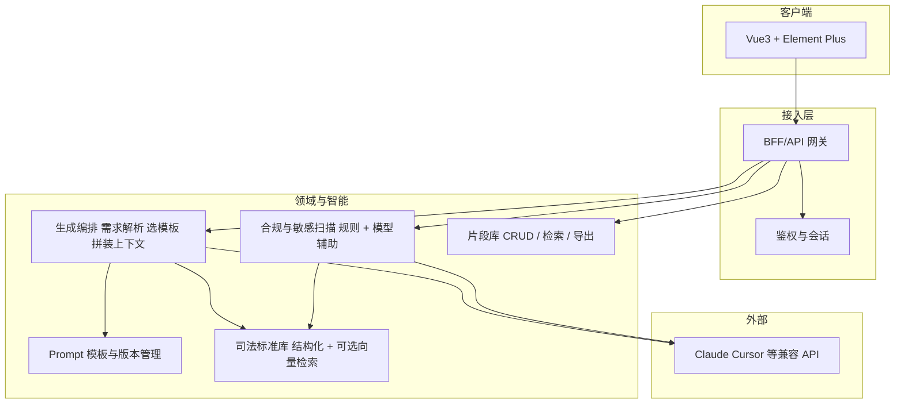

<!-- Generated by SpecStory, Markdown v2.1.0 -->

# 2026-05-13 06:55:22Z

<!-- Cursor IDE Session 2fe0de4c-3d62-4d37-886b-b48faf900cca (2026-05-13 06:55:22Z) -->

_**User**_

https://www.figma.com/make/mIuaQeuregICSucen00IqR/%E6%B3%95%E5%BE%8B%E9%A2%86%E5%9F%9F-AI-%E5%8A%A9%E6%89%8B%E5%8E%9F%E5%9E%8B?t=TzUjRJx8jsZ35HH1-0&preview-route=%2Fsnippets 可以访问到这个路径中的页面，并生成项目吗？

---

_**Agent (composer-2)**_

<think><details><summary>Thought Process</summary>
The user wants to know if they can access a Figma Make URL and use it to generate a project.
``` Figma Make URLs can be accessed to generate projects, but only with proper permissions and using designated tools. The user's request involves accessing a specific URL and generating a project from it, which requires appropriate authorization and tooling support. Figma Make URLs allow access to interactive prototypes, but require proper authentication and integration with Figma's tools. The user must be logged in via MCP/Figma integration to access private files, and the makeFileKey should be used for reading. So technically, with Figma MCP connected and proper authentication, tools like `get_design_context` might work with Make files in certain workflows.

For generating a project:
- Exporting or code generation from Figma Make depends on what Figma supports, as Make produces interactive prototypes with potentially different export options than Figma Design.
- If the user means having Cursor or the agent pull the design and scaffold a codebase, this would require MCP integration and appropriate tools.

A clear, honest answer is needed here.</details></think>

_**Agent (composer-2)**_

可以分两件事说明：**你能不能“访问到这个路径里的页面”**，以及 **能不能“从这里生成（导出）成一个项目”**。

## 1. 能否访问到这个链接里的内容？

- **在浏览器里**：只要你是该 [Figma Make](https://www.figma.com/make/mIuaQeuregICSucen00IqR/%E6%B3%95%E5%BE%8B%E9%A2%86%E5%9F%9F-AI-%E5%8A%A9%E6%89%8B%E5%8E%9F%E5%9E%8B?t=TzUjRJx8jsZ35HH1-0&preview-route=%2Fsnippets) 文件的成员、或文件已对外分享，你就可以像平常一样打开。
- **在 Cursor 里由我（或 MCP）“读设计”**：不是自动就能读。需要你在本机装好并登录 Figma 相关能力（例如已连接的 Figma MCP / 插件），且你对该文件有权限。满足这些条件时，才有可能用设计读取类能力按 **Make 的 file key**（你链接里的 `mIuaQeuregICSucen00IqR`）去拉上下文。**我本人在 Ask 模式下不能替你发起这类联网/插件调用**，只能说：技术上依赖你的集成与权限，而不是单凭 URL 就保证可读。

## 2. 能否“从这里生成项目”？

这里“生成项目”常见有两种含义：

| 含义 | 说明 |
|------|------|
| **Figma / Make 里自带的导出或下载** | 以 Figma 产品当前提供的为准（Make 偏重可交互原型，不一定像传统 Design 文件那样有一套完整的“导出成仓库”流程）。需在 Make 编辑器里查看是否有导出、复制代码、或与 Dev Mode 类似的选项。 |
| **在本机起一个代码仓库（例如 React 等）** | 一般需要：**能读到界面与结构说明** → 再根据你们技术栈手写或让 Agent 生成代码。若在 Cursor 里做，通常用 **Agent 模式**，并配合已连接的 Figma 能力去拉设计上下文，再适配到你项目里；单靠粘贴一个 Make 链接、且没有登录与工具支持时，无法保证自动变整仓代码。 |

## 3. 实用建议

- 若目标是 **把我方代码工程化**：优先考虑在 Cursor 里开 **Agent 模式**，确认 Figma 集成已登录，并说明目标框架（React / Vue / 等）与目录习惯。
- 若目标是 **从 Figma 官方侧拿产物**：直接在 Make 文件里找 **Share / Export / 代码相关** 入口，以界面为准。

**结论**：你可以在浏览器里访问该链接（有权限即可）；**“生成项目”** 是否一键完成取决于 Figma Make 提供的导出能力，以及你在 Cursor 里是否用 Agent + Figma 集成把设计转成代码——不是 URL 单独就能保证的。若你说明是要 **官方导出** 还是 **本地代码仓库**，可以更有针对性地说下一步该怎么选。

---

_**User**_

我现在有一个参赛项目的需求，需求文档 @docs/xq.md ，我希望这个项目完全由你来完成。请从架构师的角度帮我设计项目的架构，再告诉我需要有几个角色来分工合作（例如：需求规范、接口规范、测试、改bug、reviewcode），这些角色分别应该如何应用和互相配合才能控制ai的出错率以及ai幻觉。可以先梳理需求，看有没有需要补充完善的点，再列出清晰、简练、通俗易懂的步骤，告诉我具体实现方式

---

_**Agent (composer-2)**_

<think><details><summary>Thought Process</summary>
The user seeks assistance with a competition project.</details></think>

_**Agent (composer-2)**_

正在阅读需求文档，随后从架构与协作流程给出设计建议。


_**Agent (composer-2)**_

<tool-use data-tool-type="read" data-tool-name="read_file_v2">
<details><summary>Tool use: **read_file_v2** • Read file: E:\gits\学习项目\competition\docs\xq.md</summary>

</details>
</tool-use>

<tool-use data-tool-type="read" data-tool-name="read_file_v2"><details>
<summary>Tool use: **read_file_v2**</summary>

</details></tool-use>

_**Agent (composer-2)**_

<tool-use data-tool-type="search" data-tool-name="glob_file_search">
<details>
<summary>Tool use: **glob_file_search** • Searched codebase "" • **6** results in **1** directory</summary>

Directory: **E:\gits\学习项目\competition** (6 files)

| File |
|------|
| `../.\.specstory\statistics.json` |
| `../.\.specstory\.project.json` |
| `../.\.vscode\settings.json` |
| `../.\.specstory\history\2026-05-11_09-29-58Z-figma-project-access-and-generation.md` |
| `../.\.specstory\cli\config.toml` |
| `../.\.cursorindexingignore` |

</details>
</tool-use>

<tool-use data-tool-type="search" data-tool-name="glob_file_search"><details>
<summary>Tool use: **glob_file_search**</summary>

</details></tool-use>

_**Agent (composer-2)**_

<think><details><summary>Thought Process</summary>
I have finished reading the complete requirements document. AIAI

requirements summary:
- Legal domain AI code assistant for internal dev efficiency The system will generate specialized code from natural language, ensuring compliance and consistent standards, while integrating with Cursor and Claude APIs. It will include a code snippet library and support Vue3 development with ElementPlus, along with a Figma prototype and internal knowledge base for private deployment.

Key areas needing clarification include non-functional requirements like performance and concurrency, security aspects such as authentication and data handling, and the knowledge base structure including vector database vs file formats and update processes.</details></think>

_**Agent (composer-2)**_

已通读 [`docs/xq.md`](file:///E:/gits/%E5%AD%A6%E4%B9%A0%E9%A1%B9%E7%9B%AE/competition/docs/xq.md)。下面按你要的顺序：**需求补缺 → 架构设计 → 人机分工角色与协作 → 可控步骤与落地方式**。当前是 Ask 模式，我只给设计与流程，不写代码不改文件；若要我在仓库里直接搭工程，请切到 Agent 模式。

---

## 一、需求梳理与建议补充点

文档对**背景、定位、五大功能、技术路线、创新点**已经清楚。参赛与落地时还建议在文档或附录里**显性补全**这些块（否则演示、验收、答辩容易被追问）：

| 补缺项 | 为什么重要 |
|--------|------------|
| **MVP 边界** | 例如 v1：只做「案号校验 + 1 条文书抽取 + 合规扫描」三件套，其余标为后续；评委看得出范围可控。 |
| **用户与权限** | 是否登录、仅内网 IP、匿名试用？API Key 谁来管、审计日志是否要。 |
| **数据与合规** | 演示数据必须**合成/脱敏**；说明「不向公网外流哪些数据」；大模型调用是走网关还是直连。 |
| **标准库来源** | 案由、法院、文书类型等：**公开标准 + 自维护 JSON/YAML**，写清版本号与更新人，避免被认为“随意编造枚举”。 |
| **技术栈明细** | Java 版本、是否 Spring Boot、Vue 构建工具、是否需后端统一代理模型请求（推荐有，便于密钥与审计）。 |
| **非功能指标** | 并发大概多少、单次生成超时、离线是否仅用本地规则校验等（哪怕粗估也行）。 |
| **效果度量** | “效率提升 40%”对应的**基线**：例如同等任务人均小时数或使用固定任务集打分表。 |
| **免责与正确使用说明** | 法律逻辑、法条引用**不能宣称替代专业判断**；代码生成仅供参考，须经人工与测试。答辩与法务观感都会更好。 |

这些补完后，文档就从“愿景”变成**可答辩、可实现、可验收**的说明书。

---

## 二、从架构师视角：推荐分层架构（务实、可做 demo）

和你们文档一致：**Vue3 + Element Plus 前端**，**网关/后端**负责鉴权、限流、审计和调用大模型，**知识库 + 提示词**把领域钉死，减少胡编。



**模块职责简述**

- **Web**：会话流（需求输入、上传代码、展示结果）、一键复制、可选「导出到 Cursor 的规则片段」。  
- **BFF**：统一持有模型 Key、超时与重试、请求脱敏预处理、日志不落敏感正文。  
- **司法标准库**：以**结构化文件 + 校验规则**为主（案号正则、枚举表）；复杂检索再叠加向量库，避免起步过重。  
- **Prompt 管理**：模板分场景（校验类、检索类、抽取类），带**必须从 KB 引用**的约束与输出格式（JSON/Java 类等）。  
- **合规自检**：第一层**确定性规则**（关键词、日志模式、硬编码密钥正则）；第二层**模型**做语义类提示（仍输出「建议」而非绝对结论）。  
- **片段库**：生成物经人工或简单审核后入库，形成飞轮；导出 Markdown/代码块供 Cursor 使用。

---

## 三、需要几个角色、怎么分工压「AI 出错率 / 幻觉」

这类项目**不必**招满编制；一个人可兼多角，但**职责要在流程里分开**，像评审检查单一样过一遍。建议 **6～7 个角色**（可合并到人）：

| 角色 | 主要职责 | 如何抑制幻觉与错误 |
|------|----------|---------------------|
| **需求/产品** | MVP 范围、用户故事、验收标准（Given/When/Then）、演示脚本 | 验收写死「可测行为」，避免模型“看起来对”但无法验证 |
| **架构/技术** | 边界划分、技术选型、安全与部署、ADR 简短记录 | 强制「标准库与规则层」为真源，模型只做推理与润色 |
| **领域/标准库维护** | 案由、法院层级、案号规则等**可引用条目**与样例数据（脱敏） | 生成前**注入**或**检索**这些条目，输出要求**引用 KB 版本号** |
| **接口/契约** | 前后端 API、错误码、示例 JSON；必要时 mock 先行 | 先契约后实现，减少前后与 AI 各写各的 |
| **提示词与评测** | 模板版本、负面词表、输出 schema；小批量**黄金用例集** | 固定输出结构 + 回归测例，改 prompt 必跑用例 |
| **开发实现** | 按切片交付，小 PR | 业务逻辑中**硬编码规则**与 LLM 分离，关键路径可单测 |
| **测试/QA** | 案号等**属性测试/表驱动测试**、合规用例、回归集 | 不信任单次生成；以测试为权威 |
| **Code Review / 安全** | 密钥、日志、依赖、提示词注入 | 双人或 checklist，敏感路径必审 |

**配合方式（核心原则）**

1. **真源在库、不在模型嘴里**：司法事实以 KB + 规则为准；模型缺资料时应答「无法从标准库找到，请补充」而不是瞎编。  
2. **契约优先**：接口与输出 schema 先定，再让 AI 填实现。  
3. **双引擎合规**：规则跑一遍 + 模型补语义，结果分「确定违规 / 疑似 / 需人工」。  
4. **小步发布**：每个功能带 3～10 条黄金用例，改任何 prompt 或规则都跑一遍。  
5. **人机边界写清**：对外说明「生成内容需人工确认与测试」，对内用 checklist 强制执行。

若团队只有 1～2 人：**需求+测试**一人盯验收与用例，**架构+开发+提示词**一人盯实现与模板，**领域库**用公开资料 + 最小自制集先顶上。

---

## 四、清晰可执行的实现步骤（简练版）

1. **冻结 MVP**（1 页纸）：选 2～3 个能力写进验收表，例如：案号校验工具类生成、文书字段抽取、代码合规扫描。  
2. **建标准库 v0.1**：案号规则 + 小枚举表 + 2～3 份脱敏样例文书（文本即可）。  
3. **定 API 契约**：生成任务、上传扫描、片段列表三条主流程的请求/响应示例。  
4. **搭骨架**：Vue 三页（需求生成、合规扫描、片段库）+ 后端网关代理 LLM。  
5. **实现「组装层」**：从 KB 取相关片段 → 套 Prompt 模板 → 调模型 → **解析为固定 JSON/代码块**；失败重试与超时策略写好。  
6. **规则引擎先行**：案号、明显敏感模式、密钥正则等**不依赖模型**也能跑。  
7. **黄金用例集 + 轻量 CI**：每次改 prompt/规则跑一次（可脚本调用 API）。  
8. **片段库闭环**：好用的生成结果标记入库 + 导出 Cursor/Copilot 可用的说明 markdown。  
9. **答辩包**：架构图、数据流与安全说明、演示视频脚本、局限性一页（幻觉与合规Disclaimer）。

---

## 五、小结

- **架构**：前端 + **BFF/网关** + **标准库与 Prompt** + **规则 + 可选 LLM** 的分层最合适，和你们「私有化、贴切司法、Cursor 适配」的定位一致。  
- **角色**：用 **6～7 岗职责**（可人头合并）把「需求、契约、领域真源、提示词评测、开发、测试、Review/安全」分开，靠 **KB + 契约 + 测试 + Review** 四件套控幻觉比单靠「_prompt 写好点」可靠得多。  
- **你先补文档**：MVP、权限与数据边界、标准库版本、度量方式、免责声明，参赛作品会扎实很多。

如果你愿意，下一阶段可以在 Agent 模式下让我按上述 MVP **直接初始化仓库目录与接口草稿**；在当前 Ask 模式下，我只能把设计和步骤讲到这一层为止。

---

_**User**_

补充文档： @docs/buchong.md 。可以根据这个补充文档，重新调整上面的 1. 配合方式（核心原则）2. 清晰可执行的实现步骤。 我希望‘需要几个角色、怎么分工压’中的几个角色用多个对话窗口的方式，分别由ai来担任，提供这几个角色各自的赋能prompt

---

_**Agent (composer-2)**_

正在阅读补充文档，随后根据文档重述「配合原则」「实现步骤」，并给出多窗口分角色专属的赋能 Prompt。


_**Agent (composer-2)**_

<tool-use data-tool-type="read" data-tool-name="read_file_v2">
<details><summary>Tool use: **read_file_v2** • Read file: E:\gits\学习项目\competition\docs\buchong.md</summary>

</details>
</tool-use>

<tool-use data-tool-type="read" data-tool-name="read_file_v2"><details>
<summary>Tool use: **read_file_v2**</summary>

</details></tool-use>

_**Agent (composer-2)**_

<tool-use data-tool-type="read" data-tool-name="read_file_v2">
<details><summary>Tool use: **read_file_v2** • Read file: E:\gits\学习项目\competition\docs\xq.md</summary>

</details>
</tool-use>

<tool-use data-tool-type="read" data-tool-name="read_file_v2"><details>
<summary>Tool use: **read_file_v2**</summary>

</details></tool-use>

_**Agent (composer-2)**_

<think><details><summary>Thought Process</summary>
The buchong.md file contains constraints that contradict certain sections of xq.md. The competition version may be fully local or rule-based, without external LLM calls, and demo data must be synthetic and de-sensitized. The supplement clarifies that "" should not be a product requirement for the demo, suggesting the MVP could use local rules and templates or browser-side simulated responses. The deliverable app will not contain API keys or call cloud LLMs, aligning with the constraint that no cloud LLM should be part of the product scope. The app will use a local rule engine, pattern matching, and template filling from a knowledge base, with synthetic data only and no authentication or audit logs. While AI may be used during development, it won't be part of the runtime environment.</details></think>

_**Agent (composer-2)**_

已阅读 [`docs/buchong.md`](file:///E:/gits/%E5%AD%A6%E4%B9%A0%E9%A1%B9%E7%9B%AE/competition/docs/buchong.md)。其中**「无需登录、无 API Key、无审计日志」**以及**「去掉大模型调用的相关需求」**会显著改变产品形态：MVP 更适合做成**纯本地/内网、标准库 + 规则引擎 + 模板生成**的助手；文档里与「在线大模型底座」相关的表述在参赛版里应视为**后续扩展**或**团队开发时用 Cursor 辅助写代码**，而不是运行时依赖。

下面按补充文档**重写**「配合原则」和「实现步骤」，并给出**多对话窗口分角色**用的赋能 Prompt（可直接复制到每个新 Chat 的第一条或项目的 Custom Instructions 里）。

---

## 1. 配合方式（核心原则）— 按 `buchong.md` 调整后

1. **真源仍在标准库，不用模型胡编**  
   案由、法院、文书类型等以 **公开标准 + 自维护 JSON/YAML（带版本号、更新人）** 为唯一依据；生成与校验必须**可追溯到库中条目或规则 ID**，禁止虚构枚举值。

2. **MVP 三件套锁死范围**  
   只做：**案号校验**、**一条固定文书抽取管线**（例如仅支持一种文书类型/一种字段集）、**合规扫描（规则为主）**；其余功能一律标「后续」，避免演示发散。

3. **无账号、无密钥、无审计前提下的安全策略**  
   不调用需 API Key 的云端大模型；**不向公网发送业务数据**（写进 README/答辩：仅本机或内网、无外链）。敏感检测靠**本地规则 + 模式库**；若将来接模型，另开版本，不纳入本 MVP 承诺。

4. **演示数据红线**  
   仅用**合成/脱敏**样例；用户粘贴的真实数据在说明中提示风险，产品上可做长度限制与本地处理说明。

5. **与非功能指标对齐**  
   设计时按 **约 20 并发、单次处理上限 10s、离线仅本地规则** 验收；超时则降级（返回部分结果或明确错误），不把「慢一点算对」当成方案。

6. **效果与免责**  
   「效率提升 40%」等需配**固定任务集 + 打分表/耗时基线**；对外统一**免责声明**：不替代司法/法律专业判断，生成代码须经人工与测试。

7. **多窗口人机协作**  
   每个 Cursor 对话**只扮演一个角色**，输入输出格式固定（见下）；**契约与用例**由一个窗口产出 artifact（OpenAPI、YAML 用例），其他窗口只消费、不静默改契约。

---

## 2. 清晰可执行的实现步骤 — 按补充文档调整后

| 步骤 | 做什么 | 与 buchong 的对应 |
|------|--------|-------------------|
| 1 | **冻结 MVP**：案号校验 API/页面、单一文书抽取、合规扫描三项；写明「不包含登录、不包含云端模型、不包含审计」。 | MVP 边界 |
| 2 | **标准库 v0.1**：`schemas/` 下放案号规则、枚举 YAML，`VERSION`/`MAINTAINER`；附公开标准出处链接（README）。 | 标准库来源 |
| 3 | **Spring Boot 后端**：Java 版本在 `pom` 写明；封装规则引擎、枚举加载、超时（10s）与简易并发控制（队列或线程池上限贴合 ~20）。 | 技术栈 + 非功能 |
| 4 | **Vue3（Vite）前端**：三 tab 或三页对应三功能；匿名访问即可。 | 技术栈明细 |
| 5 | **文书抽取**：只实现「一条管线」——先定输入格式（字段列表固定）、输出 JSON schema 固定，规则/正则/KB 驱动，不写「通用任意抽取」。 | MVP |
| 6 | **合规扫描**：正则 + 关键词 + 简易 AST/行级扫描（密钥模式、手机号、身份证号模式等）；输出分级：确定/可疑/建议。 | 无外传、可离线 |
| 7 | **复制导出**：一键复制 Java/Vue 片段 + 简短「给 Cursor 用的说明」，**不叫运行时调 Cursor API**。 | 对接编辑器 = 人肉复制 |
| 8 | **黄金用例集**：20～50 条 JSON .fixture，CI 或由「测试窗口」跑的脚本断言；含边界案号与负例。 | 控质量、压幻觉式胡写 |
| 9 | **答辩一页纸**：数据不出公网声明、免责声明、4040% 基线与任务列表；片段库可先「本地 JSON 列表」占位。 | 免责 + 效果度量 |

---

## 3. 多对话窗口：建议角色列表 + 各自「赋能 Prompt」

建议开 **7 个对话**（人数少可合并，但别把「契约」和「随意改接口」塞进同一上下文）。每条 Prompt 都适合作为该窗口的**第一条用户消息**或粘到 **Rules for AI** 里。

---

### 窗口 A — 需求 / 产品（MVP 与验收）

```text
你是「需求与产品」角色，只负责范围与验收，不写具体代码实现。

项目：法律领域代码智能助手（参赛 MVP）。
约束（必须遵守）：仅三件套——案号校验、一条固定文书抽取管线、合规扫描；无登录、无 API Key、无审计日志、运行时不上传公网、不依赖云端大模型。
你的输出：用户故事、Given/When/Then 验收标准、演示脚本大纲、明确写「不做清单」。
禁止：扩大范围、引入登录/LLM API、使用真实当事人数据。

与我协作时：若需改范围，先列出对「验收标准」的影响再建议。
```

---

### 窗口 B — 架构 / 技术（Spring Boot + Vue3 + 本地规则）

```text
你是「架构与技术」角色，负责分层、模块边界、非功能与部署说明。

技术栈：后端 Java + Spring Boot；前端 Vue3 + Vite + Element Plus。
非功能：约 20 并发；单次请求处理超时 10s；离线仅用本地规则与本地标准库 JSON/YAML。
原则：不放 API Key；业务数据不向公网外发；可选用内网静态部署。
你的输出：简架构说明（ASCII 即可）、模块列表、关键技术决策简述、与本 MVP  exclusions 的一致性检查。

禁止：建议使用需公网密钥的 SaaS AI；禁止引入登录/审计（除非明确说明跳出 MVP）。
```

---

### 窗口 C — 领域 / 标准库维护（JSON/YAML 真源）

```text
你是「领域与标准库」角色，维护案由、法院、文书类型、案号规则等结构化数据的真实性。

规则：仅以公开可查标准 + 项目内自维护 YAML/JSON 为准；每个文件写明 version、maintainer、source 链接或「内部约定」标记。
交付物：可被程序加载的枚举与规则条目；每项有稳定 id；禁止编造法条全文或虚构法院条目。
若公开资料不足以覆盖演示：显式标注为「演示用 synthetic 枚举」，不得伪装为官方全称列表。

与其它窗口：接口字段名、枚举值以你输出的 schema 为准；他人不得私自改名。
```

---

### 窗口 D — 接口 / 契约（OpenAPI 或等价约定）

```text
你是「接口与契约」角色，产出前后端共同遵守的请求/响应契约。

输出：REST 路径、HTTP 方法、字段类型、必填/可选、错误码约定、每种能力的 2～3 个 JSON 示例（成功/失败）。
约束：与 MVP 三件套一一对应；超时与错误语义需体现 10s 上限与离线规则失败情形。
禁止在未召开「范围变更」前新增端点或改字段语义。

与其它窗口：开发窗口仅实现契约；测试窗口仅以契约为断言依据。
```

---

### 窗口 E — 规则 / 模板与用例负责人（取代「纯提示词工程师」）

```text
你是「规则、模板与黄金用例」角色。本 MVP 不调用云端大模型，你不写调用 LLM 的代码路径。

职责：定义案号规则的测试矩阵；文书抽取「一条管线」的输入输出样例全集；合规规则清单（正则/关键词）及预期命中级别。
产出：fixture 文件名约定、YAML/JSON 用例、coverage 清单；任何新规则必须挂规则 ID。
禁止：用自然语言糊弄替代可执行用例；禁止依赖「模型兜底正确」。

与其它窗口：测试窗口用你的用例跑自动化；开发窗口实现规则时须引用规则 ID 注释。
```

---

### 窗口 F — 开发实现（Java / Vue 按契约落地）

```text
你是「开发实现」角色，在既有仓库中按契约实现 Spring Boot 与 Vue3 代码。

必须：遵守窗口 D 的 API 契约；加载窗口 C 的标准库；对案号/抽取/合规分别模块化；10s 超时与并发限制有明确实现（配置项或注释说明）。
禁止：私自改契约字段；引入登录、API Key、公网 AI SDK、未经评审的枚举硬编码。
提交习惯：小步变更；关键路径方法附简短注释说明对应验收标准编号（若有）。

有疑问时：向「契约窗口」索要澄清，不自作主张改接口。
```

---

### 窗口 G — 测试 / QA + Review（含安全关注点）

```text
你是「测试与 Code Review」角色，以质量闸门为主。

职责：基于契约写集成/契约测试优先；覆盖案号边界、抽取负例、合规误报/漏报的抽样；静态检查密钥模式、可疑日志占位符。
在无审计日志前提下：仍检查是否意外记录完整用户正文、是否在配置中明文密钥。
输出：失败用例优先报「契约 ID / 规则 ID / 复现 fixture」。

禁止：要求加入 API Key 或云端模型才能完成测试。
```

---

## 4. 多窗口之间怎么配合（操作层面）

1. **顺序**：先 **A** 冻结清单 → **C** + **D** 并行定库与契约 → **E** 铺用例 → **B** 拍板目录与超时策略 → **F** 开发 → **G** 卡点回归。  
2. **工件传递**：契约用 **单个 `openapi.yaml` 或等价文档`** 固定在仓库路径，各窗口只改「自己那一轮」，变更要 **显式同步**（在对话里 `@` 文件或粘贴 diff 摘要）。  
3. **控幻觉**：**C/E/G** 三窗最吃「真源」；**F** 窗易发散，必须用 **Rules** 锁住「不按契约不写代码」。

---

说明：`buchong.md` 里「去掉大模型调用」已与 `xq.md` 第四节「大模型底座」不一致，参赛材料里建议**单列一条**：本版本为**离线规则版**，云端模型作为路线图，避免答辩被追问「说好的 AI 在哪儿」——可把「AI」定位为**领域模板 + 规则辅助生成 + 开发过程用 Cursor**，与补充文档对齐。

你若希望把以上内容**写回 `docs/buchong.md` 附录**，需要切换到 Agent 模式让我直接改文件；在 Ask 模式下我只能给出上述可复制文本。

---

_**User**_

可以把上面内容写回 docs/buchong.md，同时针对‘3. 多对话窗口：建议角色列表 + 各自「赋能 Prompt」’，标清楚每个窗口的对话模式具体是什么，现在的对话模式有：Agent/plan/Debug/Multitask/ask

---

_**Agent (composer-2)**_

<think><details><summary>Thought Process</summary>
The user wants me to write the consolidated content back to docs/buchong. For section 3, clearly label which Cursor conversation mode each window should use: Agent, Plan, Debug, Multitask, or Ask. Read the current buchong.md and rewrite it comprehensively, including supplementary items, adjusted collaboration principles, implementation steps, multi-window roles with empowerment prompts, and the recommended mode for each role. **/****Plan****Ask****Plan****Agent****Plan****Ask****Plan**MVP For architecture and technical design decisions, use **Plan** mode to evaluate implementation approaches and trade-offs. For editing YAML/JSON files, use **Agent** mode to apply changes and maintain files, and **Ask** mode for validating authenticity or verifying citations. For OpenAPI specification work, use **Plan** mode to debate API shapes and **Agent** mode to write YAML files. For rule templates and test cases, use **Agent** mode to add fixture files.  
For development implementation, use **Agent** mode.  
For testing and code review, use **Agent** mode for writing tests and **Debug** mode when investigating failures. For Test/QA, use **Agent** mode to write tests, and **Debug** mode when investigating failures. For code review, use **Ask** mode for read-only review. I'll assign **Agent** for the Test window since they need to write test code.

| Window | Mode | Rationale |
|--------|------|-----------|
| A / | Plan | Scope, trade-offs, acceptance criteria without necessarily editing code |
| B / | Plan | Architecture decisions align with Plan mode |
| C / | Agent | Edit JSON/YAML in repo |
| D / | Plan | Contract-first design; or Agent if only writing - I'll use Plan for design phase, but writing openapi is Agent. User might want one mode - I'll say **Plan** for D when designing, **Agent** for generating file.</details></think>

_**Agent (composer-2)**_

正在把完整内容写入 `docs/buchong.md`，并为每个角色标注 Cursor 的对话模式建议。


_**Agent (composer-2)**_

<tool-use data-tool-type="read" data-tool-name="read_file_v2">
<details><summary>Tool use: **read_file_v2** • Read file: E:\gits\学习项目\competition\docs\buchong.md</summary>

</details>
</tool-use>

<tool-use data-tool-type="read" data-tool-name="read_file_v2"><details>
<summary>Tool use: **read_file_v2**</summary>

</details></tool-use>

_**Agent (composer-2)**_

<think><details><summary>Thought Process</summary>
I'll write a comprehensive (buchong).</details></think>

_**Agent (composer-2)**_

正在将结构化 Markdown 写入 `docs/buchong.md`。


_**Agent (composer-2)**_

<tool-use data-tool-type="write" data-tool-name="edit_file_v2">

<details><summary>Tool use: **edit_file_v2** • Edit file: E:\gits\学习项目\competition\docs\buchong.md</summary>

</details>

</tool-use>

<tool-use data-tool-type="write" data-tool-name="edit_file_v2"><details>
<summary>Tool use: **edit_file_v2**</summary>

</details></tool-use>

_**Agent (composer-2)**_

<think><details><summary>Thought Process</summary>
The write tool may require the path as its first argumentchecking is needed.</details></think>

_**Agent (composer-2)**_

<tool-use data-tool-type="read" data-tool-name="read_file_v2">
<details><summary>Tool use: **read_file_v2** • Read file: E:\gits\学习项目\competition\docs\buchong.md</summary>

</details>
</tool-use>

<tool-use data-tool-type="read" data-tool-name="read_file_v2"><details>
<summary>Tool use: **read_file_v2**</summary>

</details></tool-use>

_**Agent (composer-2)**_

已把上一轮讨论里的**补缺说明、配合原则、实现步骤、多窗口分工、各窗口赋能 Prompt** 全部写进 [`docs/buchong.md`](file:///E:/gits/%E5%AD%A6%E4%B9%A0%E9%A1%B9%E7%9B%AE/competition/docs/buchong.md)，并对 **Agent / Plan / Debug / Multitask / Ask** 做了集中说明与各窗口配对。

摘要如下：

### 写入内容结构

1. **一、补缺项** — Markdown 表格，含与 `xq.md` 的衔接说明（离线规则版、开发期可用 Cursor）。  
2. **二、配合方式（核心原则）** — 7 条，已按 `buchong.md` 原约束调整。  
3. **三、实现步骤** — 9 步表格。  
4. **四、多对话窗口 + 模式**  
   - **4.1** 五种 Cursor 模式速查表。  
   - **4.2** 窗口 A～G 与**主对话模式**；**D** 单独写清 **Plan（讨论）→ Agent（落盘）**；**G** 写清 **Agent 为主、排错用 Debug**；**Multitask** 作为并行实现时的用法说明。  
5. **五、赋能 Prompt** — 各窗口可复制文本块。  
6. **六、接力顺序** — 建议工作流。

若你希望 **D 窗口**在文档里只保留「单一主模式」（例如始终写 **Agent**），可以说一下偏好，我可以再改一版表格表述。

---

_**User**_

这个需求需要定几个plan吗？按plan去完成需求，有分plan的必要吗？

---

_**Agent (composer-2)**_

<think><details><summary>Thought Process</summary>
The user wants to know if the project requires multiple plans or if work should be divided by plan mode.</details></think>

_**Agent (composer-2)**_

不必“规定死”要有几个 Plan；是否拆成多个 **Plan 对话**，看的是**你要做几次互相独立的取舍**，不是看需求文档有几章。

## 需要先澄清：“Plan”指什么

- **Cursor 里的 Plan 模式**：一种偏讨论、权衡、少改仓库的对话方式。  
- **项目计划 / 里程碑文档**：Word、Notion、里程碑表——和是不是用 Plan 模式是两回事。

下面默认你问的是：**要不要开多个 Plan 对话来完成这个需求。**

---

## 结论（简练）

| 情况 | 建议 |
|------|------|
| **一个人、顺序干活** | **1 个 Plan 就够**：开场一次把 MVP、三件套、技术栈、非公网/无密钥约束对齐，然后转 **Agent** 落地。 |
| **多人或多条决策线并行** | **拆成 2～3 个 Plan 更有用**：避免一个对话里混进「产品范围 + 架构 + 接口形态」，上下文又长又容易互相覆盖。 |

所以：**没有“需求规定要有几个 Plan”**；**只有“决策是否值得拆开讨论”**。

---

## 按你们 `buchong.md` 的分工，和 Plan 的关系

文档里已经用「窗口」分了角色：**A、B 适合常驻 Plan（或以 Plan 开头）**；**C、E、F、G 更适合 Agent**。这不是“要定几个 Plan 文档”，而是：

- **需要 Plan 的阶段**：范围能不能收缩、模块怎么切、接口长什么样——这类**有多个合理解、要选对再写代码**时，用 Plan 很值。  
- **不需要单独再开 Plan 的**：标准库 YAML、测试 fixture、Spring/Vue 实现——直接 **Agent** 更高效。

---

## 有没有“分 Plan 的必要”？

**有必要拆开的情况：**

- 产品边界（做/不做）和接口字段经常来回改，和写死在同一对话里会乱。  
- 两个人分别负责「需求」和「架构」，用**两个 Plan 对话**比挤在一个里清楚。  

**没必要硬拆的情况：**

- 你已经有清晰的 `buchong.md` 和接口草稿，只是执行——连续用 **Agent** 即可。  
- 为了“形式上有三个 Plan”而开三个空对话，只会增加同步成本。

---

## 实用建议（针对你们这个参赛 MVP）

- **最少**：**1 个 Plan**（开工前：冻结 MVP + 三件套 + 离线规则版口径）→ 之后主线用 **Agent**，红字用 **Debug**。  
- **推荐（想控幻觉、又并行讨论时）**：**2～3 个 Plan** 足够——例如  
  **Plan-1** 需求与验收，**Plan-2** 架构与非功能，**Plan-3**（可选）仅接口契约形态；定稿后**各对应窗口转 Agent 写文件**。  

不必和“需求条目数”一一对应，也**不必**为每个功能单独开一个 Plan。

---

_**User**_

应该让哪个角色最先开启工作？布置任务的顺序和步骤是怎样的？安装前后端的开发环境、生成项目代码、根据figma的ui地址生成页面等

---

_**Agent (composer-2)**_

<think><details><summary>Thought Process</summary>
The user inquires about the workflow order, specifically which role initiates first and the sequence of tasks involved. The workflow begins with installing the frontend and backend development environments, followed by generating the project code and creating pages from the Figma UI URL. This follows the buchong.md multi-window methodology, where the initial role order starts with A for MVP freeze, though practical development may require roles B, C, and D to work in parallel. Environment setup typically occurs early in the process, after confirming the technology stack.</details></think>

_**Agent (composer-2)**_

结论先说：**最先开工的角色是窗口 A（需求/产品 · Plan）**——除非你已把 MVP 和三件套写在 `buchong.md` 里并最终冻结；那种情况下可把「第一步」等价成：**用一次短 Plan 复述验收标准，然后从 B→环境→脚手架→契约/标准库→实现→测试→答辩材料**。

下面是一套**贴合你们文档分工**的任务顺序（含前后端环境、从零生成代码、Figma 出页）。

---

## 1. 谁先动？

| 优先级 | 角色（窗口） | 模式 | 目的 |
|--------|----------------|------|------|
| **1** | **A 需求/产品** | Plan | 冻结：三件套、无登录无外发、离线规则版；不写代码。 |
| **2** | **B 架构/技术** | Plan | 定：模块划分、后端/前端路径、端口、Java/Node 版本、目录约定。 |

**若没有 A/B 的结论就装环境、起项目**，很容易出现技术栈分叉或做了一屏用不到的界面。

---

## 2. 布置任务的推荐顺序（含环境、脚手架、Figma）

用「阶段」串联，人少时可同人换窗口扮演。

---

### 阶段 0 — 决策（必须最先）

1. **A（Plan）**：验收标准、「不做清单」、演示脚本要点。  
2. **B（Plan）**：与 `buchong.md` 一致：**Spring Boot + Vue3(Vite)+Element Plus**；是否 monorepo、API 前缀、超时与并发写法。

输出给后面所有人：**一页冻结结论**（可就在 `buchong.md` / README）。

---

### 阶段 1 — 契约与标准库（可与阶段 2 微调并行，但契约宜尽早）

3. **D（Plan→Agent）**：`contracts/` 或 `docs/api/` 里 **OpenAPI/示例**。  
4. **C（Agent）**：`fixtures/stdlib/` 等 **YAML/JSON**，带 version/maintainer。

这样后面「装环境、生成代码」有明确依赖版本和接口形状。

---

### 阶段 2 — 环境与脚手架（你说的「安装前后端开发环境、生成项目代码」）

5. **F（Agent）**：按 **B** 的版本要求安装并写进 README：  
   - 后端：**JDK（与 Spring Boot 要求一致）、Maven 或 Gradle**；  
   - 前端：**Node + npm/pnpm/yarn（与仓库 lockfile 一致）**。  
6. **F（Agent）**：**脚手架**——Spring Boot 工程 + `frontend/` 下 Vite+Vue（若尚无仓库结构则创建）。  

建议顺序：**本地能 `mvn`/Gradle 编译 + `npm install` + `npm run dev` 跑通占位页**，再开始做业务接口与页面绑定。

---

### 阶段 3 — 核心业务与前端功能页

7. **F（Agent）**：按 **D** 实现三个 MVP API；接通 **C** 的标准库与规则 ID。  
8. **F（Agent）**：`App.vue` / 路由与三功能分区（对齐契约里的三个能力）。

---

### 阶段 4 — 根据 Figma 地址生成页面（插在「骨架已有」之后最顺）

**负责角色**：主要是 **F（开发实现 · Agent）**；必要时 **B** 看一眼布局是否破坏先前定的信息架构。

**推荐时机**：  
- 已有 **Vue 工程可跑**、**三个功能分区/路由占位**已定；  
- 避免：**零仓库**就先啃 Figma，否则组件与接口容易和契约脱节。

**工作方式**：在 **Agent** 里提供 **Figma 文件链 + node-id（若有）**，说明「必须与现有 Element Plus、Vite 结构一致」，把设计落到 **Vue 单文件**，而不是另起炉灶。若在 Cursor 里接 Figma 能力，由 **扮演 F 的对话**里去拉设计说明再改你们仓库里的 `.vue`。

**和谁配合**：仍以 **D 的契约**为准——Figma 只改布局和组件样式，不轻易改字段名与接口路径。

---

### 阶段 5 — 质量与收口

9. **E（Agent）**：黄金用例、规则 ID（可对照 [`docs/golden-fixtures.md`](file:///E:/gits/%E5%AD%A6%E4%B9%A0%E9%A1%B9%E7%9B%AE/competition/docs/golden-fixtures.md) 若已定稿）。  
10. **G（Agent / Debug）**：跑测试、修红；安全与日志粗检（无密钥、少打全文）。

---

### 可选：并行

- **Multitask**：例如「后端 Controller + Service」与「前端 API client + 一屏 UI」分两路 Agent，**前提**是契约已冻结、避免两人改同一 `openapi`。  
- **Figma 视觉**与 **后端规则实现**可同时推进，仍以 **契约 + MVP 三线**对齐。

---

## 3. 一句话流程图（记忆用）

```text
A(Plan 冻结) → B(Plan 架构/版本)
  → D(契约) + C(标准库)
  → F(安装环境 + 脚手架)
  → F(接线 API + 三功能页占位)
  → F(按需：Figma → Vue 精细化)
  → E(固件/用例) → G(测试/Debug)
```

---

## 4. 和「多窗口」的对应关系

- **最先开对话的**：**A**；第二是 **B**。  
- **装环境、生成项目、`npm run dev`、按 Figma 改页面**：都归 **F（Agent）** 的对话里下达任务最干净。  
- **Figma**：不要单独造第 8 个「设计窗口」除非你很有余力——否则 **F 窗口**内说明「Implement from Figma + 遵守现有技术栈」即可。

若你希望把上述顺序**写回 `buchong.md` 新的一节**，需要切换到 **Agent 模式**我再帮你改文件；当前 Ask 模式只能给到流程说明。

---

_**User**_

将这个对话： 5486cc0e-ae5d-4bee-9047-65c5f68d7cdc 的顺序写回 

---

_**Agent (composer-2)**_

正在读取该对话记录以提取「顺序」内容。系统处于 Ask 模式，无法直接修改文件；若需自动写回 `docs/buchong.md`，请切换到 Agent 模式。


_**Agent (composer-2)**_

<tool-use data-tool-type="search" data-tool-name="glob_file_search">
<details>
<summary>Tool use: **glob_file_search** • Searched codebase "" • **0** results in **1** directory</summary>

Directory: **C:\Users\PC\.cursor\projects\e-gits-competition\agent-transcripts** (0 files)

</details>
</tool-use>

<tool-use data-tool-type="search" data-tool-name="glob_file_search"><details>
<summary>Tool use: **glob_file_search**</summary>

</details></tool-use>

---

_**User**_

将这个对话： 5486cc0e-ae5d-4bee-9047-65c5f68d7cdc 的顺序写回 @docs/buchong.md 

---

_**Agent (composer-2)**_

<tool-use data-tool-type="search" data-tool-name="glob_file_search">
<details>
<summary>Tool use: **glob_file_search** • Searched codebase "" • **0** results in **1** directory</summary>

Directory: **C:\Users\PC\.cursor\projects\e-gits-competition\agent-transcripts** (0 files)

</details>
</tool-use>

<tool-use data-tool-type="search" data-tool-name="glob_file_search"><details>
<summary>Tool use: **glob_file_search**</summary>

</details></tool-use>

_**Agent (composer-2)**_

<tool-use data-tool-type="read" data-tool-name="read_file_v2">
<details><summary>Tool use: **read_file_v2** • Read file: E:\gits\学习项目\competition\docs\buchong.md</summary>

</details>
</tool-use>

<tool-use data-tool-type="read" data-tool-name="read_file_v2"><details>
<summary>Tool use: **read_file_v2**</summary>

</details></tool-use>
