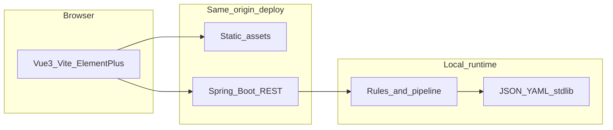

# 架构与技术陈述（参赛 MVP）

本文档与 [mvp-acceptance.md](./mvp-acceptance.md)、[buchong.md](./buchong.md)、[README](../README.md) 口径一致；API 真源见 [contracts/openapi.yaml](../contracts/openapi.yaml)。

**真源分工（更严者优先）：** 产品范围、冲突优先级、三件套最小 GWT 与答辩摘要以 [mvp-acceptance.md](./mvp-acceptance.md) 文首 **[阶段 0 冻结（跨窗口真源）](./mvp-acceptance.md#阶段-0-冻结跨窗口真源)** 为准（若渲染器不识别中文锚点，打开该文首一节即可）；流程、非功能数字与多窗口接力仍以 [buchong.md](./buchong.md) 为母版。以下 **第 5 节** 为窗口 B 对 F / D / C 的 **可执行技术轮廓**，与当前仓库目录一致，不单列第二份正文以免漂移。

## 1. 简洁架构说明

**总体形态：** 浏览器内的 **Vue3 SPA** 通过 **同源 HTTP** 调用 **Spring Boot** 提供的 REST API；**静态资源**（`index.html` + 打包后的 JS/CSS）由 **反向代理或 Spring 静态资源** 与 API 部署在同一 **origin**（内网或本机），避免 CORS 与跨站凭证复杂度，并便于答辩叙事「页面与业务处理同域、不外传业务数据」。

**逻辑分层（后端）：**

- **接入层（Web）：** Spring MVC Controller，负责校验请求体、HTTP 状态与错误封装；与 [contracts/openapi.yaml](../contracts/openapi.yaml) 对齐。
- **应用层（用例）：** 三件套各自 **Facade / Application Service**：案号校验、文书抽取（仅 `civil-judgment-v1`）、合规扫描；编排「加载规则 → 执行 → 组装 DTO」，**不**混入持久化用户态或审计。
- **领域层（规则与管道）：** 案号规则引擎、固定管线解析器、合规规则匹配（规则 ID、分级输出）；依赖 **纯本地** 输入与 **仓库内** 标准库快照。
- **基础设施层：** 启动时加载 `fixtures/stdlib` 或等价路径下的 **JSON/YAML**（version / maintainer / source）；可选本地文件监视仅用于开发，生产以内嵌或打包资源为准。

**逻辑分层（前端）：**

- **页面与路由：** 三个功能分区或路由（案号 / 抽取 / 合规），Element Plus 表单与结果展示。
- **API 客户端：** 单例 HTTP 客户端（如 `fetch`/`axios`），base URL 相对路径，**无** API Key 头、**无** Token 存储。
- **复制导出：** 纯浏览器能力复制摘要/代码块说明，**不**调用 Cursor/Claude 运行时 API。

**非功能落地要点（与 [buchong.md](./buchong.md) 一致）：**

- **约 20 并发：** 默认可用嵌入式 Tomcat 默认线程模型 + 合理 `server.tomcat.*`（或等价容器配置）；避免在单请求内阻塞过多线程；重 CPU 路径可限制并行或排队（仍须在 **10s** 内给出确定结果或超时错误）。
- **单次 10s 超时：** Spring 层可用 `TimeoutException`/统一异常处理器映射为契约中的 **确定错误**（与 [mvp-acceptance.md](./mvp-acceptance.md) S0-Time 一致）；前端配套请求超时与友好提示。
- **离线仅用本地规则与标准库：** 运行时 **零** 出站调用公网 LLM/SDK；标准库与规则 **只读** 仓库内文件；合规扫描为 **正则/关键词/轻量结构化**，结果可追溯到 **规则 ID**（见 [golden-fixtures.md](./golden-fixtures.md)）。

## 2. 模块列表（建议仓库映射）

| 模块（职责） | 边界说明 |
|-------------|---------|
| **api-web**（Controller + DTO 映射） | 仅 HTTP 与校验；不实现业务规则 |
| **case-no**（案号校验） | 规则 ID、标准库条目引用；与黄金用例对齐 |
| **extract-civil-judgment-v1**（文书抽取） | **唯一**冻结管线；失败语义：`PIPELINE_MISMATCH` 等 |
| **compliance-scan**（合规扫描） | 本地规则、分级输出；无「模型判断」兜底 |
| **stdlib-loader**（标准库加载） | version / maintainer / source；启动缓存 |
| **rules-registry**（规则注册与元数据） | 规则 ID → 实现绑定；便于测试枚举 |
| **frontend**（Vue3 应用） | 三入口 UI + 复制导出；无登录态 |
| **contracts**（OpenAPI） | [contracts/openapi.yaml](../contracts/openapi.yaml) 为契约真源 |
| **fixtures**（黄金用例） | [fixtures/](../fixtures/) 合成数据 + 回归 |

具体 Java package 名可与上表一一对应或由实现窗口折叠为更少包，但**边界**应清晰，避免三功能代码缠绕。

## 3. 部署陈述（内网 / 本机）

- **推荐叙述：** Nginx（或同类）**同一 server** 下：`/` → 静态目录，`/api` → 反代至 Spring Boot；或开发期 Vite **proxy** 到本地 8080，生产打成 **单域**。
- **数据流：** 用户粘贴内容 **POST 至同源后端**，处理在进程内完成；**不**将粘贴正文作为「调用公网 AI 服务」的载荷。

## 4. MVP exclusions 一致性检查

| 约束（来源 [buchong.md](./buchong.md) / [README](../README.md)） | 架构是否遵守 | 备注 |
|--------------------------------|-------------|------|
| 三件套のみ；无扩展 NL→任意代码生成 | **一致** | 文书仅 `civil-judgment-v1`；不设计通用代码生成服务 |
| 无登录、无账号体系 | **一致** | 无 Session/JWT/OAuth 模块 |
| 产品中无 API Key、无运行时云端密钥型 LLM | **一致** | 禁止引入 OpenAI/Anthropic 等 SDK 于核心路径；**开发时用 Cursor 写代码**与**产品运行时**分离（补充文档已写明） |
| 无审计日志产品化 | **一致** | 不设计「谁何时处理了何条数据」的存储与查询；日志仅技术级且避免记录全文粘贴（对齐 Epic 与测试窗口关注点） |
| 业务数据不向公网上传 | **一致** | 架构陈述为同源后端本地处理；CI 拉依赖与运行时分说 |
| 约 20 并发、10s 超时、离线本地规则与标准库 | **一致** | 容器线程与超时策略显式配置；stdlib/rules 本地化 |

**与 [xq.md](./xq.md) 的差异（属预期、非矛盾）：**

- `xq.md` 中「大模型底座：Claude/Cursor API」「知识库外接」「代码片段库自动沉淀」等属 **长期愿景**；参赛 MVP 以 [buchong.md](./buchong.md) 为准：**运行时不用 API Key 型云端模型**，**不实现**账号与审计，**不承诺**知识库外接与自动片段库；答辩中可表述为「本期规则+标准库，后续可替换/增强推理层，且外接须单独版本与合规评估」。

**禁止项自检：**

- 不在架构中建议「公网密钥型 AI 运行时」作为必选组件。
- 不擅自加入登录、RBAC 或审计产品模块。

## 5. 阶段 0 技术轮廓（与现状对齐）

本节是 **阶段 0：决策** 窗口 B 的落盘结论，供契约（D）、标准库（C）与环境/脚手架（F）执行；**不引入** MVP 之外的组件（登录、OAuth、云端 AI SDK、外向消息队列集群等）。

### 5.1 仓库 / 模块拓扑

| 路径 | 角色 | 与现状 |
|------|------|--------|
| [`backend/`](../backend/) | Spring Boot：REST、应用服务、规则与标准库加载（包根 `com.legaldev.mvp`） | **已存在**，建议维持 |
| [`frontend/`](../frontend/) | Vue3 + Vite + Element Plus SPA | **已存在**，建议维持 |
| [`contracts/openapi.yaml`](../contracts/openapi.yaml) | API 与 DTO / 错误形态契约真源 | **已存在** |
| [`fixtures/`](../fixtures/) | 黄金请求/期望、样本文本；[`fixtures/stdlib/`](../fixtures/stdlib/) 存放带 `version` / `maintainer` / `source` 的 YAML | **已存在**（含 `stdlib-index`、案号规则、合规规则书、文书管线注册） |
| [`docs/`](./) | `mvp-acceptance`、`buchong`、`golden-fixtures.md`、本文档等；阶段 0 冻结条文集中在 `mvp-acceptance` | **建议保持** |

**结论：** 维持 `backend/`、`frontend/`、`contracts/`、`fixtures/` 拓扑即可；无需为 MVP 单独引入 `api-gateway` 仓库或共享库模块。

### 5.2 运行时约束如何落地（策略级）

**10s 单次处理上限**

- **应用内：** 以「整次业务调用」为边界（controller → service → 规则/抽取），用受控执行（如专用 `Executor` + `Future.get(timeout)` 或等价拦截）在超时时抛出可映射到契约的语义；由全局异常处理统一为 **确定性 HTTP + 机器可读 `code`**（与 OpenAPI `ErrorResponse` / 抽取专用错误体一致）。与 README「超时（HTTP）映射声明」及 [docs/api/nfr-and-timeout.md](./api/nfr-and-timeout.md) 保持一致。
- **反向代理（若有）：** `proxy_read_timeout` 等略大于 **10s**（例如 12–15s），避免代理先于应用切断；**产品承诺**仍以应用层 10s 为准。开发期 Vite proxy 同步配置超时。
- **前端：** HTTP 客户端 **≥10s** 超时，文案与后端 `code` 对齐，避免无限 pending。

**约 20 并发**

- **默认：** 嵌入式 Tomcat **工作线程数** **≥ 20**（`server.tomcat.threads.max` 等按环境可调），保证典型场景下不因线程池过小产生「假超时」。
- **策略：** MVP **不必**引入外向消息队列；若单请求内有并行子任务，**限制并行度**并受 10s 总预算约束。
- **可选护栏：** 对解析/正则等 CPU 密集段使用有界线程池或串行化深度扫描，避免与 Tomcat 线程争用导致尾部延迟（由 F 按 Profiling 决定）。

**原则：** 无分布式锁、无外呼公网，单机/单进程即可满足阶段 0 叙事。

### 5.3 标准库加载方式

- **位置：** 开发/演示以 [`fixtures/stdlib/`](../fixtures/stdlib/) 为权威文件树；生产/打包可将同内容复制到 `classpath:/stdlib/`（或 JAR 内资源），通过配置 `stdlib.root` / 索引文件路径切换（与 [`StdlibProperties`](../backend/src/main/java/com/legaldev/mvp/config/StdlibProperties.java) 思路一致）。
- **索引：** 维持 **单一入口索引**（如 `stdlib-index.v0_1_0_demo.yaml`）列出各子库文件与版本；启动时先解析索引，再按需加载案号规则书、合规规则书、文书管线注册表。
- **校验：** 启动期 **fail-fast**（或「降级为仅健康检查失败」二选一，须在契约/验收中写死一种）：每条加载路径必须存在；每条文档顶层或索引条目必须含 **`version`**（及 `maintainer`，`source`/`synthetic` 按 [buchong.md](./buchong.md)）；缺失则**拒绝启动**或**暴露 `/actuator/health` 失败**（若启用 Spring Boot Actuator），避免「静默空规则」。

### 5.4 三功能后端切分（分层概念）

与上文第 2 节模块表一致，落地到 **当前** 包结构可参考：

| 能力 | Web（接入） | 应用服务 | 领域 / 规则 | 基础设施 |
|------|-------------|----------|-------------|----------|
| **案号校验** | `web.CaseNumberController` + `web.dto.*` | `caseno.CaseNumberService` | `stdlib.CaseNumberRulebook`（规则 ID） | `stdlib.StdlibBootstrap`、配置 |
| **文书抽取**（仅 `civil-judgment-v1`） | `web.DocumentExtractController` + DTO | `extract.CivilJudgmentExtractService` | `stdlib.DocumentPipelineRegistry`；`extract.ExtractBusinessException` | 标准库 YAML |
| **合规扫描** | `web.ComplianceController` | `compliance.ComplianceScanService` | `stdlib.ComplianceRulebook`（规则 ID + 分级） | 标准库 YAML |

横切：`web.GlobalExceptionHandler`、`web.ProcessingBoundary`（或等价超时切面）、`config.*`。

### 5.5 部署与答辩口径（与 README 摘要对齐）

- **形态：** 本机或内网单机（或同网段多客户端指向一台服务）；**同源**：静态资源与 API 同域（Nginx 一体，或 Spring 托管 `frontend/dist`）。
- **无密钥：** 产品运行时无 API Key、无 OAuth/登录；构建/CI 依赖外网与 **业务链路不外传** 分开陈述。
- **数据：** 用户粘贴内容 POST 至同源后端，进程内处理；不将业务正文发往公网 AI 服务。
- **免责与量化：** 高效率类口号 **不等于** MVP 验收；未验证的量化见 [mvp-acceptance.md](./mvp-acceptance.md) 不做清单第 9 条及 [buchong.md](./buchong.md) 效果度量；法律输出不替代专业判断（与 README 免责声明一致）。

### 5.6 给下一阶段（契约 D + 标准库 C）的交接清单

**对窗口 D（契约）**

- **API 粒度（三条主线与三件套一一对应）：**
  - 案号校验：`POST` 单资源，请求为候选字符串/批，响应含 `valid`、`reason`、`ruleRefs[]`。
  - 文书抽取：单资源，`pipelineId` + `schemaVersion` + 正文；成功体冻结为 `CivilJudgmentV1Extract`；失败体独立 schema。
  - 合规扫描：单资源，文本/源码 + 可选 `ruleSetId`；响应为分级 findings，每条必选 `ruleId`。
- **错误码 / 语义（在 OpenAPI 枚举或文档中冻结）：**
  - 通用：`VALIDATION_ERROR`、`TIMEOUT`、`INTERNAL`（名称以实现为准，须稳定）。
  - 抽取：`PIPELINE_MISMATCH`、`INSUFFICIENT_MARKERS` 等（与 [`fixtures/document-extract/`](../fixtures/document-extract/) 及验收一致）。
  - 超时与 4xx/5xx 映射表、是否允许合规「部分结果 + 超时标记」——二选一并写死（当前实现与 [README](../README.md) 声明为全局 **504** + `ErrorResponse` 时可对齐）。
- **横切字段：** `requestId`（可选）、`schemaVersion` 与文书契约对齐。

**对窗口 C（标准库）**

- **建议文件族（可演进版本后缀）：**
  - `stdlib-index.*.yaml`：索引与全局 `version` / `maintainer`。
  - `rules-case-number-*.yaml`（或等价）：案号规则列表与 **规则 ID**。
  - `document-pipelines-*.yaml`：仅注册 `civil-judgment-v1` 及元数据（markers、`schemaVersion`）。
  - `compliance-rules-*.yaml`：规则 ID、pattern、级别（deterministic / suspicious / suggestion）。
- **每条目类型：** 法院/案由/文书类型等枚举若进入 MVP，须带 `source` 或显式 `synthetic`，与 [`fixtures/stdlib/README.md`](../fixtures/stdlib/README.md) 一致。

**附：** 若需 GitHub 等平台稳定锚点，可将 `mvp-acceptance` 中「阶段 0 冻结」标题改为英文 slug（如 `phase-0-freeze`）；属单独文档轮次，不改变本节技术结论。

**MVP 外组件：** 本轮廓 **不引入** 登录、OAuth、审计产品化、公网密钥型 AI SDK、消息队列集群。
