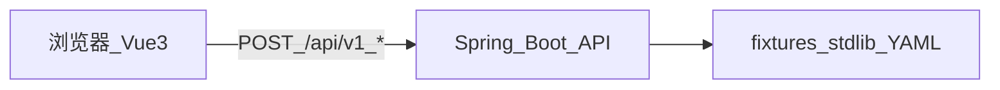

# 参赛 MVP 答辩一页纸（Legal Dev Assistant）

> **打印提示：** A4、正文可用 10.5～11pt；路演口播约 **6～8 分钟**可对齐全文。真源：[mvp-acceptance.md](./mvp-acceptance.md)、[golden-fixtures.md](./golden-fixtures.md)、[openapi.yaml](../contracts/openapi.yaml)。  
> **数据：** 演示仅用仓库 **synthetic fixture**，禁用真实当事人或可识别案情。

---

## 一句话定位

面向法律软件研发的 **离线三件套**：**案号格式校验**、**单条民事判决书抽取管线**（`civil-judgment-v1`）、**本地合规规则扫描** —— **规则 + 标准库** 驱动，**非**运行时依赖云端大模型。

---

## 产品边界（评委必问）

| 不做 | 我们怎么做 |
|------|------------|
| 登录 / API Key / 审计日志 | 匿名本机或内网访问；**不设计**键控云服务链路 |
| 业务数据上公网 | 核心能力 **不须** 把粘贴内容发到公网即可完成（见 [README](../README.md)） |
| 「AI 猜文书」 | 文书仅 **一条冻结管线**；失败 → **422 + errorCode**，**不**调 LLM 猜类型 |
| 司法结论 | 输出为开发辅助与规则命中；**不替代**律师/法官/合规负责人判断 |

---

## 架构与数据流（口述 30s）

浏览器 → 同源或内网 **`/api/v1/...`** → 本地规则与 **stdlib**（打包资源）→ JSON 返回；**无**公网模型回调。

---

## 三条能力（界面 Tab 顺序 = 演示顺序）

1. **案号校验** — 返回 `valid` + `ruleRefs`（如 `CN-YEAR-SP-001`），非法带 **`reasonCode`**。  
2. **文书抽取** — 固定 `pipelineId` + `schemaVersion`；成功返回 **`extract`** 字段集；不匹配 → **`PIPELINE_MISMATCH` / `INSUFFICIENT_MARKERS`**。  
3. **合规扫描** — **`findings[]`** 含 **`ruleId` + severity**（deterministic / suspicious）；支持 **复制摘要**。

---

## 非功能口径（对齐验收）

| 项 | 口径 |
|----|------|
| 并发 | 容量设计约 **20**，线程池/配置可追溯 |
| 单次处理 | **≤10s** 预算；逾时 → **504** + `REQUEST_TIMEOUT`（三路径一致，见 [README](../README.md)） |
| 回归 | `mvn test` + **20** 条 scenario 黄金矩阵（[golden-fixtures.md](./golden-fixtures.md)） |

---

## 演示三步（界面 + 话术）

| 步 | 点哪里 | 一句话 |
|----|--------|--------|
| 1 | **案号**：2 正 2 负（fixture） | 结果对齐 **规则 ID**，**synthetic-demo** 标准库可追溯 |
| 2 | **文书**：`success-sample.txt` + `pipeline-mismatch-sample.txt` | **单管线冻结**；422 是 **契约失败**，不是模型乱猜 |
| 3 | **合规**：deterministic 样例 + clean 样例 | **本地规则**、可 **复制摘要**；不调用 Cursor API |

**合规金句（收尾）：** 本演示 **无登录、无密钥、无审计**；处理在 **本机/内网**；**不向公网上传业务数据** 才能完成上述三功能。

---

## 效果与免责（防追问）

- **效率 40%** 等话术须配 **基线或任务打分表**；否则答辩改为「规则可追溯 / 返工减少」等定性表述。  
- 案号/规则为 **演示形态**（`synthetic-demo`），**非**全国法院编号全集认证。

---

## 延伸阅读（备查）

- 完整操作案例（Web + curl）：**[USAGE.md](./USAGE.md)**  
- API 最小示例：**[api/examples.md](./api/examples.md)**
