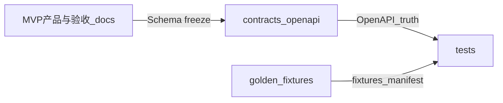

# 参赛 MVP — 范围与验收（产品与需求）

**契约冻结路径：** [contracts/openapi.yaml](../contracts/openapi.yaml)

**文书抽取管线 ID：** `civil-judgment-v1`，**schemaVersion（契约冻结）：** `2026-05-13` — 字段见 OpenAPI components `CivilJudgmentV1Extract`。

本文档对齐 [docs/buchong.md](./buchong.md)（MVP、合规与非功能：**约 20 并发、单次 10s 超时、离线本地规则与标准库**），与 [docs/xq.md](./xq.md) 的长期愿景区分开：**本 MVP 不承诺 NL→任意代码生成、运行时大模型、知识库外接等业务**。

**协作约定（范围变更）：** 任何扩招 / 删减须先写明对下方「验收标准」的影响（增加/删减/改写哪条 Scenario、是否需要新 fixture），再决定是否改范围。

---

## 阶段 0 冻结（跨窗口真源）

**冻结锚点：** 契约与文书 schema 以 [contracts/openapi.yaml](../contracts/openapi.yaml) 及首段声明为准；范围变更须同步更新本节、契约版本与 [golden-fixtures.md](./golden-fixtures.md)。

**冲突优先级：** 与 [xq.md](./xq.md) 主需求表述冲突时，以 [buchong.md](./buchong.md) 为准。**产品可见范围、验收条款、演示与不做清单** 的详尽条文以**本文档**为真源；[buchong.md](./buchong.md) 负责协作流程、非功能母版与多窗口纪律。

### MVP 三件套（用户所见 / 后端必达）

| 能力 | 用户能看见什么 | 后端必须做到什么 |
|------|----------------|------------------|
| **案号校验** | 输入候选案号后即得合法/非法与可读原因；宜展示或可追溯到 **ruleId / 标准库条目** | 依据仓库内 **YAML/JSON 标准库与规则 ID** 判定，**不靠云端大模型**；结果可与黄金用例、规则清单对齐 |
| **一条固定文书抽取管线** | 仅针对**已冻结管线**粘贴正文，得到 **契约 JSON**；不匹配时返回 **可读结构化错误**（非「猜文书类型」） | **仅**实现契约中的单管线（如 `civil-judgment-v1` + 冻结 `schemaVersion`）；解析与失败路径**本地完成**，**不调用**需 API Key 的云端大模型兜底 |
| **合规扫描** | 粘贴代码/文本后得到 **分级命中**（deterministic / suspicious / suggestion）、**规则 ID**、片段或行提示；支持 **一键复制摘要** | **本地正则/关键词等规则**扫描；不要求运行时调用 Cursor/Claude API；命中须可对应 [golden-fixtures.md](./golden-fixtures.md) 所列规则 ID |

### 最小 Given/When/Then（每功能 1 条，与第二节详细 Scenario 一致）

以下为上一条「阶段 0」可独立复述的最小条；完整断言仍以第二节与 `fixtures/` 为准。

| 功能 | Given | When | Then |
|------|-------|------|------|
| 案号 | 匿名打开应用，无需登录 | 提交黄金用例中一条合法案号请求 | **HTTP 200**、`valid=true`，与对应 fixture **预期一致** |
| 案号 | 同上 | 提交一条非法边界用例 | **HTTP 200**、`valid=false`，`reasonCode`/`message` **非空且不矛盾** |
| 文书抽取 | `pipelineId` / `schemaVersion` 与契约一致 | 提交 **success** 合成正文 | **HTTP 200**，响应 **通过契约 Schema** 且与 **success-sample.expected.json** 一致 |
| 文书抽取 | 输入 **非本管线**负例正文 | 提交抽取 | **HTTP 422** + `ExtractErrorResponse`，**不**调用云端 LLM 推断文书类型 |
| 合规 | 合成样例含确定级命中模式 | 扫描 | 结果含约定 **ruleId** 且 `severity=deterministic`（与 fixture 预期一致） |
| 合规 | 清洁合成样例 | 扫描 | **无**确定级误报（与 **clean.expected.json** 一致） |

### 答辩口径金句（合规 / 非公网）

答辩与对外材料须与下列表述一致，**不得**虚假宣传未实现能力：

- 本 MVP **无登录、无 API Key、无审计日志**；核心能力**不依赖**需密钥的云端大模型作为运行时路径。
- 业务数据处理在 **本机/内网**完成；**不得要求**将粘贴内容**上传到公网**才能完成案号校验、文书抽取、合规扫描（可与 README、架构说明交叉引用）。
- 系统输出为研发辅助与规则命中提示，**不替代**律师、司法机关或合规/安全负责人的专业判断；未经基线或固定任务集的**量化提效百分比**不作为 MVP 验收承诺。

*演示**节拍与界面顺序**见第三节「演示脚本大纲」。*

### 风险与开放问题

| 项 | 说明 | 收口方式 |
|----|------|----------|
| 效果度量 | `xq.md` 中「效率提升 40%」等须绑定**基线或固定任务打分表**，否则答辩易被追问 | 路演材料中补充基线占位或与团队删去未实证表述 |
| 标准库出处 | 公开来源未覆盖的枚举/规则须标 **synthetic-demo** | 窗口 C 与 [golden-fixtures](./golden-fixtures.md) 一致 |
| 契约与用例漂移 | OpenAPI、fixture、实现三者须同源 | 窗口 D / E / G 以契约 + golden-fixtures 为断言依据 |

**若无分歧：** 剩余实现细节由 **窗口 B（架构）** 与 **契约/标准库工件** 在阶段 1 及以后收口。

### 给窗口 B（架构 / 技术）的交接摘要

- **技术栈：** Java + **Spring Boot**；**Vue3 + Vite + Element Plus**（与 [buchong.md](./buchong.md) 一致）。
- **产品边界：** **无**账号体系、**无** API Key、**无**审计日志产品化；架构与部署叙事须支持 **不向公网上传业务数据** 即可完成三功能（本机/内网/同源策略与 [README](../README.md) 一致）。
- **非功能：** 并发设计按 **约 20**；单次处理 **≤10s**，逾时必须 **确定性**失败语义（与 README「超时 HTTP 映射」、[buchong.md](./buchong.md) 一致）。
- **真源：** **离线**仅用 **本地规则 + 本地标准库**（`fixtures/stdlib` 等）；不得默认可插多条文书管线或运行时公网 LLM SDK。
- **对齐契约：** 模块划分与 API 前缀须与 [contracts/openapi.yaml](../contracts/openapi.yaml) **1:1**，禁止静默扩展第二条抽取管线或改写已冻结字段语义。

---

## 一、用户故事（史诗 → 故事）

### Epic_E1｜离线可用的法律研发小工具（匿名）

- **US-1**：作为研发/演示人员，我希望**无需登录**即可打开 Web 界面，以便快速验证案号、文书抽取、合规三类能力。
- **US-2**：作为使用者，我希望系统在说明中明确「**不向公网上传粘贴内容 / 本地处理**」，以便满足参赛与答辩的安全叙事（与实现对齐：运行时无出站业务数据上传到公网）。
- **US-3**：作为使用者，当单次请求超过 **10s**，我希望得到**确定的超时或降级错误信息**（不接受无限挂起），与 [buchong.md](./buchong.md) 一致。

### Epic_E2｜案号校验（三件套之一）

- **US-10**：作为开发者，我希望输入或粘贴候选案号字符串，系统按**仓库内可追溯的规则与标准库条目**给出合法/非法及原因（最好能关联规则 ID 或条目说明），便于与黄金用例回归一致。

### Epic_E3｜一条固定文书抽取管线（三件套之二）

- **US-20**：作为开发者，我只使用**冻结的一种文书管线**（`pipelineId=civil-judgment-v1`, `schemaVersion=2026-05-13`），系统将正文解析为 **固定契约中的 JSON Schema 输出**，不做「任意类型文书智能推断」。
- **US-21**：作为 reviewer，抽取失败时我希望能看到**可读错误**（如 `PIPELINE_MISMATCH`、`INSUFFICIENT_MARKERS`），且不依赖云端模型兜底。

### Epic_E4｜合规扫描（三件套之三）

- **US-30**：作为开发者，我希望上传或粘贴代码/文本片段，系统用**本地规则（正则/关键词等）**标出可疑点，并分级（deterministic / suspicious / suggestion），输出可对应**规则 ID**（见 [docs/golden-fixtures.md](./golden-fixtures.md)）。
- **US-31**：作为演示人员，合规结果应支持**一键复制摘要**（与 [buchong.md](./buchong.md)「复制导出」一致），不要求运行时调用 Cursor/Claude API。

### Epic_E5｜演示与数据红线

- **US-40**：作为答辩者，bundle 内只使用**合成/脱敏样例**，并在界面或 README 对用户粘贴给出风险提示；**禁止使用真实当事人、真实法院涉密或可追溯个人的数据**。

---

## 二、Given / When / Then 验收标准

以下 Scenario 可由测试窗口映射到契约与 [docs/golden-fixtures.md](./golden-fixtures.md) 所列文件。**文书抽取**的字段名与 JSON Schema 以 [contracts/openapi.yaml](../contracts/openapi.yaml) 为真源。

### 横切 Scenario（环境与约束）

**S0-Access**

- **Given** 应用已在本机或内网按 [README](../README.md) 部署完成
- **When** 访问主入口页面
- **Then** **无需登录**即可使用三功能入口，且产品介绍中不出现「API Key、审计日志、运行时云端大模型」作为本版能力

**S0-Observability-Negative**

- **Given** MVP 范围为无审计
- **When** 检查产品说明与交互
- **Then** **不宣称**具备「谁在何时处理了哪条数据的审计追踪」

**S0-Privacy**

- **Given** 演示与测试使用合成数据
- **When** 走通三功能全流程
- **Then** **无**步骤要求将粘贴内容上传到公网服务才能完成核心功能

**S0-NFR-Timeout**

- **Given** 后端单次处理超时配置为不超过 **10 秒**（或与契约一致的说明）
- **When** 构造故意拖慢或可中断的负载（或由测试桩模拟超时）
- **Then** 客户端收到**确定的超时/降级错误**，请求不永久挂死

---

### Epic E2｜案号校验

**S1-CaseId-Valid**

- **Given** 黄金用例 `fixtures/case-number/valid-001.request.json`、`valid-002.request.json` 及配对 **`valid-*.expected.json`**
- **When** `POST /api/v1/case-number/validate` 提交该校验请求
- **Then** HTTP 200 且 `valid=true`，说明可与 `ruleRefs[].ruleId` 或 fixture 注解对应

**S1-CaseId-Invalid**

- **Given** 黄金用例 `fixtures/case-number/invalid-001.request.json`、`invalid-002.request.json` 及配对 **`invalid-*.expected.json`**
- **When** 提交校验
- **Then** HTTP 200 且 `valid=false`，`reasonCode`/`message` 非空且不矛盾

**S1-CaseId-Hardcoded-Enum-Negative**

- **Given** 验收检查清单中包含「枚举来源」抽查项
- **When** Review 标准库数据来源
- **Then** **非**凭空编造国标条目；无法在公开来源覆盖处须标注 **synthetic**（见 [docs/golden-fixtures.md](./golden-fixtures.md)「标准库数据来源」）

---

### Epic E3｜文书抽取（单管线）

**S2-Pipeline-Fixed**

- **Given** 契约已冻结 `pipelineId=civil-judgment-v1`、输入 `contentType=text/plain`、`encoding=UTF-8`
- **When** 使用合成样本 `fixtures/document-extract/success-sample.txt`
- **Then** HTTP 200，`extract` **满足** `DocumentExtractResponse` / `CivilJudgmentV1Extract` schema，关键字段与 `fixtures/document-extract/success-sample.expected.json` 一致（请求体贴片见 **`success-sample.request.json`**）

**S2-Pipeline-OOR-Negative**

- **Given** 样本 `fixtures/document-extract/pipeline-mismatch-sample.txt`
- **When** `POST /api/v1/document/extract` 与原请求体约定一致
- **Then** HTTP **422**，`ExtractErrorResponse` 含稳定 `errorCode`（首要 `PIPELINE_MISMATCH`），并与 **`fixtures/document-extract/pipeline-mismatch.expected.json`** 对齐；**不就地调用云端 LLM 猜测文书类型**

**S2-Pipeline-Timeout**

- **Given** S0 的超时约定
- **When** 输入契约允许范围内的极端长文本
- **Then** 在超时前返回完整结果或在超时阈值内返回超时/`PARSE_TIMEOUT` 类错误之一（实现需二选一并文档化）

---

### Epic E4｜合规扫描

**S3-Scan-HitDeterministic**

- **Given** `fixtures/compliance/deterministic-hit.sample.txt`
- **When** `POST /api/v1/compliance/scan`
- **Then** 结果含规则 `R-DEMO-ID-LIKE-DIGITS`（见 [golden-fixtures](./golden-fixtures.md)）、`severity=deterministic`，`findings` 与 **`fixtures/compliance/deterministic-hit.expected.json`** 一致（`snippet`/message 若存在须可读）

**S3-Scan-Suspicious**

- **Given** `fixtures/compliance/suspicious-only.sample.txt`
- **When** 扫描
- **Then** 与 **`fixtures/compliance/suspicious-only.expected.json`** 一致：最高严重度仅为 `suspicious`（不出现 `deterministic`，除非矩阵修订另有说明）

**S3-Scan-Clean**

- **Given** `fixtures/compliance/clean.sample.txt`
- **When** 扫描
- **Then** `findings` 与 **`fixtures/compliance/clean.expected.json`** 一致（空数组）

**S3-Copy**

- **Given** 扫描结果界面存在「复制」操作
- **When** 用户点击复制
- **Then** 剪贴板含规则 ID 与简述摘要，且不依赖 Cursor/Claude 运行时 API

---

### Epic E5｜数据与答辩

**S4-NoRealPartyData**

- **Given** 仓库内置 `fixtures/**/*` 与演示脚本所列样例
- **When** Spot-check 正文
- **Then** **无**真实姓名、身份证、手机号、可对号案件号等可追溯真实当事人数据（均为 demo / synthetic）

---

## 三、演示脚本大纲（5–8 分钟建议）

可打印的一页浓缩版与口播金句：**[defense-one-pager.md](./defense-one-pager.md)**；逐步操作与示例数据路径：**[USAGE.md](./USAGE.md)**。

| 节拍 | 动作 | 话术要点（产品侧） |
|------|------|-------------------|
| 0. 开篇 30s | 说明定位 | 法律研发 **离线三件套**：案号 / 固定文书管线 / 本地合规扫描；本版 **无登录、无密钥、无审计、无运行时上云与公网上传**。 |
| 1. 案号 90s | 展示 2 正 2 负 fixture | 「规则与标准库可追溯；结果可对照黄金用例」；强调非拍脑袋枚举。 |
| 2. 文书抽取 90s | 跑 1 个成功样例 + 1 个「非本管线」负例 | 强调 **单管线冻结**；失败是 **422 + errorCode** 不是模型胡猜。 |
| 3. 合规 90s | 粘贴 deterministic / suspicious / clean 三组 | 展示 **ruleId + severity**；点「一键复制摘要」。 |
| 4. 非功能与安全 45s | 口述 + README / 超时配置 | 「约 20 并发设计的说法与 10s 超时承诺」；**免责声明**：不替代法务/安全专业判断；须经人工复核。 |
| 5. 收口 30s | 创新点收紧版 | 垂直规则 + 标准库模板化、「合规前置到开发自检」；后续路线不写进 MVP 验收。 |

**演示前置检查：** 全合成数据包；断外网跑一次「核心路径仍可用」（可选说服力项，是否在 CI 断言由架构/README 另行约定）。

---

## 四、不做清单（Out of Scope / Won’t-Do）

1. **用户与权限**：账号注册登录、OAuth、租户、RBAC
2. **密钥与云服务**：运行时依赖需 **API Key** 的云端大模型；任何形式的业务正文发往公网模型
3. **审计**：操作审计日志、工单式留痕
4. **功能扩招**：任意类型文书抽取、第二条及以上可插拔抽取管线（MVP **仅** `civil-judgment-v1`）
5. **通用代码生成**：任意 NL → 全栈代码生成（非本 MVP 产品承诺）
6. **外挂知识库**：对接公司内部 wiki/接口文档的在线检索（可写「后续」，**不写进验收**）
7. **真实案例展示**：不得在演示与 fixtures 使用真实当事人、未脱敏真实案情数据
8. **司法结论**：软件**不宣称**替代律师/法官/合规官判断
9. **未实证的效果宣传**：未经基线或固定任务集支撑的**量化提效**百分比等，不作为本 MVP **验收与对外承诺**（参见 [buchong.md](./buchong.md) 效果度量一节）

---

## 五、与其它窗口的依赖

- **改文书管线或字段：** 首要影响 **S2-***，需升版 `schemaVersion`、`DocumentExtractResponse` 与答辩第 2 节。
- **增加第二条抽取管线：** 违反 MVP 冻结 → 须整体修订 Epic_E3 与不做清单第 4 条。
